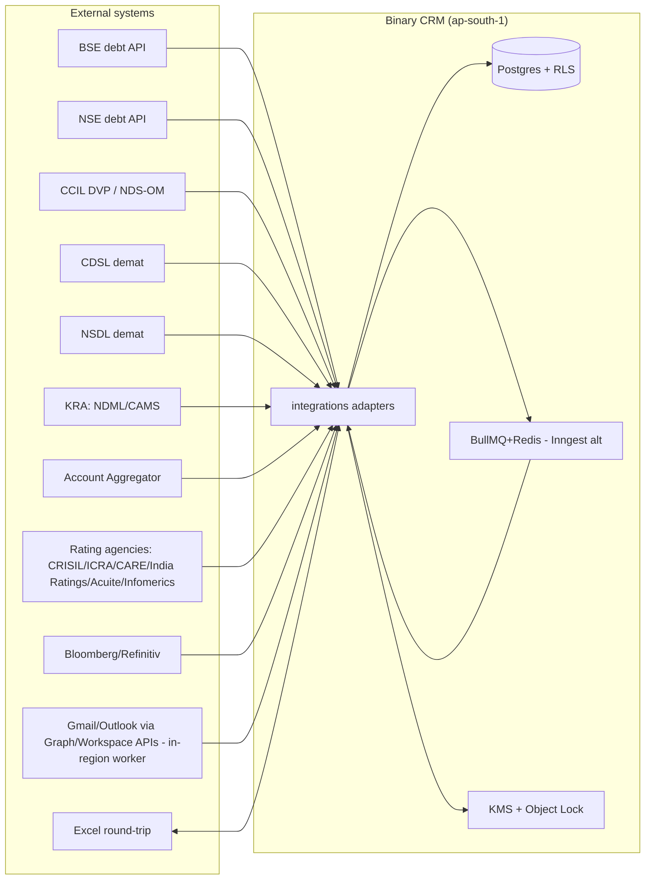
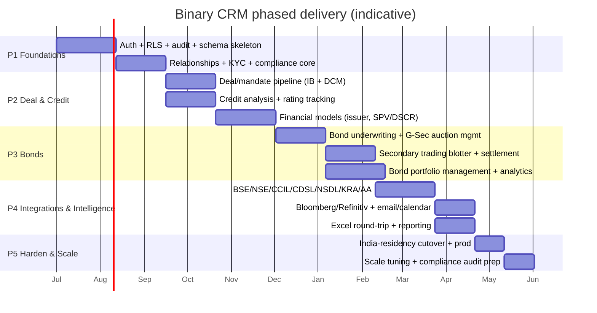

# Binary Capital / Binary Bonds — CRM Technical Architecture

> **Status:** All stack, hosting, and vendor choices in this document are a **PROPOSAL — pending research/build-vs-buy confirmation.** Nothing here is a final procurement decision. Where a choice has a real compliance implication for an Indian SEBI/RBI-regulated entity, that implication is stated explicitly and the decision is listed in [§11 Open decisions](#11-open-decisions).
>
> **Audience:** Engineering + PM leadership building the CRM. This is decision-grade — an engineer should be able to scaffold the repo from [§3](#3-folder--project-structure-app-router), implement RLS from [§4](#4-security), and wire integrations from [§6](#6-integrations-architecture) without re-deriving the domain.

---

## 0. What this system is, in one paragraph

A relationship + deal + credit-analysis CRM for **Binary Capital Advisors LLP** (Mumbai), covering two sides of one firm: the **Binary Capital** investment-banking/advisory side (M&A, project/structured finance, capital markets) and the **Binary Bonds** fixed-income execution side (corporate bond underwriting, G-Sec/SDL/T-Bill/SGB auctions, high-yield, secondary trading/market-making, portfolio management, credit-rating advisory). It must manage **10,000+ two-sided relationships** *(assumed target scale — to validate with Binary; public site shows 150+ institutional, brochure shows 70+ orgs — see [§7](#7-scale-approach-for-10k-clients))* (issuers, institutional investors, intermediaries), the **deal/mandate pipeline** across both sides, **credit analysis & financial modeling** (issuer models, SPV/non-recourse DSCR models, bond pricing, portfolio analytics), and the **Indian compliance perimeter** (KYC/AML under PMLA, DPDP Act 2023, SEBI/RBI/FIMMDA expectations). It is **not** a trade-execution/OEMS or settlement system — it integrates with those (BSE/NSE, CCIL, NDS-OM, CDSL/NSDL, KRA) but does not own settlement.

A hard constraint up front: this firm touches **PII of investors and issuers, KYC records, and material non-public information (MNPI)** across a two-sided book where **wall-crossing and information-barrier discipline** are a regulatory and ethical necessity (the firm is on both the issuer side and the investor side of the same deals). The architecture must make information compartmentalization a **first-class data model concern**, not an afterthought.

---

## 1. Stack proposal & rationale

> **PROPOSAL — pending research/build-vs-buy confirmation.**

| Layer | Choice | Rationale (specific to Binary) |
|---|---|---|
| **Framework** | **Next.js (App Router)** — Server Components + Server Actions + Route Handlers | One full-stack TypeScript codebase for a small firm (≈6–35 staff, brochure vs JSON-LD conflict — assume small). Server Components keep MNPI/PII server-side by default; Server Actions give typed RPC without a separate API layer to maintain. |
| **Runtime / hosting** | **Vercel (Fluid Compute)** pinned to `bom1` (Mumbai) — see [§2.3](#23-where-to-host-the-app--three-residency-paths). Vercel **does** offer a Mumbai compute region (`bom1` / `ap-south-1`), so the recommended default is **Path 1a: compute in `bom1` + Postgres in `ap-south-1`** (both compute and data in Mumbai). Fluid Compute auto-scales with concurrency, fits bursty import/model-calc workloads. Fallback paths: Path 1b (`sin1` + India DB, processing-abroad, needs counsel sign-off) or Path 2 (India-hosted containers on AWS/Azure `ap-south-1`, chosen for control/lock-in avoidance, not residency). |
| **Database** | **PostgreSQL 15+** (Vercel Marketplace Postgres **or** India-hosted managed PG — see §2) with **Drizzle ORM** | Postgres RLS is the cornerstone of the information-barrier model ([§4.4](#44-row-level-security-rls-as-the-information-barrier)). JSONB for flexible deal/credit-model payloads; `pgvector` for relationship/entity-resolution embeddings and semantic search over the 10k+ book. Drizzle: typed, SQL-first, migrations as code — better than Prisma for the heavy analytical SQL this app will write (portfolio attribution, bond analytics). |
| **UI** | **shadcn/ui + Tailwind CSS** + **TanStack Table** + **TanStack Query** | shadcn gives owned, accessible components (not a black-box library) — important for a regulated UI where we must customize data-density (deal blotters, portfolio tables, credit-model grids). TanStack Table for the dense, sortable, filterable tables a bond/credit desk lives in; TanStack Query for client-side cache of server-action results. |
| **Auth** | **Auth.js (NextAuth v5)** with a **DB session store** + **RBAC/ABAC layer** ([§4.2](#42-rbac--abac-model)); fallback **Lucia / Ory / a commercial IdP** | Auth.js v5 has had an extended beta/RC history — note its maturity before locking in. The DB-session + RBAC/ABAC layer is **library-agnostic** (it lives in `lib/auth/`, not in the Auth.js adapter), so swapping to Lucia, Ory Kratos, or a commercial IdP later is cheap. OIDC is not needed (no enterprise SSO stated — to confirm); username/password + TOTP 2FA + optional WebAuthn for directors. DB sessions (not JWT-only) so sessions are revocable — required for compliance (instant kill-switch on a leaked device). |
| **File storage** | **AWS S3 in `ap-south-1`** (or local MinIO for PII) as the **default**; Vercel Blob only for non-regulated assets | Even with compute pinned to `bom1`, **Vercel Blob may process metadata outside India** ([§2.3](#23-where-to-host-the-app--three-residency-paths)) — so keep regulated PII/KYC/MNPI files on S3 `ap-south-1`. Stores KYC docs, audited financials, rating rationales, term sheets, models (xlsx), NDAs. PII/KYC documents must be encrypted with per-tenant KMS keys ([§4.3](#43-encryption--secrets)). |
| **Background jobs / queues** | **BullMQ + in-region Redis (ElastiCache `ap-south-1`)** as the **default for India-hosted paths**; **Inngest** only for a Vercel-`bom1` path **if** counsel accepts its processing location, or self-hosted Inngest on `ap-south-1` | Inngest SaaS processes outside India → residency concern on the India-hosted path; BullMQ + in-region Redis keeps job state in Mumbai. (Vercel Cron + QStash only for light/non-PII use.) Long-running: xlsx model imports, batch credit-model recalcs, rating-agency feed ingestion, email/calendar sync, periodic portfolio analytics. Must be resumable + observable — financial calcs cannot silently drop. |
| **Search** | **Postgres FTS + trigram (`pg_trgm`)** for structured/entity search; **pgvector** for semantic match; optional **Meilisearch/Typesense** only if FTS proves insufficient at 10k+ scale | 10k clients is small enough that Postgres FTS + good indexes is likely enough; defer dedicated search infra until measured. |
| **Excel round-trip** | **`exceljs`** (npm) primary; **`@e965/xlsx-stream`** fork only for streaming-large files; models stored as structured JSON, xlsx as a *view* | **Supply-chain note:** the `xlsx` (SheetJS) npm package was pulled from npm for CVEs and is now CDN-only — do **not** depend on it from npm. Prefer `exceljs` (npm, maintained) as the primary reader/writer; use the `@e965/xlsx-stream` fork only when streaming very large files. Bankers live in Excel. Credit/SPV models are authored as structured data (server-validated), exported to xlsx, and re-imported with cell-level reconciliation. Never store the model *as* an opaque xlsx blob that can't be queried/audited. |
| **Email / calendar intelligence** | **Native Microsoft Graph + Google Workspace APIs**, pulled by the CRM's own mail adapter on an in-region BullMQ worker (`ap-south-1`); **Nylas optional only for non-MNPI metadata if processing-abroad is acceptable** | Nylas is US-based and **cannot do in-region India processing**, so for India-hosted/MNPI paths the default is native Graph/Workspace APIs synced by an in-region worker into a `communications` table. Relationship intelligence: who-talks-to-whom across the 10k+ book, last-touch dates, deal-linked threads. Requires explicit user consent (DPDP) and MNPI hygiene — see [§4.5](#45-mnpi--chinese-wall-enforcement). |
| **Observability** | **Vercel Observability** + **Sentry** + structured logs to an India-retained sink if mandated | Audit-relevant events must be tamper-evident ([§5](#5-audit--compliance)). |
| **Package monorepo** | Single Next.js app (not a monorepo) until a second service is justified | Small team; YAGNI on turborepo. |

### 1.1 Why not just buy Salesforce/HubSpot + a credit tool?

Preliminary view (final call deferred to research, see [§9](#9-preliminary-build-vs-buy-lean)): a generic CRM cannot model (a) two-sided issuer/instrument/investor matching, (b) Indian bond pricing & SPV/DSCR models, (c) Indian compliance (KYC/KRA, DPDP consent, PMLA retention, wall-crossing), or (d) BSE/NSE/CCIL/NDS-OM integration. The **likely optimal shape is custom-build on the modern stack above, possibly fronting an existing platform for the generic CRM layer** (Salesforce/HubSpot/Zoho) via API, used purely as a contacts-and-activities backstop. But the credit, deal, pricing, and compliance cores are custom.

---

## 2. India data-residency analysis

> This is the single most consequential architectural decision. **PROPOSAL — to confirm with Binary's compliance officer and counsel.**

### 2.1 The legal landscape (as of 2026-06, to confirm)

- **DPDP Act 2023** (Digital Personal Data Protection): restricts transfer of personal data *outside India* except to countries the Central Government permits (a "blacklist/negative list" mechanism expected, exact notified list **to confirm**). DPDP does **not** mandate that personal data be *stored only in India*; it restricts **cross-border transfer** and imposes obligations on the data fiduciary (Binary). For a SEBI-regulated entity handling financial PII, the conservative read is: **store and process personal data in India** to eliminate transfer-risk.
- **SEBI Cloud Framework — BINDING, not advisory (Circular SEBI/HO/ITD/ITD_VAPT/P/CIR/2023/033, 6 Mar 2023; per compliance/feasibility research):** all SEBI-RE data must reside **and be processed** within India (primary + DR + near-DR); the cloud provider must be **MeitY-empaneled with STQC-audited data centres** (or on-prem); PaaS/SaaS must sit on MeitY-empaneled infrastructure with back-to-back enforceable agreements; the RE retains ownership of data, logs, and keys (CSP acts only fiduciarily); encryption at rest/in transit/in use with **BYOK/BYOE keys in a dedicated fault-tolerant HSM under RE control**; mandatory **exit/expunging**; 6-month remediation if the CSP loses empanelment. Source: sebi.gov.in. **Implication for §2.3 paths:** **Path 2 (India-hosted containers on AWS/Azure/GCP India — all three hyperscalers are MeitY-empaneled) is the compliance-default.** **Path 1a (Vercel `bom1`)** is viable **only if** counsel confirms Vercel satisfies the SEBI Cloud Framework's CSP/sub-processor requirements (Vercel is not known to be MeitY-empaneled as a CSP) and that residual control-plane metadata is not personal/MNPI under DPDP/SEBI; **do NOT use Vercel managed Postgres** for regulated data — use AWS RDS/Aurora `ap-south-1`. RBI has **not** issued a binding cloud-empanelment mandate as of Jun 2026 (IFS Cloud via IFTAS is announced but not compulsory); the SEBI Cloud Framework is the binding instrument for a SEBI RE. Monitor for a future RBI cloud circular. **RBI cyber / outsourcing guidelines** impose analogous expectations on any RBI-regulated counterparty flow.
- **PMLA**: requires KYC records (identity, address, PAN, beneficial-ownership) and transaction records be retained **5 years from the end of the calendar month in which the transaction is recorded or the client relationship ends, whichever is later** — must be retrievable on demand to FIU-IND.
- **MNPI / SEBI (Prohibition of Insider Trading) Regulations**: log integrity and access control on systems holding MNPI.

**Bottom line (proposed, to confirm with counsel):** treat **personal data (KYC, investor/issuer PII) and MNPI as India-resident**, both at-rest and for primary processing. This is the safe, defensible posture for a SEBI/RBI-regulated Mumbai bond house.

### 2.2 Where to host the database

- **Primary DB: India region.** Options: AWS RDS/Aurora PostgreSQL in **`ap-south-1` (Mumbai)**, Azure Database for PostgreSQL in **West India (Pune)**, or a Vercel Marketplace partner with an India region **to confirm which Marketplace Postgres providers offer an actual Mumbai region** (some marketplace options run in US/EU — verify before procurement).
- **Replicas**: read replica in-region for analytical/reporting workloads (portfolio attribution, credit-model batch runs) to keep the primary free for transactional CRM writes.
- **Backups**: encrypted, in-region, point-in-time-recovery (PITR) minimum 35 days; long-term cold retention for KYC/PMLA 5+ years (glacier-class, India).

### 2.3 Where to host the app — three residency paths

**VERIFIED (2026-06):** Vercel **does** offer a Mumbai compute region — `bom1` (`ap-south-1`, Mumbai, India) is one of Vercel's **20 compute-capable regions** (per Vercel docs, updated 2026-03-05) and sits in the default failover ring (P16). This inverts the earlier "no India compute on Vercel" premise. Established regions in the catalog include US (`iad1`, `sfo1`, `pdx1`), EU (`fra1`, `cdg1`, `lhr1`, `dub1`), APAC (`hnd1`, `sin1`, `syd1`, `hkg1`), and India (`bom1`); the **full current 20-region list — re-confirm at procurement time**, as the catalog changes (recent Vercel catalogs have added further EU/APAC/ME regions — exact codes to confirm).

With `bom1` available, the residency question is no longer "Vercel can't host in India" — it is "does Vercel's *control plane* and *managed products* keep regulated data in India when compute is pinned to `bom1`?" Three paths:

1a. **Vercel `bom1` + India Postgres (RECOMMENDED default).** Vercel Fluid Compute pinned to `bom1` for app + Server Actions/Functions, with Postgres (Aurora or RDS) in `ap-south-1`. **Both compute and data sit in Mumbai**, so primary processing of PII/MNPI is in-region. Lowest-effort compliant posture *if* the control-plane caveat below clears. **Gating caveat (to confirm with counsel):** Vercel's *control plane* (deployment orchestration, env-var plumbing, project metadata) and *managed products* — **Vercel Blob, Vercel KV, Vercel Edge Config** — may process metadata outside India even with compute pinned to `bom1`. Mitigations: (a) do **not** store regulated personal/MNPI data in Blob/KV/Edge Config — use S3 `ap-south-1` + ElastiCache `ap-south-1` instead; (b) confirm counsel accepts that residual control-plane metadata (project name, deployment IDs, env-var *names* not values, request counts) is not itself personal/MNPI under DPDP/SEBI; (c) if counsel objects, fall back to Path 2. Avoid Vercel-specific APIs (`vercel/og`, Vercel KV, Vercel Edge Config) for anything compliance-relevant regardless.

1b. **Vercel `sin1` + India Postgres (processing-abroad).** Compute pinned to `sin1` (Singapore), DB in `ap-south-1`. Functions read PII/MNPI from the Mumbai DB and process it in `sin1` — a cross-border *processing* transfer. **Needs explicit counsel sign-off** under DPDP's transfer regime and SEBI cloud advisory. Lower priority than 1a; included for completeness.

2. **India-hosted containers (control/lock-in choice, NOT residency-forced).** Run the **same Next.js app** on India-region compute — **AWS App Runner / ECS Fargate / EKS in `ap-south-1`**, or Azure Container Apps in West India — in front of an India Aurora/RDS Postgres. With `bom1` now available, Path 2 is no longer forced by residency; it is justified by **vendor control / lock-in avoidance / no Vercel dependency / full runtime control**, which some SEBI-regulated peers prefer regardless. Choose this path when the firm values control over Vercel's DX/scale convenience, or when counsel rejects even `bom1` control-plane metadata residency. Vercel may still be used for **preview/internal non-PII environments** and static assets.

**The REAL residual residency concern to flag** (independent of path): even on Path 1a with compute pinned to `bom1`, **Vercel's control plane and managed products (Blob / KV / Edge Config) may process metadata outside India.** The mitigation is architectural — keep regulated personal/MNPI data on S3 `ap-south-1` + ElastiCache `ap-south-1` + Aurora `ap-south-1`, and use Vercel only for compute + static edge. If counsel rules that even control-plane metadata is a transfer, Path 2 is the answer.

**PROPOSAL:** Design the app to be **hosting-portable** — no Vercel-only primitives in the hot path. Keep the data layer and Server Actions standard Next.js so the same code runs on Vercel `bom1` (Path 1a), Vercel `sin1` (Path 1b / dev-preview), or `ap-south-1` containers (Path 2). The decision among 1a / 1b / 2 is a [§11 open decision](#11-open-decisions), gated on counsel's opinion on control-plane metadata residency.

### 2.4 PII handling specifics

- **PII fields are column-encrypted at the application layer** (PAN, Aadhaar if ever collected, passport, demat BO ID, bank account numbers) — see [§4.3](#43-encryption--secrets). RLS hides rows; field encryption protects the sensitive columns even from a DB superuser snapshot.
- **KMS:** AWS KMS in `ap-south-1` (or Azure Key Vault West India) with **CMKs** and per-environment keys, key rotation on, CloudTrail/Audit logs on key use.
- **Data minimization:** collect only what KYC/AML requires (PAN mandatory; Aadhaar **only if** a SEBI-registered process explicitly requires it — to confirm; for most broker/merchant-banker flows PAN + Demat + address suffices). Never collect Aadhaar unless a documented lawful basis exists.
- **DPDP consent:** every data subject (investor, issuer contact, IFA) has a `consent` record capturing scope, timestamp, version of privacy notice, and withdrawal events. Consent withdrawal triggers a data-subject-rights workflow ([§5.3](#53-dpdp-data-subject-rights)).
- **Data classification:** every table/column tagged `pii` / `mnpi` / `kyc` / `financial` / `public`; tag drives encryption, logging, and export controls.

---

## 3. Folder & project structure (App Router)

```
binary-crm/
├── app/                          # App Router
│   ├── (auth)/                   # login, 2FA, password reset (public)
│   ├── (app)/                    # authenticated app shell (layout with RBAC guard)
│   │   ├── dashboard/
│   │   ├── relationships/        # Contacts, Orgs, Investors, Issuers, Intermediaries
│   │   ├── deals/                # Mandate pipeline (IB + DCM)
│   │   ├── bonds/                # Underwriting deals, G-Sec auction participation
│   │   ├── trading/              # Secondary blotter, orders, CCIL settlement status
│   │   ├── portfolios/           # Bond portfolio management, attribution
│   │   ├── credit/               # Credit analysis: issuer models, scoring, rating tracking
│   │   ├── models/               # Financial models: issuer, SPV/DSCR, bond pricing
│   │   ├── kyc/                  # KYC/KRA records, documents, status
│   │   ├── compliance/           # Audit log viewer, consent mgmt, wall-cross registry, STR/CTR + FIU-IND filings, FEMA/NRI (if retail in scope)
│   │   ├── reports/
│   │   └── settings/             # Users, roles, teams, integrations
│   ├── api/                      # Route Handlers (webhooks: KRA, rating feeds, email)
│   └── layout.tsx
├── features/                     # Domain modules (co-located logic, NOT route-coupled)
│   ├── relationships/
│   │   ├── schema.ts             # Drizzle tables: orgs, contacts, relationships, consent
│   │   ├── actions.ts            # Server Actions (createContact, mergeDuplicates…)
│   │   ├── queries.ts            # Server-side data access (RLS-aware)
│   │   ├── lib/                  # entity-resolution, dedupe, investor-classification
│   │   └── ui/                   # React components for the relationships feature
│   ├── deals/                    # mandate pipeline, stages, fees
│   ├── bonds/                    # underwriting, G-Sec auctions, placement
│   ├── trading/                  # orders, blotter, settlement reconciliation
│   ├── credit/                   # credit scoring, rating tracking, issuer analysis
│   ├── models/                   # financial-model engine (issuer, SPV, bond-pricing)
│   ├── kyc/                      # KRA integration, doc vault, retention scheduler
│   ├── compliance/               # audit log, consent, wall-cross, retention, STR/CTR + FIU-IND filing tracking, FEMA/NRI (if retail in scope)
│   └── integrations/             # adapters (BSE/NSE, CCIL, CDSL/NSDL, KRA, AA, Bloomberg…)
├── lib/
│   ├── auth/                     # session, RBAC/ABAC, permission helpers
│   ├── db/                       # drizzle client, transaction helpers, RLS context
│   ├── crypto/                   # field encryption, hashing, KMS client
│   ├── audit/                    # immutable audit-log writer
│   ├── mnpi/                     # wall-cross enforcement, compartment helpers
│   └── utils/
├── db/
│   ├── schema.ts                 # re-export all feature schemas (Drizzle)
│   ├── migrations/               # Drizzle Kit migrations (checked in)
│   ├── seed/
│   └── rls.sql                   # RLS policy SQL (Drizzle can't express all policies)
├── instrumentation/              # Sentry, OTEL init
├── tests/                        # vitest + playwright
├── drizzle.config.ts
├── next.config.ts
└── package.json
```

**Conventions:**
- **Server Actions are the primary mutation boundary.** Every action (a) authenticates the session, (b) checks ABAC permission, (c) sets the RLS context (`SET LOCAL app.user_id`, `app.role`, `app.wall`), (d) writes an audit event, (e) returns typed results. A single `withContext()` helper enforces this — no raw DB access outside `features/*/queries.ts`.
- **Route Handlers only for webhooks** (incoming KRA callbacks, rating-agency pushes, email provider webhooks). They authenticate via signed headers/HMAC, not sessions.
- **Edge Middleware** runs on every request for auth + RBAC + wall-cross routing (redirects a Capital-side banker away from `/trading` and vice-versa where policy mandates) — see [§4.6](#46-edge-middleware-for-authrbac).
- **No client component touches the DB.** All data flows through Server Components or Server Actions; client components receive already-authorized, already-redacted data.

---

## 4. Security

### 4.1 Threat model (specific to this firm)

- **Two-sided wall-cross:** the firm advises an issuer on a bond issue *and* manages portfolios for investors who may buy that issue. A banker on the issuer desk must not see investor portfolio positions; a portfolio manager must not see pre-issue issuer MNPI. Insider-trading risk is real and SEBI-enforced.
- **KYC/MNPI theft:** a stolen device or credential dump exposes 10k+ investors' PII and deal MNPI — both a DPDP breach (notify the Data Protection Board **as soon as possible** and affected data principals **without undue delay**, per DPDP Rules 2025) and reputational catastrophe. The firm keeps a **separate internal 72-hour operational target** for breach triage/containment as a matter of discipline — this is **not** the legal SLA (the legal standard is "as soon as possible" / "without undue delay").
- **Model integrity:** tampered credit/SPV models → wrong ratings/wrong pricing → mis-selling and SEBI enforcement.
- **Insider misuse:** a rogue employee bulk-exporting the investor book (a classic CRM abuse).

### 4.2 RBAC / ABAC model

**Roles (RBAC baseline):**
| Role | Scope |
|---|---|
| `director` | Full firm-wide access (Shray Vasudeva, Shahrukh Sheikh, Rati Ravi Kant) |
| `ib_banker` | Binary Capital side: deals, M&A, project/structured finance |
| `bond_desk` | Binary Bonds side: underwriting, trading, portfolio mgmt |
| `credit_analyst` | Credit analysis, models, rating advisory |
| `kyc_officer` | KYC/KRA records only |
| `compliance` | Audit logs, consent, wall-cross registry, retention |
| `ops_settlement` | Trade booking, CCIL/CDSL/NSDL reconciliation |
| `ifa_portal` | External IFA/broker (limited, scoped to own introduced clients) |

**ABAC attributes** layered on top:
- `wall` / `compartment`: `issuer_desk` | `investor_desk` | `trading` | `credit` | `compliance` — a user belongs to one or more; data rows declare which compartments may see them.
- `mandate_id` / `deal_id`: row-level access scoped to deals the user is staffed on.
- `client_id`: for IFA-portal users, scoped to clients they introduced.

Permissions are evaluated as `role ∧ attributes ∧ row-compartment`. Implement via a `can(user, action, resource, ctx)` helper used inside every Server Action and as the basis for RLS policies.

### 4.3 Encryption & secrets

- **In transit:** TLS 1.3 everywhere; HSTS; internal service-to-service mTLS where applicable.
- **At rest (DB):** Postgres TDE / volume encryption (Aurora/EBS encryption) with India-region KMS CMK.
- **At rest (files):** S3/Blob SSE-KMS with per-environment CMK; KYC documents under a separate `kyc-doc` key with tighter key-policy.
- **PII field encryption (application layer):** PAN, bank account no., demat BO ID, passport, Aadhaar-if-any stored as `pgcrypto`/app-encrypted bytes (AES-256-GCM) with key IDs in KMS; searchable via HMAC-SHA256 blind index for equality lookups (e.g., PAN dedup) — never store the PAN in plaintext, never index the ciphertext directly.
- **Secrets:** never in env files in prod. Use AWS Secrets Manager / Azure Key Vault (India region) + Vercel env for non-prod. `next.config` public env only for non-secret. Rotate DB credentials via IAM auth (Aurora IAM auth) where supported.
- **Application-level crypto** in a single `lib/crypto/` module — never scatter `crypto.*` calls across features.

### 4.4 Row-Level Security (RLS) as the information barrier

**This is the architectural centerpiece for the two-sided wall.** Every multi-tenant-sensitive table has RLS enabled with policies that consult `current_setting('app.user_id')`, `app.role`, `app.wall`, `app.mandate_ids`, set per-transaction by `SET LOCAL` inside the `withContext()` helper. **Set arrays directly as Postgres arrays** — e.g. `SET LOCAL app.mandate_ids = ARRAY['...','...']::uuid[]` and `SET LOCAL app.wall = ARRAY['issuer_desk','trading']::text[]` — **not** as a comma-separated string parsed with `string_to_array` per row (the per-row parse is both slower and error-prone on empty/NULL values).

Example (illustrative):
```sql
ALTER TABLE deals ENABLE ROW LEVEL SECURITY;
CREATE POLICY deals_wall ON deals
  FOR ALL
  USING (
    -- compliance sees everything
    current_setting('app.role') = 'compliance'
    -- OR user is staffed on the deal (mandate_ids set directly as uuid[])
    OR deal_id = ANY(current_setting('app.mandate_ids')::uuid[])
    -- OR user's wall includes the deal's compartment (wall set directly as text[])
    OR deals.compartment = ANY(current_setting('app.wall')::text[])
  );
```

- **Force RLS even for table owners** (`FORCE ROW LEVEL SECURITY`) so a misconfigured service role can't bypass.
- The migration/DBA role (`app_admin`) is `BYPASSRLS` but is **never used by the application** — only migrations.
- RLS is **defense in depth**, not the only control — the application already filters via `can()`. Both must agree; CI runs a test that every query result respects the wall.
- **Wall-cross registry:** explicit, logged exceptions (e.g., a director approves a banker to cross walls for a specific mandate) stored in `wall_crossings` with approver, reason, expiry.

### 4.5 MNPI & Chinese-wall enforcement

- Every `deal`/`mandate`/`bond_issue` row is tagged `compartment` (e.g., `issuer:XYZ`).
- Users are *opted into* compartments by an explicit `user_compartments` grant, approved by compliance and time-boxed.
- Attempts to access a compartment the user isn't in are **denied at the query layer (RLS) and logged as a wall-cross attempt** in the audit log — compliance dashboard surfaces repeated denials.
- MNPI documents carry a `mnpi=true` flag that disables download, copy, and email-forward in the UI (best-effort) and forces a watermark with the viewer's user id + timestamp.
- Email/calendar sync respects walls: a synced thread is only visible to users in compartments the thread's deal belongs to.

### 4.6 Edge Middleware for auth/RBAC

Next.js **Edge Middleware** (`middleware.ts`) runs before every request:
1. Validates an **opaque session-id cookie** against **in-region Redis (ElastiCache `ap-south-1`)** that mirrors the authoritative `sessions` table; on a Redis **miss it falls through to the DB** (and back-fills Redis). The lightweight-JWT alternative is **relegated to the Vercel-only path** (1b `sin1`) where an Edge-readable store is unavailable — not the default.
2. Resolves the user's role + walls from a cached profile in the same in-region Redis.
3. **Route-guards** by path prefix (`/trading` → requires `bond_desk`; `/credit` → requires `credit_analyst` or `compliance`; `/kyc` → requires `kyc_officer`/`compliance`).
4. Rejects or redirects unauthorized requests **before** any data is fetched — cheap, fast, audited.

Edge Middleware is a UX/early-guard layer; RLS + `can()` remain the authoritative controls (middleware can't see DB row compartments). **Revocation writes both Redis and the DB** so a killed session is instantly reflected at the edge and authoritative.

### 4.7 Session handling

- **DB-stored sessions are authoritative** (`sessions` table: id, user_id, refreshed_at, ip, ua, wall_snapshot, expires_at, revoked_at), **mirrored to in-region Redis (ElastiCache `ap-south-1`)** for Edge-Middleware reads. Cookie = **opaque session id**, `Secure`, `HttpOnly`, `SameSite=Lax` — never a JWT carrying claims (no client-side trust). Redis is a read-through cache: miss → DB lookup → back-fill. **Revocation writes both** Redis and the DB so a kill is instant at the edge and durable.
- **Session wall snapshot** is captured at login; if compliance revokes a compartment grant mid-session, the next session refresh picks it up — and compliance can force `revoked_at` to kill instantly.
- **2FA:** TOTP (RFC 6238) mandatory for all staff; WebAuthn optional for directors. Backup codes hashed.
- **Idle timeout** 20 min (configurable per role); absolute reauth after 8h.
- **Device binding:** record `user_agent` + optional device cert for director role.

---

## 5. Audit & compliance

### 5.1 Immutable audit log

- `audit_events` table: `id, ts, user_id, action, resource_type, resource_id, before_hash, after_hash, ip, ua, wall, result, request_id`.
- **Append-only:** enforced by RLS (no `UPDATE`/`DELETE` policy for any role, including admin) **plus** a Postgres trigger that rejects any non-INSERT on the table.
- **Tamper-evidence:** each event includes a `prev_hash` chain (each row's hash includes the prior row's hash) — detectable if anyone tampers via a superuser path. Periodic anchor hashes exported to a write-once store (S3 Object Lock, India) and to an independent compliance-owned log.
- **What's logged:** every read/write of MNPI or PII, every auth event, every wall-cross grant/denial, every export, every consent change, every integration call (BSE/NSE/CCIL/KRA), every config/permission change.
- **Viewer:** compliance-only UI with full-text + filter, export to PDF for regulator requests.

### 5.2 PMLA / KYC retention

- **KYC and transaction records retained 5 years from the end of the calendar month in which the transaction is recorded or the client relationship ends, whichever is later** (PMLA Rule 3 / Master Directions on KYC). Implement a **retention scheduler** keyed on that "whichever is later" date, that flags records for archival (not auto-deletion — KYC must remain *retrievable* for FIU-IND on demand).
- Archive to **Object Lock (WORM)** storage in India; deletion only on explicit compliance approval with a second authorization.
- KYC document set: PAN, address proof, identity proof, demat master, beneficial-ownership declaration (for entity investors), FATCA/CRS declarations, PEP screening result, risk-category assignment.
- **Risk categorization** (low/medium/high per PMLA rules) stored on the client; high-risk triggers enhanced due diligence (EDD) workflow with periodic refresh.

### 5.3 DPDP data-subject rights

Implement a **Data Subject Rights (DSR) workflow** covering: access, correction, erasure ("right to be forgotten"), consent withdrawal, and grievance redressal.

- **Access:** generate a structured export of the data subject's records (PII, KYC, deal involvements where lawful) within DPDP timelines (**to confirm exact statutory SLA**).
- **Erasure:** nuanced — KYC records are *legally required* to be retained under PMLA, so a DPDP erasure request for a current/former investor's KYC is **subject to legal retention override**. The system returns "retained under legal obligation; access restricted" rather than deleting. Non-KYC personal data (e.g., marketing preferences, optional fields) is erasable.
- **Consent:** `consents` table (subject_id, scope, granted_at, withdrawn_at, privacy_notice_version). Withdrawal propagates to downstream processors (email provider, AA) via the integration layer.

### 5.4 Data retention policy (summary)

| Data class | Retention | Notes |
|---|---|---|
| KYC/PMLA records | 5 yrs from end of calendar month of transaction-record or relationship-end, whichever is later; then archive (retrievable) | WORM storage |
| Audit log | 7+ yrs (to confirm with counsel; align to SEBI retention norms) | WORM, anchored |
| Deal/MNPI records | Per deal + statutory window; archive post-close | |
| Consent records | Lifetime of relationship + 5 yrs | |
| Email/calendar sync | Configurable; default purge >24mo unless deal-linked | |
| Contact-form submissions (marketing) | ~2 yrs (per firm Privacy Policy) | |

### 5.5 AML transaction monitoring & FIU-IND filing

PMLA obliges the reporting entity to monitor transactions and file Suspicious Transaction Reports (STRs) with FIU-IND, and to retain Cash Transaction Reports (CTRs) / structured records. The CRM is **not** the transaction-execution system, but it is the natural place to surface red-flag indicators across the relationship/deal/credit book and to track the filing lifecycle.

- **STR/CTR generation:** rules-based and ML-assisted detection of PMLA-rule red flags (structuring, unusual round-tripping, mismatch between client profile and flows, high-yield/NRI patterns, off-book settlement mismatches). Generates draft STR/CTR records (`suspicious_transactions`, `cash_transactions` tables) with the evidence trail and linked client/mandate IDs.
- **Review / approval workflow:** draft → compliance-officer review → principal-officer approval → ready-to-file. Each transition is an audited event ([§5.1](#51-immutable-audit-log)); the **Principal Officer** (PMLA-designated) is the only role that can mark an STR ready to file. No auto-filing — human gate is mandatory.
- **FIU-IND filing tracking:** `fiu_filings` table tracks filing-id, submission date, FIU-IND acknowledgement, status, and linked STR. The CRM **does not transmit to FIU-IND directly** (filing goes via the FIU-IND portal / prescribed channel); the CRM mirrors the filing status and acknowledgement for audit and follow-up. Retention aligned to the PMLA 5-year rule ([§5.2](#52-pmla--kyc-retention)).
- **NRA / thresholds:** cash-transaction aggregation thresholds and cross-border/NRI flag logic are configurable and versioned; threshold changes are audited.

### 5.6 FEMA / NRI compliance (conditional — see [§11 #12](#11-open-decisions))

**In scope only if the retail "Buy Bonds" flow ([§11 #12](#11-open-decisions)) is confirmed in scope.** If NRI/HNI retail debt investment is in scope, the CRM adds:

- **RBI FEMA tracking:** FEMA notification / RBI master-direction compliance for NRI investment in debt (permissible instruments, sector/bond-issuer caps, NRE/NRO/FCNR-B repatriation basis, PIS/RBI reporting where applicable).
- **NRI-specific KYC:** FEMA-declaration fields (NRI/OCI status, country of residence, FATCA/CRS + FEMA), overseas address, repatriable vs. non-repatriable classification, custodian/authorised-dealer linkage.
- **Repatriation tracking:** linked to the trade/settlement mirror ([§6](#6-integrations-architecture)) — track repatriable proceeds, Form 15CA/15CB generation hooks (CB-style: the CRM drafts, the authorised dealer/CAs file), NRI holding-limit/cap monitoring per issuer/ISIN.
- This module is **gated on the retail-channel open decision**; if the retail flow is out of scope, NRI handling stays at the institutional-custodian level and this module is deferred.

---

## 6. Integrations architecture

All integrations behind a `features/integrations/` adapter layer with a uniform shape: `authenticate()`, `fetch()`, `sync()`, `webhook()`, plus a typed event stream into the audit log and an `integration_runs` table for observability/retry.



| Integration | Purpose | Notes / open items |
|---|---|---|
| **BSE / NSE debt APIs** | Bond listing, trade reporting, order routing for retail/HNI "Buy Bonds" flow | Requires the firm to be a SEBI-registered broker authorized on the debt segment — **to confirm registration category**. API access via exchange membership; likely SFTP + REST + drop-copy. |
| **CCIL (DVP) / RBI NDS-OM** | G-Sec/SDL/T-Bill/SGB settlement, corporate-bond settlement reporting | NDS-OM is an RBI platform; CCIL does DVP. **Direct NDS-OM access eligibility depends on Binary's RBI registration category** ([§11 #2](#11-open-decisions)) — e.g., SGL-member-only access vs. access via a custodian/counterparty. The CRM **mirrors trade/settlement status** from drop-copy/confirmations — it does not initiate settlement, and may mirror NDS-OM trades executed **via a custodian/counterparty rather than direct access** depending on the registration category. Reconciliation against ICCL for the BSE-leg. |
| **CDSL / NSDL demat** | Client demat master, BO positions, pledge status | Demat BO ID stored field-encrypted. Position snapshots via NSDL/CDSL APIs for portfolio mgmt + collateral. |
| **KRA (NDML / CAMS)** | KYC verification, PAN-KYC, CVL KRA lookup | Centralized KYC per SEBI KRA regulations. CRM submits KYC, polls/receives KRA status, stores KRA reference + KYC status. |
| **Account Aggregator (AA)** | Pull bank statements / financial data for credit analysis (with consent) | RBI-regulated AA framework; consent-based; FITF/ReBIT standards. Transforms issuer credit-analysis data collection from manual PDFs to consented feeds. |
| **Rating agencies (CRISIL/ICRA/CARE/India Ratings/Acuite/Infomerics)** | Track rating assignments, outlook, rationale, watchlist | No public real-time API for most; ingest via scheduled scrape of agency portals, email parsing of rationales, or manual upload. Track rating → issuer → instrument → outstanding-issue mapping. |
| **Bloomberg / Refinitiv** | G-Sec/SDL yields, FIMMDA benchmarks, corporate bond spreads, ISIN master, MARS analytics | Bloomberg Terminal API (BLPAPI) or Bloomberg Data License; Refinitiv Eikon/Refinitiv Data Platform. Used for yield curves, pricing benchmarks, relative-value. **Vendor pricing — to confirm.** |
| **Email / calendar (native Microsoft Graph + Google Workspace APIs; Nylas only for non-MNPI metadata)** | Relationship intelligence: last-touch, deal-linked threads, meeting cadence | Default: native Graph/Workspace APIs pulled by the CRM's own mail adapter on an in-region BullMQ worker (`ap-south-1`), so sync processing stays in India. **Nylas is US-based and cannot do in-region India processing** — use it only for non-MNPI metadata if processing-abroad is acceptable. Requires explicit DPDP consent; MNPI hygiene via wall-scoped sync; opt-in per user. |
| **Excel round-trip** | Models in/out, deal logs, investor lists | Models authored as structured JSON, exported to xlsx, re-imported with cell-level reconciliation. Never treat xlsx as source of truth. |

**Integration principles:**
- **No PII/MNPI leaves India-region compute** without a documented lawful basis and consent (e.g., Bloomberg API calls carry ISINs/yields, not investor PII). Email/calendar sync runs on an **in-region BullMQ worker pulling native Graph/Workspace APIs** so processing stays in India; **Nylas is US-based and excluded from in-region/MNPI paths** ([§1](#1-stack-proposal--rationale), [§6 table](#6-integrations-architecture)).
- Every external call is logged to `audit_events` with request/response hashes (PII redacted in the hash input).
- All webhooks authenticated via HMAC signatures + IP allowlists + replay-protection timestamps.
- Idempotency keys on all write-side integration calls (KRA submissions, trade reports).

---

## 7. Scale approach for 10k+ clients

> **Scale assumption — to validate with Binary.** "10k+ relationships" is an **assumed target scale**, not a verified current figure. The public site shows **150+ institutional investor relationships** and the brochure shows **70+ organisations worked with**. The CRM should be designed for the target (10k+) so it is not a re-platform later, but the actual current book size **must be confirmed with Binary**. **The §7 scale approach holds either way** — Postgres + the indexing/caching/jobs below serve 150 relationships and 10k+ equally well; the only thing that changes at the low end is that dedicated search infra (Meilisearch/Typesense) and heavy read-replica use can be deferred further.

10k relationships is **modest** for Postgres; the scaling challenges are elsewhere — **concurrent financial-model calcs, bulk imports, and read-heavy analytics on portfolios/deals.**

### 7.1 Indexing
- Composite indexes on `orgs(type, status)`, `contacts(org_id, role)`, `deals(stage, owner_id, compartment)`, `bond_issues(isin, status)`, `audit_events(user_id, ts desc)`, `kyc_records(client_id, status)`.
- **Trigram (`pg_trgm`)** indexes on `orgs.name`, `contacts.name`, `isin` for fuzzy/typo-tolerant search across the 10k book.
- **pgvector** HNSW index on `orgs.embedding` / `contacts.embedding` for semantic "find similar investor" / entity resolution.

### 7.2 Connection pooling
- **PgBouncer (transaction mode)** or Aurora RDS Proxy / Pgcat in front of Postgres; pool sized for Fluid Compute / container concurrency.
- Drizzle client configured with a pooled connection string; Server Actions use short-lived transactions via `withContext()`.

### 7.3 Caching
- **In-region Redis (ElastiCache `ap-south-1`)** for: session lookups (Edge Middleware), RBAC profile cache, reference data (ISIN master, yield-curve snapshots), rate-limits.
- **HTTP cache headers** on static-ish pages; `unstable_cache` / `revalidateTag` for derived data with explicit invalidation on writes.

### 7.4 Background jobs / queues
- **BullMQ + in-region Redis (ElastiCache `ap-south-1`)** is the **default for India-hosted paths** (keeps job state in Mumbai). **Inngest** is used **only on a Vercel-`bom1` path if counsel accepts its processing location**, or self-hosted Inngest on `ap-south-1`. Inngest SaaS processes outside India → residency concern on the India-hosted path ([§1](#1-stack-proposal--rationale), [§11 #13](#11-open-decisions)). Queue choice covers:
  - xlsx model imports (large files → stream-parse, chunk-insert, per-row validation).
  - batch credit-model recalculation (issuer models, SPV DSCR scenarios, bond pricing across a portfolio).
  - rating-agency feed ingestion.
  - email/calendar incremental sync.
  - periodic portfolio analytics (duration, modified duration, convexity, DV01, credit-spread attribution, benchmark tracking).
  - retention scheduler (KYC archive triggers).
- Jobs are **resumable + observable** with dead-letter queues; financial calcs must not silently drop. Each job run records `integration_runs`/`job_runs` row + audit event.

### 7.5 Search
- Postgres FTS + trigram at 10k scale is sufficient; promote to Meilisearch/Typesense only if measured latency/typo-tolerance is inadequate. Avoid premature Elasticsearch.

### 7.6 Data model resilience
- **Soft deletes** (`deleted_at`) for everything recoverable; hard deletes only via compliance-approved retention jobs.
- **Entity resolution / dedupe:** a periodic job merges duplicate contacts/orgs using name+PAN+email+phone signals + embeddings; merges logged in audit + reversible within a window.

---

## 8. Deployment & environments

| Env | Purpose | Hosting | Data |
|---|---|---|---|
| **Preview** | PR previews per-branch | Vercel (non-India acceptable) | Synthetic / non-PII seed |
| **Staging** | UAT, integration testing with sandboxed external APIs | India-region (`ap-south-1`) container, staging DB | Anonymized subset |
| **Production** | Live | Per §2.3 decision: **Path 1a (Vercel `bom1` + Aurora `ap-south-1`)** recommended default, or **Path 2 (`ap-south-1` containers)** if control/lock-in or control-plane-metadata residency drives it | Real PII/MNPI |

**CI (GitHub Actions):**
1. Lint + typecheck (tsc strict).
2. Unit tests (vitest) incl. RLS policy tests (spin a throwaway Postgres, run policy assertions per role/wall).
3. Playwright e2e for critical flows (login, deal create, credit model round-trip, KYC submit, audit-log query).
4. Drizzle migration check + dry-run.
5. Security scan (npm audit, CodeQL, secret scan).
6. Build + deploy preview to Vercel; staging/prod deploy on merge/manual approval.

**Environment variables:**
- Public (`NEXT_PUBLIC_*`) — non-secret UI config.
- Server-only — DB url, KMS key refs, integration credentials — from Secrets Manager (prod) / Vercel env (preview).
- **No secrets in repo.** Branch-protection + signed commits recommended.

**Environments parity:** same Next.js + Drizzle stack on Vercel (`bom1` prod / `sin1` preview) and on `ap-south-1` containers; the only divergence is the hosting adapter and which env vars are populated. The codebase is hosting-portable across Path 1a / 1b / 2.

---

## 9. Preliminary build-vs-buy lean

> **Preliminary expert view — final decision deferred to research phase.** See [§11](#11-open-decisions).

For a **boutique Indian bond house that needs bond pricing, SPV/non-recourse modeling, two-sided issuer/investor matching, and Indian compliance (PMLA/DPDP/SEBI/RBI/KRA/walls)**, the optimal shape is almost certainly:

- **Custom-build the core** on the modern stack in [§1](#1-stack-proposal--rationale): relationships, deals/mandates, credit analysis, financial models, bond underwriting/trading/portfolio, KYC, compliance/audit, integrations. These are differentiators and compliance-critical — buying them yields either a poor fit (generic CRM) or a regulatory mismatch (US/EU-built tool).
- **Consider fronting an existing platform for the generic CRM layer only** (Salesforce / HubSpot / Zoho Bigin) as a contacts-and-activities backstop, accessed via API, used for low-risk marketing/contact management where Indian-compliance friction is lowest. This is optional and may be skipped if the custom relationships module is strong enough — the team is small and a second system adds integration cost.
- **Buy/subscribe where the buy is unambiguously better:** Bloomberg/Refinitiv (market data), KRA service (NDML/CAMS), Account Aggregator consent rails, an SMS/OTP provider. (Email sync uses **native Graph/Workspace APIs on an in-region worker** — not a paid third-party sync; Nylas only if non-MNPI metadata + processing-abroad acceptable.) Don't build market data or telco.

**Why not Salesforce Financial Services Cloud + nCino + a credit plugin:** (a) not built for Indian bond markets / BSE-CCIL-NDS-OM; (b) heavy license cost for a ~10–40 user firm; (c) SPV/DSCR and bond pricing still need custom code; (d) DPDP/PMLA/KRA/wall-crossing need custom compliance logic regardless. **Why not Zoho one-size-fits-all:** lacks the analytical depth (bond math, credit models) and the wall-crossing model. **Why not a fintech-specific Indian CRM (if any exists):** none credibly cover the bond-house + IB + credit-modeling combination — **to confirm in research**.

**Net preliminary:** custom-build on the proposed stack, with selective buys for market data, email sync, KRA, AA, and SMS; optionally front a generic CRM for the contacts/marketing backstop. This gives the boutique the bespoke altitude their positioning ("bespoke, client-centric strategies") already promises clients, while keeping compliance in-house.

---

## 10. Phased delivery plan (mapping to PRD phases)

> Maps to the assumed PRD phases; final phase scope set by the PRD doc.



| Phase | Scope | Architecture milestones |
|---|---|---|
| **P1 — Foundations** | Auth/RBAC/ABAC, RLS + wall-cross scaffold, audit log, KYC/KRA core, relationships module, consent mgmt | §4 security core, §5 compliance core, §2 residency decision locked |
| **P2 — Deal & Credit** | Mandate pipeline (IB + DCM), credit analysis, rating tracking, financial models (issuer + SPV/DSCR) | §3 features/deals, /credit, /models; §7.4 model-calc jobs |
| **P3 — Bonds** | Underwriting, G-Sec/SDL/T-Bill/SGB auction participation mgmt, secondary blotter + CCIL/CDSL/NSDL reconciliation, portfolio mgmt + analytics | §6 trading/settlement integrations (read-side) |
| **P4 — Integrations & Intelligence** | Full BSE/NSE/CCIL/demat/KRA/AA wiring, Bloomberg/Refinitiv market data, email/calendar intelligence, Excel round-trip, reporting | §6 adapters complete; §7.2/7.3 caching/pooling tuned |
| **P5 — Harden & Scale** | India-residency production cutover (Path 1a/1b/2 per §2.3 decision), performance tuning, compliance audit prep, retention scheduler live | §2.3 prod cutover, §5.2 retention jobs, §5.5 STR/CTR + FIU-IND workflow live, §5.6 FEMA/NRI (if retail in scope), §7 scale validation |

Each phase ships behind feature flags; RLS/wall policies are present from P1 so no phase accrues technical debt on the compliance perimeter.

---

## 11. Open decisions

1. **India data-residency path: 1a (Vercel `bom1` + India Postgres) vs 1b (`sin1` + India DB) vs 2 (India-hosted containers).** `bom1` is now available, so the question is **not** "can Vercel host in India" but "is Vercel's *control plane + managed products (Blob/KV/Edge Config)* acceptable under DPDP/SEBI when compute is pinned to `bom1`?" Path 1a is the recommended default **if** counsel accepts control-plane metadata residency; Path 2 is the control/lock-in choice or the fallback if counsel objects. Needs counsel's opinion on DPDP transfer rules + SEBI cloud advisory + RBI outsourcing guidelines as applied to a Mumbai bond house. *(Highest-impact open decision.)*
2. **Which SEBI registration category does Binary hold** (Merchant Banker / Stock Broker-debt / Investment Adviser / NBFC)? Determines which integrations (BSE/NSE debt API, NDS-OM access) are even available and what compliance obligations attach. **To confirm via SEBI/RBI registers.**
3. **Vercel Marketplace Postgres vs India-managed Aurora/RDS.** Confirm whether any Vercel Marketplace PG provider runs a genuine Mumbai region with control-plane metadata in India; if not (or if counsel flags marketplace control-plane metadata as a transfer), use **Aurora/RDS `ap-south-1`** regardless of Path 1a/1b/2. Aurora/RDS `ap-south-1` is the safe default for all paths.
4. **Aadhaar collection — yes/no?** Only if a SEBI-registered flow lawfully requires it. If no, omit Aadhaar fields entirely (data minimization). **To confirm with compliance.**
5. **Buy vs build — generic CRM backstop.** Do we front Salesforce/HubSpot/Zoho for contacts/marketing, or build fully custom? Defer to research but lean custom + selective buy (§9).
6. **Email/calendar intelligence scope.** Full native Graph/Workspace sync (in-region worker) vs minimal pull vs none. **Nylas is US-based and excluded from in-region/MNPI paths** — it is only an option for non-MNPI metadata if processing-abroad is acceptable. MNPI/consent implications; opt-in mechanics. **To confirm with directors.**
7. **Rating-agency data acquisition method** — official API (rare), portal scrape, email parse, or manual upload. Varies by agency; needs per-agency confirmation.
8. **Bloomberg vs Refinitiv** — vendor selection and licensing cost for market data + analytics. **Vendor pricing to confirm.**
9. **DPDP breach-notification** — the **DPDP Rules 2025 standard is "notify the Data Protection Board as soon as possible" and affected data principals "without undue delay"** (there is **no statutory 72-hour clock**; the 72h figure is a firm-internal operational target only). Confirm exact procedural details (form, manner, content of notice) against the notified DPDP Rules and Data Protection Board guidance once published.
10. **Audit-log retention period** — 7 years is a common SEBI-aligned figure; confirm exact requirement with counsel.
11. **IFA/broker portal** — do external IFAs get a self-service portal (introduced-clients view, deal participation)? Affects auth model (external identities) and is a product decision from the PRD.
12. **NRI/HNI retail "Buy Bonds" flow** — in-scope for this CRM or handled by a separate channel? The brochure/site confirms a retail channel exists (HNI/senior-citizen/NRI/IFA per FAQ); the CRM scope boundary is a PRD call. **If in scope, the FEMA/NRI compliance module ([§5.6](#56-fema--nri-compliance-conditional--see-11-12-open-decisions)) must be built** — RBI FEMA for NRI debt investment, NRI-specific KYC, repatriation tracking, Form 15CA/15CB hooks, NRI holding-limit/cap monitoring. If out of scope, defer that module.
13. **Background-queue choice** — **default BullMQ + in-region Redis for India-hosted paths**; Inngest only on a Vercel-`bom1` path **if** counsel accepts its processing location, or self-hosted Inngest on `ap-south-1`. (Inngest SaaS processes outside India → residency concern.) Tie to decision 1.
14. **Wall-cross policy granularity** — compartment-per-deal vs compartment-per-desk vs hybrid. Affects UX friction; needs compliance + director sign-off.
15. **Entity resolution / dedupe automation level** — fully automatic merges vs suggestion-only with human approval. For a 10k book with KYC implications, lean suggestion-only.

---

*End of architecture proposal. All choices above are PROPOSAL — pending research/build-vs-buy confirmation. Validate §2 residency posture and §6 integration availability before procurement.*
