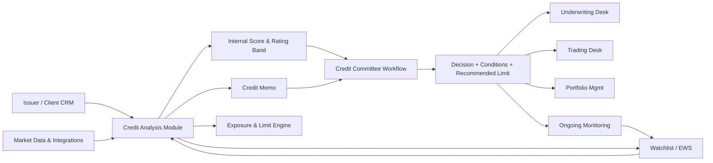

# Credit Analysis Module — Functional & Technical Specification

**Client:** Binary Capital Advisors LLP ("Binary Capital" / "Binary Bonds — A Division of Binary Capital")
**Module:** Credit Analysis (subsystem of the Binary Capital CRM)
**Document status:** Decision-grade spec for engineering & PM
**Version:** 1.0 (draft for review)
**Regulators in scope:** SEBI, RBI, FIMMDA; adjacent: PMLA (KYC/AML), DPDP Act 2023, IFRS 9 (Ind AS 109)

---

## 1. Purpose & Users

### 1.1 Purpose

The Credit Analysis module is the analytical core of Binary Capital's **credit-rating-advisory** and **high-yield-bond** practices, and the risk gate for its **corporate-bond underwriting**, **secondary-market trading/market-making**, and **bond portfolio management** desks. It must:

- Standardize how an analyst **spreads** an issuer's financials, computes a ratio library, and produces a **defensible internal credit score**.
- Map that internal score to **Indian rating-agency scales** (CRISIL, ICRA, CARE, India Ratings, Acuite, Infomerics, Brickwork) so the rating-advisory team can pre-position an issuer before agency management meetings.
- Support the **high-yield desk's** 8-step methodology (fundamental credit, relative value, PD/recovery/LGD, liquidity risk, concentration limits, stress testing) with quantitative inputs.
- Provide **exposure & limit management** and a **watchlist / early-warning** layer for the portfolio-management and trading desks.
- Generate a **committee-ready credit memo** and capture the credit-committee decision, conditions, and ongoing monitoring covenants.
- Produce an **Expected Credit Loss (ECL)** estimate suitable for a non-banking IB, scoped by **Ind AS 109 (IFRS 9 equivalent) measurement category** (§6): simplified approach for trade/fee receivables; three-stage general approach for bonds at amortized cost / FVOCI (off by default, auditor-confirmed); no separate ECL for FVTPL trading inventory (credit risk already in fair value); loan-commitment / financial-guarantee treatment for firm underwriting commitments.

### 1.2 Users & roles

| Role | Who at BC | Key actions |
|---|---|---|
| **Credit Analyst** | Junior/associate on Rati Ravi Kant's credit & risk team | Spread financials, run ratios, draft scorecard, draft memo |
| **Rating-Advisory Lead** | Senior credit SME | Select agencies, set target-rating strategy, review analyst draft, manage agency interaction log |
| **Credit Committee Member** | Rati Ravi Kant (chair), Shray Vasudeva, Shahrukh Sheikh + invited desk heads | Review, challenge, decide (approve / approve-with-conditions / decline / hold-for-more-info) |
| **Underwriting Desk** | Binary Bonds corporate-bond team | Consumes approved rating band & limit to price/place a deal |
| **Trading/Market-Making Desk** | Secondary-market team | Consumes internal score, watchlist flags, issuer/sector limits for two-way quoting and inventory |
| **Portfolio Manager** | Bond portfolio management team | Uses scores, ECL, concentration limits for allocation/rebalancing |
| **Compliance/KYC** | Back-office | KYC/AML status gate (PMLA), DPDP consent, SEBI/RBI disclosure checks |
| **Auditor (read-only)** | External/statutory auditor | Read access to scorecard provenance, committee minutes, ECL inputs |

> **Small-team RBAC note.** At BC's size (~6 SMEs + 2 directors per the brochure), one person routinely fills multiple roles (e.g., an analyst may also support the trading desk; a director may both chair and sponsor across different mandates). The RBAC model must therefore support **multi-role assignment per user** (a user can hold several roles simultaneously) **without weakening segregation-of-duty rules**: the controls `analyst-drafts-cannot-vote` and `sponsor-cannot-chair` are enforced on the *transaction/credit-file* level, not the user level — i.e., for any given credit file, the user who drafted it cannot vote in its committee decision, and the user who sponsored the deal cannot chair that sitting, even if that user holds the chair or voter role for other files. Multi-role assignment is a user-profile concern; SoD is a per-mandate enforcement concern, and the two must not be conflated.

### 1.3 Module relationships



---

## 2. Inputs

### 2.1 Financial statements (issuer-side)

- **Audited standalone + consolidated financials** (Balance Sheet, P&L, Cash Flow) — last **5 years + latest interim** (quarterly/half-yearly). Source: MCA filings, issuer-provided, stock-exchange disclosures (BSE/NSE for listed issuers).
- **Notes to accounts**: debt schedule (instrument-wise: NCDs, term loans, working capital, foreign currency debt), security structure, covenants, related-party, lease liabilities (Ind AS 116), contingent liabilities, derivatives/forex exposure.
- **CRA disclosures / rated-instrument details**: existing rated lines, ISINs, outstanding amount, coupon, maturity, security, ranking.
- **Banking arrangement**: working capital limits (fund-based/non-fund-based), CC/CD limits, utilization certificates, DP status.

### 2.2 External ratings & bureau

- **Existing external ratings** from all agencies with rationale PDFs, outlook (Stable/Positive/Negative/Credit Watch), and history (rating actions log).
- **Credit bureau**: CIBIL (TransUnion CIBIL), Experian, Equifax, CRIF High Mark — company credit reports (CCR) for borrower entity, group/associate entities, promoters/directors (individual CIR). Used to corroborate leverage and detect undisclosed borrowing.
- **Group/parent financials** where the issuer is a subsidiary/SPV (especially relevant for BC's project-finance SPV and real-estate issuer work).

### 2.3 Market & macro data

- **Bloomberg / Refinitiv (LSEG) / S&P Capital IQ**: peer comparables, sector spreads, CDS (where available), sovereign curve (G-Sec/SDL), FIMMDA benchmark yields, implied rating from spread.
- **NSE/BSE corporate bond trades** (time-stramped last traded price, YTM, modified duration) for secondary-market relative value.
- **RBI/FIMMDA**: G-Sec curve, MIBOR/MIFOR, OIS, repo rates, policy signals.
- **Macro**: sector PMI, IIP, WPI/CPI, sector credit growth (RBI Sectoral Deployment of Credit).

### 2.4 Qualitative factors

Captured as structured fields (not free text) for scoring:
- Promoter/management quality & track record, succession, governance (independent directors, audit committee).
- Business risk: market position, revenue stability/diversification, customer/supplier concentration, pricing power, barriers to entry, regulatory environment.
- Industry risk: cyclicality, growth outlook, competition intensity, government policy exposure.
- Project-specific (for SPV/project-finance credits): DSCR, debt tenure vs asset life, off-take agreements, EPC risk, O&M, counterparty (off-taker) credit.
- ESG & DPDP/reputation risk.
- KYC/AML status (PMLA), sanctions screening, adverse-media check.

### 2.5 Data quality & provenance

- Every numeric input stores **source, source document, captured-by, captured-at, currency, unit (₹ Cr vs ₹ L)**.
- **Currency normalization**: all amounts normalized to ₹ Cr INR; FX exposures flagged with original currency and hedging status.
- **Consolidation basis** flag (standalone vs consolidated) — ratios computed on both; consolidated preferred for group credits, standalone for SPV/project.
- **As-of date** per statement; staleness alerts if audited financials > 12 months old (interim > 1 quarter).

---

## 3. Ratio Library

All ratios are computed automatically from the spread financials with the formulas below; the analyst can override any computed value with a documented reason. **Benchmark ranges** are Indian-context guidelines for non-financial corporates (sector-specific overrides are mandatory for NBFCs, real estate, infra/SPV, and services — see §3.3).

### 3.1 Core ratio table

| Category | Ratio | Formula | Indian benchmark range (typical IG corporate) | Notes / BC usage |
|---|---|---|---|---|
| **Leverage** | Debt/Tangible Net Worth (Adjusted D/E) | Total Debt ÷ Tangible Net Worth | ≤ 1.0x (AAA/AA), 1.0–2.0x (A/BBB), >3.0x caution | Use *adjusted* net worth (net of intangibles, revalued assets, deferred tax). The scorecard also exposes **Debt/Equity (book)** = Total Debt ÷ Book Equity as a secondary, unadjusted ratio for transparency. For NBFCs use gearing = Debt/Equity with sector cap (RBI norms). |
| | Debt/EBITDA | Total Debt ÷ EBITDA (TTM) | ≤ 2.5x (AAA/AA), 2.5–4.0x (A/BBB), >5.0x caution | Primary agency leverage metric. Exclude working-capital debt for project cos where relevant. |
| | Net Debt/EBITDA | (Total Debt − Cash & equivalents) ÷ EBITDA (TTM) | ≤ 2.0x (AAA/AA), 2.0–3.5x (A/BBB) | Cash netted only if unrestricted & liquid. |
| **Coverage** | Interest Coverage (ICR) | EBIT ÷ Interest Expense (or EBITDA ÷ Interest) | ≥ 4.0x (AAA/AA), 2.0–4.0x (A/BBB), <1.5x distress | Use EBIT-based for conservatism; EBITDA-based for comparability to agency rationales. |
| | DSCR (project/SPV) | Cash Flow Available for Debt Service (CFADS) ÷ Total Debt Service (Principal + Interest) | ≥ 1.5x minimum, ≥1.75x target (infra), ≥1.4x (real estate) | Core to BC's project-finance & SPV structuring. Compute life-of-loan avg and worst-year. |
| **Liquidity** | Current Ratio | Current Assets ÷ Current Liabilities | ≥ 1.33 (AAA/AA), 1.0–1.33 (A/BBB) | Exclude current portion of long-term debt for true working-capital liquidity. |
| | Quick Ratio | (Current Assets − Inventory) ÷ Current Liabilities | ≥ 1.0 | Inventory net of advances for real estate. |
| | Cash Ratio | (Cash + Marketable Securities) ÷ Current Liabilities | ≥ 0.20 | Distress indicator; very low cash ratio triggers EWS. |
| **Profitability** | EBITDA Margin | EBITDA ÷ Revenue | Sector-dependent; >15% strong manufacturing, >30% strong services | Compare to 3-yr trend and peer median. |
| | Net Margin | Profit After Tax ÷ Revenue | >6% (AAA/AA), 3–6% (A/BBB) | |
| | ROE | PAT ÷ Avg Net Worth | ≥ 15% (AAA/AA), 10–15% (A/BBB) | Use average of opening/closing net worth. |
| | ROA | PAT ÷ Avg Total Assets | ≥ 6% (AAA/AA), 3–6% (A/BBB) | |
| | ROCE | EBIT ÷ Avg Capital Employed (Equity + Debt − Cash) | ≥ 14% (AAA/AA), 10–14% (A/BBB) | Capital-employed basis preferred for asset-light vs asset-heavy comparison. |
| **Activity** | Receivable Days | (Avg Trade Receivables ÷ Revenue) × 365 | Sector-dependent | Working-capital quality; rising DSO = EWS. |
| | Payable Days | (Avg Trade Payables ÷ Cost of Goods Sold/ Purchases) × 365 | Sector-dependent | Stretching payables = liquidity stress signal. |
| | Inventory Days | (Avg Inventory ÷ COGS) × 365 | Sector-dependent | Real estate: WIP/total cost. |
| | Asset Turnover | Revenue ÷ Avg Total Assets | ≥ 1.0 (asset-light), sector for asset-heavy | |
| **Bond-specific** | Funds From Operations / Total Debt (FFO/Debt) | FFO ÷ Total Debt, where FFO = PAT + Depreciation + Amortization + Deferred Tax + Other Non-cash Items (= CFO before working-capital changes) | ≥ 0.30 (AAA/AA), 0.15–0.30 (A/BBB) | Agency-standard cash-flow leverage. An optional **FFO-after-dividends / Debt** secondary metric (FFO − Dividends paid) ÷ Total Debt is tracked separately where dividend policy is material. |
| | Free Cash Flow / Debt | (CFO − CapEx) ÷ Total Debt | ≥ 0.20 (AAA/AA), 0.05–0.20 (A/BBB) | Sustainability of leverage; dividends are **not** subtracted (they are a financing decision, not operating cash generation). Negative FCF/Debt for >2 yrs = EWS. An optional **FCFE/Debt** = (CFO − CapEx − Dividends) ÷ Total Debt is tracked as a secondary dividend-aware metric. |

> **Formula conventions.** EBITDA = EBIT + Depreciation + Amortization. EBIT = PBT + Interest (gross). Use *TTM* (trailing twelve months) where interim available, else latest audited year. **CFO** is taken **before interest paid** — an analyst adjustment to the Ind AS 7 reported CFO (which typically classifies interest paid under financing or operating activities per the entity's accounting policy choice), used so that FFO and FCF reflect pure operating generation before financing costs. CapEx = purchase of fixed assets (incl. capitalized CWIP). **FFO = CFO before working-capital changes** = PAT + Depreciation + Amortization + Deferred Tax + Other Non-cash Items (normalized operating cash generation; rating-agency standard). **FCF = CFO − CapEx** (dividends excluded).

### 3.2 Additional sector metrics (BC-relevant)

- **NBFCs / HFCs**: Capital adequacy (CRAR ≥ 15% Tier-1 norms per RBI), GNPA/NNPA, net interest margin (NIM), cost-to-income, gearing (≤ 6–8x typical), asset-liability maturity profile (ALM gaps). *RBI prudential norms govern.*
- **Real estate**: Debt/Equity (≤ 1.0–1.5x), interest coverage (≥ 2.0x), collection efficiency (% of bookings collected), land bank quality, project IRR, DSCR per project, inventory days.
- **Infrastructure / SPV**: DSCR (avg & worst-year), Debt Service Coverage over concession, traffic/volume ramp vs appraisal, O&M cost variance, debt tenure vs concession remaining, counterparty (off-taker/government) credit.
- **Manufacturing**: capacity utilization, power/fuel cost ratio, forex exposure hedge ratio.
- **Services**: revenue per employee, EBITDA per employee, client concentration.

### 3.3 Sector override policy

Each ratio's benchmark range is parameterized by **sector code** (mapped to RBI Sectoral Deployment + NIC code). The scorecard (§4) pulls sector-adjusted thresholds; deviations from base ranges are logged and require no analyst override (they are system policy).

---

## 4. Credit Scoring Framework

### 4.1 Weighted scorecard

A **100-point scorecard** combining quantitative and qualitative factors. Weights are configurable by sector template and reviewed annually by the Credit Committee. Default weights (non-financial corporate):

| Factor group | Weight | Sub-factors |
|---|---|---|
| **Business risk** | 25% | Market position (10%), Industry risk (8%), Revenue stability/diversification (7%) |
| **Financial risk — Leverage** | 20% | Net Debt/EBITDA (10%), Debt/Equity adjusted (5%), FFO/Debt (5%) |
| **Financial risk — Coverage & Cash flow** | 20% | Interest Coverage (8%), DSCR (7% if project/SPV else reallocated), FCF/Debt (5%) |

> **DSCR weight reallocation (non-project / non-SPV issuers).** DSCR is meaningful only for project-finance / SPV credits. For all other corporates the 7% DSCR weight is **reallocated** — default rule: **+4% to Interest Coverage (→ 12%) and +3% to FCF/Debt (→ 8%)**. This reallocation is **template-configurable** via `ScorecardTemplate.factor_weights_json` (§13) so the Credit Committee can change the split per sector template (e.g., services may weight FCF/Debt more heavily) without code changes. The effective weight set used is stored on every `Scorecard` for audit.
| **Liquidity** | 10% | Current ratio (4%), Cash ratio (3%), Utilization of working-capital limits (3%) |
| **Profitability & Efficiency** | 10% | ROCE (4%), EBITDA margin trend (3%), Receivable/Inventory days trend (3%) |
| **Management & Governance** | 10% | Promoter track record (5%), Board/governance quality (3%), KYC/AML clean (2%) |
| **External corroboration** | 5% | Existing agency ratings alignment (3%), Bureau/CCR alignment (2%) |

Each sub-factor scored **1–5** (5 = strongest, 1 = weakest) against its sector-adjusted benchmark. The total score is computed by the explicit normalization formula:

> **total_score = Σᵢ [ weightᵢ × (sub_scoreᵢ / 5) ] × 100**, range **0–100**, where `sub_scoreᵢ ∈ {1, 2, 3, 4, 5}` and `weightᵢ` is the sub-factor's fractional weight (e.g., 0.10), with Σ weights = 1.0. A sub-factor scored 5 at weight 0.10 contributes `0.10 × (5/5) × 100 = 10.0` points; scored 3 it contributes `0.10 × (3/5) × 100 = 6.0` points.

**Example**: Net Debt/EBITDA sub-factor (weight 10%, i.e., 10 pts max at score 5):
- Score 5 if ≤ 1.5x, Score 4 if 1.5–2.0x, Score 3 if 2.0–3.0x, Score 2 if 3.0–4.0x, Score 1 if > 4.0x (manufacturing template).

### 4.2 Score-to-band mapping (internal)

| Internal score | Internal band | Notional grade | Indicative 1-yr PD |
|---|---|---|---|
| 85–100 | **BC-1** | Excellent | < 0.05% |
| 70–84 | **BC-2** | Strong | 0.05–0.15% |
| 55–69 | **BC-3** | Adequate | 0.15–0.50% |
| 40–54 | **BC-4** | Below average | 0.50–1.50% |
| 25–39 | **BC-5** | Weak / sub-IG | 1.50–10.00% |
| 0–24 | **BC-6** | Distressed / near-default | > 10.00% |

### 4.3 Mapping to Indian agency scales

See §5 for the full rating-scale mapping table. The internal band maps to a *target external rating* the rating-advisory team will aim for, and to a *recommended action* for underwriting/trading/PM desks (see §8 limits and §9 workflow).

### 4.4 Scorecard governance

- Every sub-factor score stores **computed input value, benchmark used, score assigned, assigned-by, justification**.
- Analyst overrides of any sub-factor score require a free-text rationale and are flagged in committee view.
- Scorecard templates are versioned; historical memos reference the template version used (audit trail).

---

## 5. Indian Rating Agency Scale Mapping

Long-term issuer/instrument rating scales (investment grade AAA–BBB; sub-investment grade BB–D). BC uses a **normalized internal scale** (BC-1 … BC-6) bridging all agencies. NBFC/corporate issuer scales shown; agency short-term scales (A1+/A1/A2/A3/A4/D) tracked separately for CP/short-tenor instruments.

| Internal band | CRISIL | ICRA | CARE | India Ratings (Ind Ra) | Acuite | Infomerics | Brickwork (BWR) | Notional grade | Indic. 1-yr PD |
|---|---|---|---|---|---|---|---|---|---|
| BC-1 | AAA | AAA | AAA | IND AAA | AAA | AAA | BWR AAA | Highest safety | < 0.05% |
| BC-1 | AA+ | AA+ | AA+ | IND AA+ | AA+ | AA+ | BWR AA+ | High grade | < 0.07% |
| BC-2 | AA | AA | AA | IND AA | AA | AA | BWR AA | High grade | 0.07–0.10% |
| BC-2 | AA− | AA− | AA− | IND AA− | AA− | AA− | BWR AA− | High grade | 0.10–0.15% |
| BC-3 | A+ | A+ | A+ | IND A+ | A+ | A+ | BWR A+ | Upper-medium | 0.15–0.25% |
| BC-3 | A | A | A | IND A | A | A | BWR A | Upper-medium | 0.25–0.35% |
| BC-3 | A− | A− | A− | IND A− | A− | A− | BWR A− | Upper-medium | 0.35–0.50% |
| BC-4 | BBB+ | BBB+ | BBB+ | IND BBB+ | BBB+ | BBB+ | BWR BBB+ | Lower-medium | 0.50–0.75% |
| BC-4 | BBB | BBB | BBB | IND BBB | BBB | BBB | BWR BBB | Lower-medium | 0.75–1.00% |
| BC-4 | BBB− | BBB− | BBB− | IND BBB− | BBB− | BBB− | BWR BBB− | Lower-medium | 1.00–1.50% |
| BC-5 | BB+ | BB+ | BB+ | IND BB+ | BB+ | BB+ | BWR BB+ | Speculative | 1.50–2.50% |
| BC-5 | BB | BB | BB | IND BB | BB | BB | BWR BB | Speculative | 2.50–4.00% |
| BC-5 | BB− | BB− | BB− | IND BB− | BB− | BB− | BWR BB− | Speculative | 4.00–6.00% |
| BC-5 | B+ | B+ | B+ | IND B+ | B+ | B+ | BWR B+ | Highly speculative | 6–10% |
| BC-6 | B / B− | B / B− | B / B− | IND B / B− | B / B− | B / B− | BWR B / B− | Highly speculative | 10–20% |
| BC-6 | C | C | C | IND CCC | C | C | BWR C | Extremely speculative | 20–50% |
| BC-6 | — | — | — | IND CC | — | — | — | Extremely speculative | 30–40% |
| BC-6 | — | — | — | IND C | — | — | — | Near-default | 40–50% |
| BC-6 | D | D | D | IND D | D | D | BWR D | Default | 100% (in default) |

> **Notes.** (1) Outlook and Credit Watch modifiers (Stable/Positive/Negative/Developing, Watch-Developing/Negative/Positive) are tracked as attributes, not bands. (2) Acuite merged with SMERA; both names may appear. (3) Brickwork (BWR) is winding down per the **SEBI November 2022 order** (SEBI barred BWR from fresh mandates via an interim, then confirmatory, order) — BC may still encounter legacy BWR ratings; map for completeness but flag. (4) **Sub-IG grade taxonomy differs by agency** and is *to confirm* against each agency's current published rating-scope document: CRISIL, ICRA, CARE, Acuite, and Infomerics use **C** then **D** on long-term scales (no CC/CCC grade). India Ratings & Research (Fitch affiliate) uses **three** distinct sub-IG non-default grades — **IND CCC**, **IND CC**, **IND C** — before IND D. Brickwork uses **BWR C** then **BWR D**. The table above splits the speculative grade rows accordingly (em-dash = grade not used by that agency). (5) PD values are indicative internal estimates, *to confirm* against agency-published default studies (CRISIL/ICRA/CARE annual default and transition studies) and BC's own historical experience once enough data accrues.

---

## 6. PD / LGD / EAD & Expected Credit Loss (Ind AS 109 / IFRS 9)

### 6.1 Applicability & scope by measurement category

Binary Capital is a **non-banking investment-banking / advisory LLP**, not a scheduled commercial bank. **Ind AS 109 (the IFRS 9 equivalent applied in India)** expected-credit-loss accounting applies only to **financial assets that BC holds on its own balance sheet** that generate credit risk. Scope is determined by the instrument's **Ind AS 109 measurement category**, not by desk:

| # | Exposure / instrument | Ind AS 109 measurement category | ECL treatment |
|---|---|---|---|
| 1 | **Trade & fee receivables** (advisory fees overdue, broker commissions) | Trade/fee receivables | **Simplified approach** — lifetime ECL via the provisioning matrix in §6.3 (no Stage 1/2/3 staging). |
| 2 | **Bonds held to collect** (managed portfolios held at Amortized Cost, or FVOCI where BC has elected the FVOCI election) | Amortized Cost or FVOCI | **Three-stage general approach** (Stage 1 = 12-month ECL; Stage 2 = lifetime ECL on significant-credit-risk increase; Stage 3 = lifetime ECL on credit-impaired). **Off by default**; *to confirm* with BC's statutory auditor which bond positions are held at AC vs FVOCI vs FVTPL and whether staging is required. |
| 3 | **Trading / market-making inventory** (corporate bonds held for trading or market-making) | FVTPL | **No separate ECL** — credit risk is already reflected in fair value through P&L. The module tracks **notional credit risk** (PD/LGD/EAD, band, sector) on these positions **for limit and concentration purposes only**, not as an ECL provision. |
| 4 | **Firm underwriting commitments / devolving risk** | Loan commitment / financial-guarantee (Ind AS 109) read with IAS 37 contingent-liability election | **ECL on the commitment** using the loan-commitment or financial-guarantee treatment under Ind AS 109 (and the IAS 37 contingent-liability election where applicable). CCF per §6.2. **To confirm** with auditor which election BC applies and whether commitments are within Ind AS 109 scope or disclosed under IAS 37. |

It does **NOT** apply to:
- Pure **advisory mandates** (no balance-sheet exposure) — the ECL engine is not invoked for rating-advisory clients with no BC exposure.
- **Client/investor positions** BC does not hold on its own book — these are tracked as portfolio analytics, not BC's own ECL.

> **Methodology default.** The simplified provisioning matrix (§6.3) is the default for trade/fee receivables. The three-stage general approach for AC/FVOCI bonds is **off by default** and is enabled per-portfolio only after auditor confirmation. The previous draft's claim that the simplified approach covers **held-for-trading inventory** is **dropped** — FVTPL inventory carries no separate ECL (credit risk is in fair value); it is tracked for limits only.

### 6.2 ECL formula

**ECL = PD × LGD × EAD**

- **PD (Probability of Default)**: derived from internal band (§4.2) mapped to a 1-year PD; for multi-year instruments, PD scaled using a term structure (e.g., cumulative PD via constant hazard: PD(T) = 1 − (1 − PD₁)^T), with sector and tenor adjustment.
- **LGD (Loss Given Default)**: recovery-based. Default assumption **LGD = 1 − Recovery Rate**. Recovery Rate defaults by seniority/security: Senior secured ~ 65% (RR 65%, LGD 35%); Senior unsecured ~ 40% (LGD 60%); Subordinated ~ 20% (LGD 80%). Sector/security-specific overrides from credit memo. For G-Secs/SDLs/sovereign: LGD ≈ 0 (treat as risk-free for ECL; sovereign ceiling applied).
- **EAD (Exposure at Default)**: outstanding principal + accrued interest + undrawn commitment × CCF (Credit Conversion Factor). For bonds held: face × dirty-price factor. For underwriting commitments: full commitment amount × CCF (default 100% for firm underwriting, ~50% for best-efforts).
- **CCF defaults**: firm underwriting/devolving 100%; best-efforts placement 50%; undrawn working-capital lines 30–50% (RBI-aligned).

### 6.3 Simplified ECL provisioning matrix (trade receivables / fee receivables)

| Aging bucket | Provision % (default) |
|---|---|
| Not due | 0.5% |
| 1–30 days overdue | 1% |
| 31–60 days | 3% |
| 61–90 days | 10% |
| 91–180 days | 25% |
| > 180 days | 50% (specific + matrix) |

Overlaid by **specific provision** when a counterparty enters BC-5/BC-6 or is on the watchlist with a default flag.

### 6.4 High-yield desk usage

For the high-yield desk (BC-5 issuers), the PD/LGD/EAD engine doubles as the **credit-spread justification** tool: expected loss = PD × LGD; the desk prices a spread above risk-free that exceeds expected loss plus a risk-adjusted return margin (the "200–500 bps premium over IG" the brochure cites should be reconciled against PD × LGD + liquidity premium + capital charge). Stress PD (downturn LGD) should be used for the spread floor.

---

## 7. Exposure & Credit-Limit Management

### 7.1 Exposure types tracked

| Exposure type | Definition | Source |
|---|---|---|
| **Underwriting commitment** | Firm/best-efforts amount on a live mandate | Underwriting desk |
| **Trading inventory** | Net long/short corporate bond position by issuer | Trading desk (BSE/NSE feeds) |
| **Market-making outstanding** | Two-way quotes outstanding / inventory held for MM | Trading desk |
| **Portfolio holding** | Bonds held in managed portfolios (per client mandate) | PM desk |
| **Counterparty / settlement** | Exposure to brokers, CCIL/ICCL, custodians (settlement risk) | Ops |
| **Advisory receivable** | Outstanding fee from issuer (credit exposure to issuer) | Finance |

### 7.2 Limit framework

- **Issuer limit** (single-name): max exposure as % of BC's regulatory capital / notional cap. Default: single corporate issuer ≤ X% of net worth — *exact % to confirm* against BC's board-approved risk policy and any RBI prudential exposure norms applicable to its registration category.
- **Group limit**: aggregate across entities sharing a promoter/group (group exposure ≤ e.g. 1.5x single-issuer limit).
- **Sector concentration limit**: e.g., NBFC sector ≤ 25% of total exposure; real estate ≤ 20%; infra ≤ 25% — *values to confirm with risk policy*.
- **Rating-band limit**: sub-IG (BC-5) exposure ≤ e.g. 15% of total; BC-6 ≤ 5% — *to confirm*.
- **Tenor limit**: exposure > 10-yr tenor ≤ cap; high-yield max tenor ≤ 5–7 yr.
- **Counterparty (broker/settlement) limit**: per broker, per CCIL/ICCL.

### 7.3 Utilization & pre-trade checks

- Real-time **utilization dashboard**: each limit shows Approved, Used, Available, % utilized, headroom.
- **Pre-trade check API**: before any new bond trade/underwrite/PM allocation, the module validates against all applicable limits and returns approve/decline/breach-escalation. Breaches require Credit Committee override (logged).
- **Netting & collateral**: where collateral/margin posted (e.g., market-making), net exposure computed.

#### 7.3.1 Pre-trade check API — contract sketch

```
POST /api/v1/pretrade/check
Request:
{
  "issuer_id":        "string",
  "exposure_type":    "underwriting | trading_inventory | market_making | portfolio_holding | counterparty | advisory_receivable",
  "amount":           "decimal (₹ Cr)",
  "tenor":            "integer (months, nullable for short-dated)",
  "instrument":       "NCD | CP | G-Sec | SDL | structured-bond | loan-commitment | receivable"
}

Response (200):
{
  "limits_evaluated": [
    {
      "scope":           "issuer | group | sector | band | tenor | counterparty",
      "scope_ref":       "string",
      "used_before":     "decimal",
      "used_after":      "decimal",
      "limit_value":     "decimal",
      "utilization_pct_before": "decimal",
      "utilization_pct_after":  "decimal",
      "headroom_after":  "decimal",
      "breached":        "boolean"
    }
  ],
  "decision":          "approve | decline | breach",
  "breach_reason":     "string (present when decision != approve)",
  "committee_override_required": "boolean",
  "checked_at":        "ISO-8601 timestamp",
  "checked_by":        "user_id"
}
```

Decision semantics: `approve` = all limits within policy; `decline` = hard policy block (e.g., BC-6 issuer when band-limit = 0); `breach` = a limit is exceeded but eligible for Credit Committee override (override is logged with rationale and approver).

#### 7.3.2 `open_questions` schema

Each open question / placeholder is persisted as a structured record so the spec's "to confirm" items are trackable to closure rather than buried in prose:

```
OpenQuestion:
  id:            string (slug, e.g. "bc-registration-category")
  area:          "limits | ecl | scorecard | pd | authority | bwr | feeds | governance | other"
  description:   string
  placeholder_value: string  (current assumption baked into the spec)
  owner:         string  (named role/individual)
  due:           date (ISO-8601, nullable)
  status:        "open | in_progress | confirmed | superseded"
  resolution:    string (nullable; populated when status = confirmed)
  resolved_at:   timestamp (nullable)
```

The §15 open-questions list is the seed population of this entity.

---

## 8. Watchlist & Early-Warning Signals

### 8.1 Watchlist tiers

| Tier | Trigger | Action |
|---|---|---|
| **Watchlist — Yellow** | One or more EWS; review at next monthly monitoring | Enhanced monitoring (monthly ratio refresh), analyst note |
| **Watchlist — Amber** | Material EWS or external rating downgrade / negative outlook | Review within 5 working days; committee notification; reduce/exit recommendation |
| **Watchlist — Red** | Default imminent, severe breach, BC-6 | Immediate committee; freeze new exposure; workout/recovery plan |

### 8.2 Early-warning signals (EWS)

**Quantitative (auto-detected from refreshed financials/market data):**
- Net Debt/EBITDA deteriorates by > 0.75x in one period or breaches sector threshold.
- Interest Coverage falls below 1.5x or drops > 25% YoY.
- Negative Free Cash Flow for 2 consecutive years.
- Cash ratio < 0.10; current ratio < 1.0.
- Receivable days rising > 30% over 2 years (working-capital stress).
- Working-capital limit utilization > 90% sustained.
- GNPAs rising > 100 bps in one period (for NBFC issuers).
- Bond price drop > 10% in 5 sessions or YTM blow-out > 200 bps vs peer (market signal).
- Implied rating (from spread) 2+ notches below external rating (rating lag).

**Qualitative / event-based (captured by analyst or news feed):**
- External rating downgrade / negative outlook / credit watch.
- Promoter exit, key management change, pledged shares > 50% of holding.
- Delay in interest/principal payment, covenant breach, debt restructuring (CDR/NCLT/IBC admission).
- KYC/AML alert, adverse media, regulatory action (SEBI/RBI/ED).
- Delayed financial reporting (> 6 months for audited), auditor resignation/qualification.
- Sector stress event (e.g., sector-wide NBFC liquidity, real estate RERA action).

### 8.3 Monitoring cadence

| Internal band | Routine refresh | Watchlist refresh |
|---|---|---|
| BC-1 / BC-2 | Quarterly | Monthly |
| BC-3 | Quarterly | Bi-weekly |
| BC-4 | Monthly | Weekly |
| BC-5 (high-yield) | Monthly + market daily | Weekly + market daily |
| BC-6 | Continuous | Continuous |

---

## 9. Credit-Committee Workflow

```mermaid
flowchart TD
    A[Analyst drafts credit file: spread + ratios + scorecard + memo] --> B[Rating-Advisory Lead review]
    B -->|revision| A
    B --> C[Submit to Credit Committee agenda]
    C --> D{Committee quorum?}
    D -->|no| Wait[Wait for next sitting]
    D -->|yes| E[Committee meeting: challenge, discussion]
    E --> F{Decision}
    F -->|Approve| G[Approved rating band + recommended limit + conditions]
    F -->|Approve with conditions| H[Conditions logged; analyst tracks closure]
    F -->|Hold for more info| I[Analyst gathers; resubmit]
    F -->|Decline| J[Decline logged; exposure freeze]
    G --> K[Rating recommendation to agency (advisory) / desk instructions (underwriting/trading/PM)]
    H --> K
    K --> L[Ongoing monitoring: periodic refresh + EWS]
    L --> M{EWS triggered?}
    M -->|yes| N[Watchlist entry → committee re-review]
    M -->|no| L
    N --> O{Re-rating / limit change?}
    O -->|yes| P[Re-run committee mini-cycle]
    O -->|no| L
```

### 9.1 Workflow states

1. **Draft** — analyst owns.
2. **Lead Review** — rating-advisory lead.
3. **Committee Agenda** — queued for next sitting (sittings: weekly, or ad-hoc by chair).
4. **Committee Deliberation** — discussion recorded (minutes).
5. **Decision** — Approve / Approve-with-conditions / Hold / Decline (with rationale).
6. **Post-decision** — rating recommendation logged; limit set; conditions tracked to closure.
7. **Monitoring** — periodic refresh; EWS-driven re-review.

### 9.2 Quorum & authority matrix

- **Quorum**: minimum 3 members including chair (Rati Ravi Kant) + at least one of Shray Vasudeva / Shahrukh Sheikh.
- **Authority by limit size** (single transaction): ≤ ₹50 Cr — committee with chair + 1; ₹50–250 Cr — full quorum; > ₹250 Cr — full quorum + documented board ratification. *Thresholds to confirm with BC governance policy.*
- **Segregation**: the analyst drafting cannot vote; the desk head sponsoring a deal cannot chair.

### 9.3 Audit trail

Every state transition, vote, comment, condition, override, and document version is immutable, time-stamped, user-attributed, and exportable for SEBI/RBI inspection and statutory audit.

---

## 10. Outputs

| Output | Description | Consumer |
|---|---|---|
| **Credit Memo (PDF + structured)** | Executive summary, business & financial risk analysis, ratio table with trends, scorecard, peer comparison, rating-band rationale, recommended limit, conditions, monitoring plan. Multi-section template with sections matching agency rationale style. | Committee, issuer (sanitized version), file |
| **Internal Score** | 0–100 score + band (BC-1…BC-6) + sub-factor breakdown | All desks |
| **Recommended Rating Band** | Target external rating (e.g., "CRISIL AA- / equivalent") + agency-specific recommendations + rating-advisory action plan | Rating-advisory team |
| **Recommended Limit** | Issuer/group/sector limit numbers + tenor + instrument types | Underwriting, Trading, PM |
| **Conditions / Covenants** | Structured list (e.g., "Maintain Net Debt/EBITDA < 3.5x", "Quarterly financials within 45 days", "Limit security toexclusive first charge on receivables"), each with tracking cadence & owner | Monitoring desk |
| **ECL Output** | PD, LGD, EAD, ECL amount per exposure; aggregated ECL for reporting | Finance, audit |
| **Watchlist Entry** | Tier, triggers, action plan, review date | Credit/risk team |
| **Agency Interaction Log** | Agency, date, contact, discussion points, documents shared, outcome (rating assigned/outlook) | Rating-advisory team |

---

## 11. Data Sources & Integrations

| Source | Purpose | Integration pattern |
|---|---|---|
| **Bloomberg** (Terminal/API) | Peer comps, spreads, sovereign curve, implied ratings, news | API (bql/blpapi) or scheduled export; market-data entitlement per named user |
| **Refinitiv / LSEG Workspace** | Bond terms, ratings, fundamental data, Eikon feeds | API + feed; alternate to Bloomberg |
| **S&P Capital IQ** | Deep fundamental time series, peer screening, transaction data | API + bulk |
| **CIBIL (TransUnion)** | Company credit reports, individual CIRs (promoters) | Bureau API (per RBI/PMLA permitted use); consent-gated |
| **Experian / Equifax / CRIF High Mark** | Bureau corroboration, fraud/identity | Bureau API; consent-gated |
| **Rating-agency feeds** (CRISIL, ICRA, CARE, India Ratings, Acuite, Infomerics) | Rating actions, rationales, outlook, default studies | Scraped portal / licensed feed where available; *to confirm* licensing per agency |
| **MCA (Ministry of Corporate Affairs)** | Audited financials, charges, directorships, filings (XBRL) | MCA21 portal API / bulk extract; fee per fetch |
| **BSE / NSE** | Listed-issuer disclosures, bond trades (last traded price, YTM), corporate actions | Exchange data feeds / APIs |
| **RBI / FIMMDA** | G-Sec/SDL curve, policy rates, MIBOR/MIFOR, sectoral credit data | Public feeds / scrape |
| **News / adverse-media** | EWS qualitative triggers (Reuters, ET, Moneycontrol, SEBI/RBI orders) | News API + NLP classifier for entity/event tagging |
| **Internal CRM** | Issuer/investor master, KYC/AML status, deal pipeline | Direct DB / internal API |
| **Trading & settlement systems** (BSE/NSE front-end, CCIL/NDS-OM, ICCL, CDSL/NSDL demat) | Live positions, settlement status, exposure | Integration with BC's OMS/EMS |

**Integration notes:**
- **Entitlement & licensing**: Bloomberg/Refinitiv/Capital IQ entitlements are per-seat and contractually restricted; the module must honor entitlement and not redistribute raw data — only derived analytics exposed to un-entitled users.
- **Bureau consent**: every bureau pull requires a captured PMLA-compliant consent record (DPDP Act 2023 alignment); pulls are logged for audit.
- **MCA charges & directorships**: used to detect undisclosed related-party debt and group complexity (material for rating-advisory pre-assessment).
- **Fallback order**: Bloomberg → Refinitiv → Capital IQ → MCA, for financials; multiple sources reconciled with variance flag > 2%.

---

## 12. Screen / UX Concepts

### 12.1 Analyst Workspace (primary screen)

- **Left rail**: issuer search / recent / watchlist; pipeline of credit files by status (Draft / Review / Committee / Monitoring).
- **Top bar**: active issuer header (name, group, sector, existing external ratings chips, internal band chip, KYC status chip).
- **Main canvas — tabbed**:
  - **Overview**: snapshot KPIs (key ratios, score, band, limit utilization, EWS count).
  - **Financials (spreading grid)**: multi-year spreadsheet (5yr + interim) with formulas auto-computed; cells color-coded vs benchmark; override with reason inline.
  - **Ratios**: ratio table with 5-yr trend mini-charts, sector benchmark overlay, flags.
  - **Scorecard**: factor-by-factor card view, scores 1–5, weights, computed vs assigned, justification fields, total score & band.
  - **Ratings**: existing external ratings + rationale highlights, outlook history, target-rating recommendation, agency interaction log.
  - **Exposure & Limits**: limit utilization tiles by issuer/group/sector/band.
  - **EWS / Watchlist**: active signals list with severity.
  - **Memo**: structured memo editor (sections pre-filled from above tabs), version history.
  - **Documents**: source documents (financials PDFs, agency rationales, bureau reports) with provenance.
  - **Audit log**: every change.

### 12.2 Financial-Spreading Grid

- Excel-like grid: rows = line items (revenue, EBITDA, EBIT, PAT, debt, cash, receivables, etc.), columns = periods (FYxx, FYxx+1, …, interim TTM).
- Cells are formula-driven (e.g., EBITDA = EBIT + D&A) with traceability to source statements.
- Auto-mapping from MCA/imported PDF XBRL or mapped CSV; analyst verifies.
- Variance highlighting: cell turns amber if YoY change > sector-typical threshold, red if benchmark breach.
- "Consolidation toggle" standalone/consolidated; "currency toggle" ₹ Cr/₹ L with red flags on mixing.

### 12.3 Scorecard View

- Vertical list of factor groups (§4.1) with sub-factors; each shows computed input, benchmark band, score (1–5 stars or dots), weight, points contributed.
- Total score gauge (0–100) with band pointer and target-rating mapping chip.
- "Run scenario" button: analyst can flex an input (e.g., simulate +₹100 Cr debt) and see score impact (sensitivity).

### 12.4 Committee View

- Agenda of pending files with one-line summary, proposed rating band, proposed limit, risk highlights.
- Per-file: side-by-side memo + scorecard + key ratios + EWS; voting buttons; comment thread; decision selector with mandatory rationale for conditions/decline.
- Conditions tracker post-decision with owner + due date + closure state.
- Export to PDF minutes.

### 12.5 PM / Trading desk views

- Portfolio heatmap by issuer (band) × sector × tenor, sized by exposure.
- Watchlist ticker with severity color; click-through to credit file.
- Pre-trade limit-check widget: enter proposed trade → returns limit impact and approve/decline.

### 12.6 Non-functional UX requirements

- **Role-based access**: views and actions gated by role (§1.2); KYC-AML gate blocks analysis-ready status until KYC clean.
- **Mobile**: committee view and watchlist read-only on mobile for directors; full analyst workspace desktop-first.
- **Performance**: spreading grid renders 5yr × ~120 line items < 1s; scorecard recompute < 500ms.
- **Accessibility**: WCAG 2.1 AA target.
- **Localization**: INR, Indian date format (DD-MMM-YYYY), English (Hindi labels optional later).

---

## 13. Data Model (core entities — summary)

| Entity | Key fields |
|---|---|
| `Issuer` | id, legal_name, group_id, sector_code, legal_form, CIN/LLPIN, KYC_status |
| `CreditFile` | id, issuer_id, status, template_version, created_by, created_at |
| `FinancialStatement` | file_id, period, basis (standalone/consolidated), source, source_doc_ref, as_of_date |
| `LineItem` | statement_id, code, label, value, currency, unit |
| `Ratio` | file_id, ratio_code, period, value, benchmark, breach_flag, override, override_reason |
| `Scorecard` | file_id, template_version, total_score, band, computed_at |
| `ScoreFactor` | scorecard_id, factor_code, sub_factor, input_value, benchmark, score, weight, points, justification |
| `ExternalRating` | issuer_id, agency, instrument, rating, outlook, watch, rated_date, rationale_doc_ref |
| `AgencyInteraction` | issuer_id, agency, date, contact, summary, outcome |
| `Exposure` | issuer_id, type, amount, currency, tenor, instrument, source_desk, as_of |
| `Limit` | scope (issuer/group/sector/band/tenor), limit_value, used, available, policy_ref |
| `WatchlistEntry` | issuer_id, tier, trigger_refs, action_plan, review_date, owner |
| `EWS` | issuer_id, signal_code, severity, detected_at, source, acknowledged_by |
| `CommitteeMeeting` | id, date, chair, quorum, agenda, minutes_doc_ref |
| `CommitteeDecision` | file_id, meeting_id, decision, conditions_json, recommended_rating_band, recommended_limit, voters |
| `ECL` | exposure_id, PD, LGD, EAD, ECL_amount, method (simplified/staged), computed_at, assumptions_json |
| `AuditEvent` | entity, action, before, after, user, timestamp (immutable) |
| `ScorecardTemplate` | template_id, version, sector_code, factor_weights_json, benchmark_overrides_json, approved_by, approved_at, status (draft/approved/retired) |
| `SectorCode` | sector_code, nic_code, rbi_sectoral_deployment_code, label, parent_sector_code |

---

## 14. Compliance, Security & Governance

- **PMLA / KYC-AML**: KYC status is a hard gate — a credit file cannot reach Committee Agenda without KYC clean; bureau pulls require consent record.
- **DPDP Act 2023**: personal data (promoter CIRs) minimized, purpose-limited, retention tied to data-retention policy (Privacy Policy: contact-form data ~2 yrs — *confirm* retention for credit files which should be longer, e.g., 7–10 yrs for regulatory/audit). Data principal rights (access, correction, grievance) supported.
- **SEBI / RBI**: audit trail immutable; exportable for inspection. Any activity requiring SEBI registration (merchant banker / investment adviser / broker) gated by registration-number capture in firm profile — *registration category and numbers to confirm* (BUSINESS_CONTEXT flags this as undisclosed).
- **Ind AS 109 (IFRS 9 equivalent)**: ECL methodology and assumptions documented and auditable; assumption changes versioned. ECL scope is by measurement category (§6.1): simplified for trade/fee receivables; three-stage general approach for AC/FVOCI bonds (off by default, auditor-confirmed); no separate ECL for FVTPL trading inventory; loan-commitment / financial-guarantee treatment for firm underwriting.
- **Security**: encryption at rest (AES-256) and in transit (TLS 1.2+); RBAC + attribute-based access for sensitive fields (promoter CIRs, bureau data); field-level audit; segregation of duties (analyst cannot vote; sponsor cannot chair).
- **Data residency**: Indian personal and financial data resident in India; cloud region ap-south-1 (Mumbai) preferred. *To confirm* vendor selection.
- **Vendor concentration**: avoid single-vendor lock-in for market data (Bloomberg vs Refinitiv vs Capital IQ fallback).

---

## 15. Assumptions & Open Questions

See `open_questions` in the returned schema. Key assumptions baked into this spec:

1. BC's regulatory category (merchant banker / stockbroker / investment adviser / NBFC) is **not yet disclosed**; limits and ECL applicability assume an **IB/advisory + market-maker** profile with on-balance-sheet trading inventory and underwriting commitments. Confirm registration category.
2. **ECL scope by measurement category** (§6.1): simplified approach is the default for trade/fee receivables; the three-stage general approach for AC/FVOCI bonds is optional and off; FVTPL trading inventory carries no separate ECL; firm underwriting uses loan-commitment / financial-guarantee treatment. Confirm with BC's statutory auditor which bond positions are held at AC vs FVOCI vs FVTPL, and which Ind AS 109 / IAS 37 election applies to underwriting commitments.
3. **Scorecard weights and benchmark ranges** are sensible defaults; must be calibrated to BC's portfolio experience and validated with at least one cycle of historical back-testing once data is available.
4. **Indicative PDs** per band are placeholders pending calibration against agency default/transition studies and BC's own observed defaults.
5. **Limit percentages** (issuer, group, sector, band, tenor) need BC's board-approved risk policy values.
6. **Authority thresholds** (₹50 Cr / ₹250 Cr) are placeholders; confirm with BC governance.
7. **Brickwork (BWR)** mapping included for legacy completeness, but BWR is wound down per the **SEBI November 2022 order** (interim then confirmatory order barring BWR from fresh mandates) — no fresh ratings since; flag in UI.
8. **Rating-agency feed licensing** per agency — confirm which agencies offer licensed programmatic feeds vs requiring manual rationale capture.

---

*End of Credit Analysis Module Spec.*
