# Domain & Data Model — Binary Capital / Binary Bonds CRM

> **Scope.** This document defines the persistent data model for the CRM that serves **Binary Capital Advisors LLP** ("Binary Capital") and its bond-markets division **Binary Bonds — A Division of Binary Capital** (one operating entity, two branded practice lines). The CRM must model a two-sided book — **issuers** raising debt and **investors** allocating to it — plus intermediaries, the full mandate lifecycle across corporate-bond underwriting, G-Sec auctions, rating advisory, M&A, project finance, structured finance, and ECM/DCM, **and** a credit-analysis / financial-modeling subsystem (because Rati Ravi Kant's desk performs credit work internally as well as rating-agency coordination).
>
> **Stack assumption.** PostgreSQL 15+ (JSONB, generated columns, exclusion constraints, `uuid`, `citext`, `pg_trgm`). Read notes on open questions if a different primary store is chosen. All identifiers are `UUID v7` (time-ordered) unless noted. All monetary amounts are `numeric(18,4)` in INR unless a `currency_code` column overrides (multi-currency for ADR/GDR / cross-border ECM mandates). All timestamps are `timestamptz` stored as IST (`Asia/Kolkata`); store UTC and render IST — see §5.
>
> **Compliance posture baked into the schema.** PMLA (KYC/AML with CDD/EDD, beneficial-ownership thresholds at 10%/25%), DPDP Act 2023 (purpose-bound consent, retention clocks, data-principal rights), SEBI (deal-record keeping, Chinese-wall / information-barrier controls between advisory and trading desks), RBI (FEMA for NRI flows, NDS-OM/CCIL trade reporting). These are not optional features; they shape the entity design below.

---

## 1. Design Principles

### 1.1 Party master is the single source of truth

Every counterparty in the firm's universe — a corporate issuer, a bank, an insurer, an MF house, a pension fund, an AIF, a family office, an HNI, an NBFC, an IFA/broker, a rating agency, a law firm, a trustee, a SEBI registrar, an SPV — is first and foremost a **`Party`**. A party is a legal or natural person the firm has a relationship with. **No deal, contact, allocation, exposure, or credit record references free-text names**; all reference `party_id`. This is the spine that lets the firm answer "what is our total exposure to group X across all desks and all instruments" — the single most important risk question for a bond house running both primary underwriting and secondary market-making.

A `Party` is typed by one or more `PartyType` enum values (issuer, investor, intermediary, etc.). A single party can carry multiple types over time — e.g., an NBFC that is **both an issuer** of NCDs (via the underwriting desk) **and an investor** in other issuers' paper (via the portfolio-management desk), or an SBI that is investor, arranger, and rating-counterparty's parent. Typing is multi-valued in a link table (`party_type_assignment`), not a single column, so re-typing is append-only history.

### 1.2 Contacts are decoupled from parties; roles are the link

A `Contact` is a natural person (a human). A `PartyContact` row links a contact to a party with a role and an interval (`valid_from`/`valid_to`) — because the same banker-broker individual moves between firms, and the same person may sit on multiple boards. We never delete a contact when they leave a firm; we close the `PartyContact` interval. This preserves history (which director signed which deal) and supports "find me everyone who was on the issuer's board when we priced the 2024 NCD."

### 1.3 Soft-delete + immutable audit on everything that matters

Two distinct mechanisms, both required:

- **Soft-delete** (`deleted_at timestamptz NULL`, plus `is_active` generated/computed) on operational rows (parties, contacts, deals, tasks, documents metadata). Soft-deleted rows are excluded by default via row-level security policies and filtered indexes. Hard deletes are forbidden except by a documented purge job (see §5.6 for DPDP retention).
- **Immutable audit** via `audit_log` (append-only, `INSERT`-only permissions, never `UPDATE`/`DELETE`) capturing *who changed what field from what to what when, under which consent/mandate*. For regulated fields (KYC status, exposure, credit limits, allocations, consent records) the audit row is the legal record; the mutable business row is a convenience projection. Where stricter immutability is needed (deal allocations post-pricing, executed trades) we use **append-only event tables** (`allocation_event`, `trade_event`) and derive current state — see §3.12.

### 1.4 Dedup at 10k+ scale is structural, not a cleanup job

With 10,000+ client relationships accumulated over a decade, duplicates are inevitable on ingestion. The model treats dedup as a first-class concern:

- **Canonical identifiers** are the primary dedup key where they exist: **PAN** (mandatory for all Indian parties including foreign-liable ones via Form 60/61 logic), **LEI** (mandatory for issuers/investors above SEBI thresholds in bond markets), **CIN/LLPIN** for companies/LLPs, **GSIN/GSTIN** (secondary), demat DP+client ID (investor-side), SEBI registration number (intermediaries). These are stored normalized (PAN uppercase alphanumeric, LEI 20-char, GSTIN 15-char uppercase) in a **unique-indexed** `party_identifier` table that supports multiple identifiers per party with provenance.
- **Probabilistic matching** for parties lacking canonical IDs (early-stage prospects, retail/HNI leads): `pg_trgm` trigram similarity on `legal_name` + `name_phonetic` (Metaphone/Double Metaphone generated column) + address tokenization. A `match_score` and `match_rule_id` are written to a `duplicate_candidate` table for human adjudication; **no auto-merge** — merging is an audited, reversible operation via `party_merge` records with a surviving `party_id` and a list of absorbed `party_id`s.
- **Survivorship rules**: the surviving party keeps the lowest `party_seq`, the most-complete KYC record, the earliest `created_at`; absorbed parties' FKs are re-pointed in a single transaction; the absorbed `party_id` is retained in `party_merge` so historical audit rows remain resolvable.

### 1.5 Multi-type party + group hierarchy

Corporate groups are modeled explicitly via `Relationship` (an org-hierarchy edge table: `parent_party_id`, `child_party_id`, `relationship_type` ∈ {wholly_owned, subsidiary, associate, jv, promoter, beneficial_owner, guarantor, sister_concern}, `ownership_pct numeric(5,2)`, `effective_from`/`effective_to`). **Ultimate parent** is computed, not stored (materialized path `ultimate_parent_party_id` is a denormalized cache refreshed on edge change, but the edge table is canonical). **Beneficial ownership %** is a first-class attribute because PMLA requires it and because credit exposure is aggregated at the group/ultimate-beneficial-owner level.

### 1.6 Normalization posture

Third normal form (3NF) for transactional core (parties, contacts, deals, allocations, KYC, consent). **Controlled denormalization** only where read-latency or regulator-reporting demands it: `ultimate_parent_party_id`, `group_exposure_inr` cache on `Party`, `current_credit_score` cache on `CreditAnalysis`. All denormalized caches are **derived from canonical source via a single recomputation job** and flagged `is_stale` when source changes outpace the job.

### 1.7 Information barriers (Chinese walls)

Binary Capital runs advisory desks (M&A, ECM, DCM advisory, rating advisory) **and** a secondary trading/market-making desk on the same platform. SEBI insider-trading norms require that material non-public information (MNPI) from a mandate not flow to the trading desk. The data model enforces this via:

- **`InformationBarrier`** table: a deal-side (`deal_id`) or party-side (`party_id`) wall with `restricted_role_set` (e.g., "trading_desk", "market_making") and `erected_at`/`reason`.
- **Row-level security policies** tagged by `barrier_id` on `Deal`, `DealParty`, `Allocation`, `CreditAnalysis`, `Document`, `Interaction`.
- Every `User` has an RLS context (`current_setting('app.barrier_tags')`) set at login; queries silently filter MNPI rows the user is not cleared for. This is a database-level control, not an app-layer hope.

### 1.8 Multi-tenancy / multi-brand

Although there is one legal entity, the platform surfaces two brands (`binarycapital` and `binarybonds`). Mandates, contacts, and documents carry a `brand` enum so reporting and RBAC can scope to a desk. There is no separate tenant — it is one tenant with brand-level scoping.

---

## 2. Core Entities

Field types use PostgreSQL notation. `PK` = primary key, `FK` = foreign key, `UQ` = unique, `NN` = not null. All tables additionally carry `created_at`, `updated_at`, `created_by_user_id`, `updated_by_user_id`, `deleted_at` (soft delete) unless marked `IMMUTABLE`.

### 2.1 `party` — the party master

| Column | Type | Constraints | Notes |
|---|---|---|---|
| `party_id` | uuid v7 | PK | |
| `party_seq` | bigserial | UQ | stable internal sequence for sorting/display |
| `legal_name` | citext | NN | canonical legal name; `citext` for case-insensitive match |
| `display_name` | text | | marketing/trade name (e.g., "Binary Bonds") |
| `name_phonetic` | text | GENERATED | Double-Metaphone of legal_name; dedup aid |
| `party_nature` | enum party_nature | NN | organization / natural_person / spv / trust / government / regulator |
| `country_of_incorporation` | char(2) | NN | ISO-3166; `IN` default |
| `domicile_state` | text | | Indian state code (MH, DL, KA…) for Indian parties |
| `ultimate_parent_party_id` | uuid | FK→party | denormalized cache; canonical via `relationship` |
| `is_listed` | boolean | NN default false | listed entity (ECM relevance) |
| `listing_exchange` | enum exchange | | BSE/NSE/Both/Other |
| `ticker` | text | | if listed |
| `industry_segment_id` | uuid | FK→segment | primary sector |
| `crisil_sector_code` | text | | agency sector taxonomy (credit-relevant) |
| `group_exposure_inr` | numeric(18,4) | | denormalized cache; recomputed by exposure job |
| `is_kyc_complete` | boolean | trigger-maintained (NOT a PostgreSQL GENERATED column — a generated column cannot reference another table). Recomputed by an `AFTER INSERT/UPDATE/DELETE` trigger on `kyc_record` that sets `party.is_kyc_complete = true` iff an approved, non-expired `kyc_record` exists for the party and all identified beneficial owners are cleared. A companion `is_kyc_stale boolean` flag is set when source rows change and cleared by recomputation. Equivalent alternative: a `party_kyc_status` materialized view / `LATERAL` read model; the trigger-maintained column is chosen here to keep `party` a single-row read. |
| `barrier_id` | uuid | FK→information_barrier, nullable | party-side information wall (e.g., a walled issuer whose MNPI must not reach the trading desk) — see §1.7 |
| `kyc_risk_rating` | enum kyc_risk | | low/medium/high per PMLA |
| `status` | enum party_status | NN | active/dormant/onboarding/blacklisted/closed |
| `brand_origin` | enum brand | NN | binarycapital/binarybonds/shared |
| `source` | enum data_source | | manual/capital_markets_import/bond_desk_import/website_lead/broker_feed |
| `source_ref` | text | | external id from import source |

Indexes: `UQ(legal_name, country_of_incorporation)` partial-where `deleted_at IS NULL`; `GIN(name_phonetic)`; `btree(ultimate_parent_party_id)`; `btree(status, brand_origin)`; `btree(barrier_id)`.

### 2.2 `party_type_assignment` — multi-valued typing

| Column | Type | Notes |
|---|---|---|
| `party_id` | uuid | PK, FK→party |
| `party_type` | enum party_type | PK |
| `assigned_at` | timestamptz | |
| `assigned_by_user_id` | uuid | FK→user |
| `confidence` | numeric(3,2) | for inferred types from import |
| `evidence_note` | text | |

PK is `(party_id, party_type)`. Types are append-only; removal writes a `party_type_removal` audit row, never a hard delete, so historical "was-an-issuer" facts survive.

### 2.3 `party_identifier` — canonical identifiers (dedup backbone)

| Column | Type | Notes |
|---|---|---|
| `party_identifier_id` | uuid | PK |
| `party_id` | uuid | FK→party |
| `identifier_type` | enum identifier_type | PAN/LEI/CIN/LLPIN/GSTIN/TAN/demat_dp_client/SEBI_regn/NSDL/CDSL/ISIN/CRN |
| `identifier_value` | text | normalized (uppercase, stripped) |
| `is_primary` | boolean | |
| `verified_at` | timestamptz | when last verified against source (PAN→NSDL/PROUD, LEI→GLEIF, CIN→MCA) |
| `verification_source` | text | |
| `valid_from`/`valid_to` | timestamptz | LEI renewals, GSTIN changes |

Index: `UQ(identifier_type, identifier_value) WHERE deleted_at IS NULL` — this is the **dedup enforcement point**. Insertion of a duplicate identifier triggers a `duplicate_candidate` row instead of failing softly; for hard-PAN collisions the insert is rejected and routed to merge review.

### 2.4 `contact` — natural person

| Column | Type | Notes |
|---|---|---|
| `contact_id` | uuid v7 | PK |
| `full_name` | citext | NN |
| `salutation` | enum salutation | Mr/Ms/Dr/… |
| `primary_email` | citext | UQ partial where not null |
| `primary_phone` | text | E.164 normalized |
| `designation` | text | job title (free text; see `contact_designation` enum for analytics) |
| `linkedin_url` | text | |
| `is_kyc_individual` | boolean | whether this person has individual KYC (e.g., beneficial owner) |
| `pan` | char(10) | UQ partial where not null; **convenience copy** for beneficial-owner/EDD individuals — the **canonical** PAN store is `party_identifier(identifier_type='PAN')` (§2.3), which is the dedup/verification backbone. `contact.pan` is synced from the linked party's `party_identifier` PAN (or held for standalone BO individuals not yet party-linked) and may lag; for any regulated decision (KYC, dedup, merge) read `party_identifier`, not `contact.pan`. |
| `pep_status` | enum pep | politically-exposed-person flag (PMLA) |
| `pep_verified_at` | timestamptz | |

### 2.5 `party_contact` — role link with interval

| Column | Type | Notes |
|---|---|---|
| `party_contact_id` | uuid | PK |
| `party_id` | uuid | FK→party |
| `contact_id` | uuid | FK→contact |
| `role` | enum contact_role | director/promoter/md_ceo/cfo/treasurer/compliance/rm_broker/ifa/relationship_manager/authorised_signatory/beneficial_owner/other |
| `is_primary` | boolean | one primary per (party, role) |
| `valid_from` | timestamptz | NN |
| `valid_to` | timestamptz | null = current |
| `reporting_to_party_contact_id` | uuid | FK→party_contact; org-chart **within the same party** (renamed from `reporting_to_contact_id` so the reporting line is per-party — the same contact at two different firms has two independent reporting lines) |

Exclusion constraint: `EXCLUDE USING gist (party_id WITH =, contact_id WITH =, role WITH =, tstzrange(valid_from, valid_to) WITH &&)` prevents overlapping intervals for the same role.

Unique partial index: `UNIQUE INDEX (party_id, role) WHERE is_primary AND valid_to IS NULL AND deleted_at IS NULL` — enforces at most one current primary contact per (party, role).

### 2.6 `relationship` — org hierarchy / beneficial ownership

| Column | Type | Notes |
|---|---|---|
| `relationship_id` | uuid | PK |
| `parent_party_id` | uuid | FK→party |
| `child_party_id` | uuid | FK→party |
| `relationship_type` | enum relationship_type | wholly_owned/subsidiary/associate/jv/promoter/beneficial_owner/guarantor/sister_concern/management_control |
| `ownership_pct` | numeric(5,2) | 0–100; null for non-equity relations |
| `voting_rights_pct` | numeric(5,2) | |
| `is_publicly_disclosed` | boolean | from MCA/beneficial-ownership filings |
| `effective_from`/`effective_to` | timestamptz | |
| `evidence_document_id` | uuid | FK→document (e.g., MGT-7, BEN-1) |

PK constraint ensures no duplicate directed edges; a `beneficial_owner` edge with `ownership_pct >= 10` triggers EDD review (PMLA). A `relationship_path` materialized view (recursive CTE) exposes ultimate-parent chains.

### 2.7 `segment` / `tag`

Two distinct concepts:

- **`segment`** — a controlled taxonomy (sector, sub-sector, geography, deal-category). Hierarchical (`parent_segment_id`). Examples: `infra.roads`, `infra.renewable`, `real_estate.resi`, `nbfc.gold_loan`, `mfg.steel`. Used for credit-sector analytics and investor-mandate matching.
- **`tag`** — free-form, user-created labels on parties, deals, contacts (e.g., "ESG", "promoter-led", "repeat-issuer", "tifr-rated-only"). Polymorphic via `tag_link(target_type, target_id)`.

### 2.8 `app_user` / `role` / `permission` (RBAC)

| Column (app_user) | Type | Notes |
|---|---|---|
| `user_id` | uuid | PK |
| `employee_party_id` | uuid | FK→party (the firm's own staff modeled as a party) |
| `contact_id` | uuid | FK→contact |
| `email` | citext | UQ |
| `is_active` | boolean | |
| `desk` | enum desk | ib_advisory/bond_underwriting/gsec_trading/secondary_mm/portfolio_mgmt/credit/rating_advisory/operations/compliance/management |
| `barrier_clearance` | text[] | array of barrier tags this user can see |
| `last_login_at` | timestamptz | |
| `mfa_enrolled_at` | timestamptz | required for any user touching MNPI or KYC |

`role` and `permission` are standard RBAC: `role(role_id, name, desk)`, `permission(permission_id, code, description)`, `role_permission(role_id, permission_id)`, `user_role(user_id, role_id, valid_from, valid_to)`. Permission codes are resource-action pairs (e.g., `deal:create`, `allocation:edit_pre_pricing`, `allocation:view_post_pricing`, `kyc:approve`, `credit_score:override`, `document:download_kyc`, `party:merge`). **Time-bounded roles** matter because secondees and temps rotate through the credit desk.

### 2.9 `deal` / `mandate`

One `deal` row per mandate. `deal_type` drives which sub-tables and which `FinancialModel` types are relevant.

| Column | Type | Notes |
|---|---|---|
| `deal_id` | uuid v7 | PK |
| `deal_code` | text | UQ human code, e.g., `BB-2026-0142` |
| `deal_type` | enum deal_type | NN |
| `deal_subtype` | text | e.g., NCD/private placement/green bond/SDL auction bid/QIP/buy-side M&A |
| `deal_name` | text | |
| `status` | enum deal_status | lead/mandated/in_dd/structuring/rating_marketing/pricing/allocation/settled/closed/dropped/on_hold |
| `brand` | enum brand | NN |
| `lead_user_id` | uuid | FK→app_user (lead banker) |
| `credit_analyst_user_id` | uuid | FK→app_user |
| `target_close_date` | date | |
| `actual_close_date` | date | |
| `target_size` | numeric(18,4) | deal size in `currency_code` (renamed from `target_size_inr` — multi-currency applies for ADR/GDR/cross-border ECM mandates) |
| `target_tenor_years` | numeric(6,2) | |
| `currency_code` | char(3) | default INR |
| `fee_structure` | jsonb | retainer/success_fee/% of deal size; engagement-letter ref |
| `mandate_letter_document_id` | uuid | FK→document |
| `barrier_id` | uuid | FK→information_barrier |
| `parent_deal_id` | uuid | FK→deal (e.g., a re-rating tied to a refinance) |

### 2.10 `deal_party` — parties on a deal with roles

| Column | Type | Notes |
|---|---|---|
| `deal_party_id` | uuid | PK |
| `deal_id` | uuid | FK→deal |
| `party_id` | uuid | FK→party |
| `role` | enum deal_party_role | issuer/arranger/co_arranger/underwriter/book_runner/lead_manager/syndicate_member/investor/allocator/guarantor/trustee/registrar/rating_agency/legal_counsel/auditor/escrow_agent/selling_broker/buy_side_advisor/sell_side_advisor/target/acquirer |
| `is_lead` | boolean | lead arranger / sole underwriter flag |
| `commitment_amount` | numeric(18,4) | underwriting commitment / investor indicated amount, in `deal.currency_code` (renamed from `commitment_inr` — multi-currency) |
| `participation_note` | text |

UQ `(deal_id, party_id, role)`.

### 2.11 `allocation` — investor order / indication / allotment (event-sourced)

Current state is derived from `allocation_event` (append-only). The `allocation` view below is the read projection.

| Column (allocation_event — IMMUTABLE) | Type | Notes |
|---|---|---|
| `allocation_event_id` | uuid v7 | PK |
| `deal_id` | uuid | FK→deal |
| `party_id` | uuid | FK→party (investor) |
| `event_type` | enum alloc_event | indication/order/revised_order/allocated/withdrawn/oversubscribed_adjusted/settled |
| `amount` | numeric(18,4) | in `deal.currency_code` (renamed from `amount_inr` — multi-currency) |
| `yield_pct` | numeric(6,4) | for bonds; bid-yield for G-Sec auctions |
| `price` | numeric(12,6) | clean/dirty per `price_type` |
| `price_type` | enum price_type | clean/dirty/par |
| `put_call_indicator` | enum | for G-Sec auction: competitive/non-competitive |
| `allotment_pct` | numeric(5,2) | % of order allotted |
| `demat_account_id` | uuid | FK→demat_account |
| `event_at` | timestamptz | NN |
| `event_by_user_id` | uuid | FK→app_user |
| `source_channel` | enum | phone/email/rfq_platform/ndsom/brokers/ifa |

Read projection `allocation_current` aggregates to one row per `(deal_id, party_id)` with `current_state`, `total_indicated_inr`, `total_allotted_inr`. Pre-pricing rows are editable (by RM); **post-pricing rows are frozen** — only new events append. This is the regulator-grade trade-record pattern for CCIL/NDS-OM reportable trades.

### 2.12 `credit_analysis` — internal credit work

| Column | Type | Notes |
|---|---|---|
| `credit_analysis_id` | uuid v7 | PK |
| `deal_id` | uuid | FK→deal (nullable — can be annual surveillance on an existing issuer) |
| `party_id` | uuid | FK→party (the rated obligor / SPV) |
| `obligor_type` | enum obligor_type | corporate/spv/project/sovereign/state_psu/nbfc/bank |
| `analyst_user_id` | uuid | FK→app_user |
| `reviewer_user_id` | uuid | FK→app_user (four-eyes) |
| `analysis_type` | enum credit_analysis_type | origination/annual_surveillance/event_driven/watchlist_trigger/rating_presentation_support |
| `internal_rating_short` | text | internal short-term rating (e.g., A1+, P1+) |
| `internal_rating_long` | text | internal long-term rating (mapped to a notching ladder) |
| `internal_rating_action` | enum | assign/maintain/upgrade/downgrade/watch_negative/watch_positive |
| `pd_1y` | numeric(6,4) | probability of default, 1-yr |
| `pd_5y` | numeric(6,4) | |
| `lgd_pct` | numeric(5,2) | loss given default |
| `ead` | numeric(18,4) | exposure at default; INR for INR obligors, see `currency_code` on the linked `exposure`/`financial_model` for multi-currency |
| `expected_loss` | numeric(18,4) | generated: EL = PD × LGD × EAD (stored in the analysis's reporting currency) |
| `recovery_rate_pct` | numeric(5,2) | |
| `current_credit_score` | numeric(5,2) | trigger/job-maintained cache of the latest aggregate `credit_score.weighted_score` for this analysis (per §1.6 normalization principle). NOT a generated column — recomputed by an `AFTER INSERT/UPDATE/DELETE` trigger on `credit_score` (and on `credit_analysis` update) that aggregates the active component weighted scores for this analysis (Σ `component_score × component_weight`, with weights normalized per the scorecard definition in §2.23.6). Equivalent alternative: `current_credit_score_id uuid FK→credit_score`; the numeric cache is chosen for single-row read convenience. |
| `recommendation` | text | |
| `watchlist_flag` | boolean | |
| `valid_from`/`valid_to` | timestamptz | point-in-time credit view |
| `superseded_by` | uuid | FK→credit_analysis (version chain) |

EL is a PostgreSQL GENERATED column enforcing the formula: `expected_loss numeric(18,4) GENERATED ALWAYS AS (pd_1y * lgd_pct / 100.0 * ead) STORED` — dimensionally PD (0–1) × LGD (%, ÷100) × EAD (currency) = currency; consistent. `credit_score` (see §2.14) is a separate, more granular scoring output linked here.

**Link to `financial_statement`** is many-statements-per-analysis (an analysis draws on multiple periods/statements of the obligor). Because `financial_statement` is keyed by `party_id` and carries no `credit_analysis_id`, the link is modeled as a junction:

| Column (`credit_analysis_fs_link`) | Type | Notes |
|---|---|---|
| `credit_analysis_id` | uuid | PK, FK→credit_analysis |
| `financial_statement_id` | uuid | PK, FK→financial_statement |
| `link_role` | enum fs_link_role | primary_basis / supporting / prior_period / peer |
| `linked_at` | timestamptz | |
| `linked_by_user_id` | uuid | FK→app_user |

PK is `(credit_analysis_id, financial_statement_id)`. This replaces the ERD's earlier `||--||` (one-to-one) which was incorrect — the relationship is many-to-many (one analysis consumes many statements; one statement can support many analyses over time). The ERD in §4 is updated to match.

### 2.13 `financial_statement` / `ratio_result`

| Column (financial_statement) | Type | Notes |
|---|---|---|
| `financial_statement_id` | uuid | PK |
| `party_id` | uuid | FK→party |
| `period_type` | enum period_type | annual/half_year/quarter/month |
| `period_end_date` | date | NN |
| `period_start_date` | date | |
| `statement_type` | enum statement_type | balance_sheet/profit_loss/cash_flow/standalone/consolidated |
| `currency_code` | char(3) | |
| `units` | enum units | absolute/lakhs/crores/millions |
| `source` | enum fs_source | audited/limited_review/management_provisional/rating_agency_filing |
| `is_consolidated` | boolean | |
| `auditor_id` | uuid | FK→party (auditor firm) |
| `raw_payload` | jsonb | full line-item tree as received |
| `line_items` | jsonb | normalized line-item map keyed by `crisil_lineitem_code` |

`ratio_result` stores computed ratios keyed to this statement:

| Column | Type | Notes |
|---|---|---|
| `ratio_result_id` | uuid | PK |
| `financial_statement_id` | uuid | FK |
| `ratio_code` | enum financial_ratio | see §6.6 |
| `ratio_value` | numeric(14,4) | |
| `formula_snapshot` | text | the formula used (for auditability — formulas change) |
| `computed_at` | timestamptz | |

Ratios are computed by a defined engine (not free-form) so formula drift is auditable: `interest_coverage = EBIT / interest expense`, `DSCR = CFADS / (principal + interest)`, `Debt/EBITDA`, `ISCR`, `current_ratio`, `quick_ratio`, `gearing`, `ROCE`, `ROE`, `NIM` (for NBFCs/banks), `GNPA%`, `NNPA%`, `credit_cost`, `tier1_ratio` (banks), `crar` (NBFCs).

### 2.14 `credit_score`

| Column | Type | Notes |
|---|---|---|
| `credit_score_id` | uuid | PK |
| `credit_analysis_id` | uuid | FK→credit_analysis |
| `scorecard_id` | uuid | FK→scorecard (obligor-type-specific) |
| `component_code` | enum score_component | business_risk/financial_risk/management_risk/industry_risk/country_risk/structural_risk/ESG |
| `component_score` | numeric(5,2) | 0–100 |
| `component_weight` | numeric(5,2) | weight as a fraction 0.00–1.00 (per scorecard; component weights for an analysis sum to 1.00) |
| `weighted_score` | numeric(7,4) | GENERATED ALWAYS AS (component_score * component_weight) STORED — dimensionless score (score × fraction); the analysis-level aggregate is `credit_analysis.current_credit_score` |
| `override_flag` | boolean | analyst override |
| `override_reason` | text | required when override |

A scorecard is templated per `obligor_type` (a corporate scorecard differs from an NBFC scorecard differs from a project-finance SPV scorecard which is cash-flow-based, not entity-based). Project-finance scoring uses a separate `pf_score` linked to the project-finance financial model (DSCR, LLCR, PLCR).

### 2.15 `external_rating`

| Column | Type | Notes |
|---|---|---|
| `external_rating_id` | uuid | PK |
| `party_id` | uuid | FK→party (obligor) |
| `instrument_id` | uuid | FK→instrument (nullable — issuer-level vs instrument-level rating) |
| `agency` | enum rating_agency | CRISIL/ICRA/CARE/India Ratings/Acuite/Infomerics/Brickwork |
| `rating_scale` | enum rating_scale | long_term/short_term/structured/sovereign/state_guaranteed |
| `rating_value` | text | e.g., `AA+` (long), `A1+` (short) — stored as-is, with a normalized `rating_rank` |
| `rating_rank` | smallint | normalized ordinal across agencies (long-term: AAA=1 … D=18 per §6.4) for cross-agency comparison; populated only for `rating_scale='long_term'` (see §2.23.7) |
| `outlook` | enum outlook | stable/positive/negative/developing/credit_watch |
| `rating_action` | enum rating_action | initial/affirm/upgrade/downgrade/withdraw/rating_solicited |
| `effective_date` | date | NN |
| `withdrawn_date` | date | |
| `rationale_url` | text | link to published rationale (where public) |
| `deal_id` | uuid | FK→deal (if rating obtained in support of a mandate) |
| `is_solicited` | boolean | |

`rating_rank` mapping is maintained in a `rating_ladder` reference table because agencies use different symbology (e.g., CARE `AAA(ind)` vs CRISIL `AAA`; Acuite `AAA/Stable` notation). This is the cross-agency comparability layer.

### 2.16 `instrument` / `exposure` / `credit_limit`

`instrument` models a tradable/issuable security:

| Column | Type | Notes |
|---|---|---|
| `instrument_id` | uuid | PK |
| `isin` | char(12) | UQ |
| `instrument_type` | enum instrument_type | corp_bond/ncd/cp/gsec/sdl/tbill/sgb/structured/muni/eco/equity |
| `issuer_party_id` | uuid | FK→party |
| `issue_date` | date | |
| `maturity_date` | date | |
| `coupon_pct` | numeric(6,4) | |
| `coupon_type` | enum | fixed/floating/zero/step/up/linked |
| `frequency` | enum | annual/semi_annual/monthly |
| `face_value` | numeric(12,4) | |
| `issue_size` | numeric(18,4) | in `currency_code` of the instrument (renamed from `issue_size_inr`; INR for domestic paper, USD/other for cross-border) |
| `security_package` | jsonb | guarantee/collateral/subordination/credit_enhancement |
| `listing_exchange` | enum exchange | |
| `credit_enhancement_provider_id` | uuid | FK→party |

`exposure` — the firm's economic exposure to a party/instrument (aggregated for risk):

| Column | Type | Notes |
|---|---|---|
| `exposure_id` | uuid | PK |
| `party_id` | uuid | FK→party (counterparty) |
| `instrument_id` | uuid | FK→instrument (nullable) |
| `exposure_type` | enum exposure_type | underwriting_unsold/secondary_inventory/portfolio_holding/advisory_fee_at_risk/settlement_counterparty/repo |
| `currency_code` | char(3) | NN, default `INR` — exposure is multi-currency (FX mandates, ADR/GDR); aggregation to a single group- exposure figure uses FX snapshot rates |
| `gross_exposure` | numeric(18,4) | in `currency_code` units |
| `net_exposure` | numeric(18,4) | post-collateral/netting, in `currency_code` units |
| `as_of_date` | date | NN |
| `maturity_date` | date | |

`credit_limit` — limits set by the credit/risk desk (Rati Ravi Kant's function). Multi-currency: a `currency_code` column is carried so non-INR limits (cross-border ECM, FX mandates) are not forced into INR; `limit_amount`/`utilized`/`available` are in `currency_code` units. INR limits use `currency_code='INR'`.

| Column | Type | Notes |
|---|---|---|
| `credit_limit_id` | uuid | PK |
| `party_id` | uuid | FK→party | for `limit_type='group'` this is the **ultimate-parent** `party_id` (per §1.5, ultimate parent is computed via `relationship`; the group limit applies to the consolidated group, so the `party_id` references the ultimate parent and utilization is aggregated across all descendants) |
| `limit_type` | enum limit_type | issuer_underwriting/secondary_inventory/single_name/group/sector/tenor/concentration |
| `currency_code` | char(3) | NN, default `INR` |
| `limit_amount` | numeric(18,4) | the sanctioned limit in `currency_code` |
| `utilized` | numeric(18,4) | **STORED**, NOT generated — recomputed by a periodic exposure-snapshot job that aggregates `exposure` rows (gross or net per limit policy) for this `party_id`/`limit_type`/`currency_code` as of the snapshot date. Updated via `UPDATE` from the job; the job writes an `audit_log` row per change. |
| `available` | numeric(18,4) | **GENERATED ALWAYS AS (limit_amount - utilized) STORED** — pure column arithmetic, valid as a PG generated column |
| `utilized_as_of` | date | the `as_of_date` of the exposure snapshot that last updated `utilized` (so consumers know the freshness) |
| `is_stale` | boolean | set true when underlying exposure rows change after `utilized_as_of`; cleared by the snapshot job |
| `effective_from`/`effective_to` | timestamptz | |
| `approved_by_user_id` | uuid | FK→app_user (credit committee) |
| `review_due_date` | date | annual review |

Language note: throughout the doc "derived" = recomputed by a job/trigger into a STORED column; "generated" = a PostgreSQL `GENERATED ALWAYS AS (...) STORED` column computed from other columns of the same row. `utilized` is **derived** (job-maintained STORED); `available` is **generated**.

### 2.17 `financial_model`

Versioned, type-specific financial models. Inputs and outputs are JSONB; the engine is pluggable but the *shape* is constrained by `model_type`.

| Column | Type | Notes |
|---|---|---|
| `financial_model_id` | uuid v7 | PK |
| `deal_id` | uuid | FK→deal (nullable — can be standalone) |
| `credit_analysis_id` | uuid | FK→credit_analysis, nullable | the credit-analysis this model feeds (a credit analysis may have multiple model versions/scenarios, hence 1:N; null when the model is standalone M&A/valuation work not tied to a credit analysis) |
| `party_id` | uuid | FK→party (obligor / SPV / target) |
| `model_type` | enum model_type | bond_pricing/project_finance/securitization/dcf/m_and_a/lbo/valuation |
| `version` | int | NN; versioned, append-only |
| `parent_model_id` | uuid | FK→financial_model (prior version) |
| `currency_code` | char(3) | |
| `params` | jsonb | input parameters, schema-validated per `model_type` |
| `outputs` | jsonb | computed outputs, schema-validated per `model_type` |
| `assumptions_doc` | text | |
| `scenario_tag` | text | base/upside/downside/stress |
| `engine_version` | text | which calculator code version produced outputs |
| `computed_at` | timestamptz | |
| `computed_by_user_id` | uuid | FK→app_user |
| `approved_by_user_id` | uuid | FK→app_user (model approval — four-eyes) |

**Per-type output schemas (illustrative, enforced by `CHECK` constraints / JSON schema):**

- `bond_pricing`: `{ yield_to_maturity, modified_duration, macaulay_duration, convexity, clean_price, dirty_price, accrued_interest, dv01, spread_over_gsec_bp, spread_over_aa_bp, all_in_cost_to_issuer }`
- `project_finance`: `{ dscr_min, dscr_avg, llcr, plcr, debt_service_coverage_profile[], irr_equity, irr_project, npv_equity, debt_irr, sizing_debt_inr, sculpting_schedule[] }` (DSCR/LLCR/PLCR are the credit gate metrics)
- `securitization`: `{ pool_cfo, cumulative_loss_pct, credit_enhancement_inr, tranche_a_credit_support_pct, tranche_a_rating_implied, passthrough_rating, cashflow_waterfall[], prepayment_cpr }`
- `dcf`: `{ wacc, terminal_value, enterprise_value, equity_value, fair_value_per_share, key_assumptions{revenue_cagr, ebitda_margin, capex_pct_revenue, nwc_days}, pv_stage[] }`
- `m_and_a`: `{ ev, equity_value, implied_per_share, premium_to_market, accretion_dilution_pct, synergy_pv, football_field{low/base/high} }`

### 2.18 `interaction`

| Column | Type | Notes |
|---|---|---|
| `interaction_id` | uuid v7 | PK |
| `party_id` | uuid | FK→party (nullable if deal-only) |
| `deal_id` | uuid | FK→deal (nullable) |
| `contact_id` | uuid | FK→contact (nullable) |
| `channel` | enum interaction_channel | meeting/call/email/whatsapp/rfq/ndsom_chat/site_visit/management_presentation |
| `direction` | enum | inbound/outbound |
| `subject` | text | |
| `body` | text | notes |
| `occurred_at` | timestamptz | |
| `duration_min` | int | |
| `primary_contact_id` | uuid | FK→contact |
| `user_id` | uuid | FK→app_user |
| `barrier_id` | uuid | FK→information_barrier — MNPI interactions are walled |
| `contains_mnpi` | boolean | required flag; if true, RLS walls it from trading desks |
| `next_action` | text | |

CHECK constraint: `CHECK (num_nonnulls(party_id, deal_id, contact_id) >= 1)` — an interaction must anchor to at least one of a party, a deal, or a contact (no free-floating notes).

Attendees are modeled as a junction (replacing the former `attendee_contact_ids uuid[]` array, which could not carry a per-attendee role or enforce FK integrity):

| Column (`interaction_attendee`) | Type | Notes |
|---|---|---|
| `interaction_attendee_id` | uuid | PK |
| `interaction_id` | uuid | FK→interaction, NN |
| `contact_id` | uuid | FK→contact, NN |
| `role_at_meeting` | enum attendee_role | host/chair/presenter/issuer_side/investor_side/advisor/observer/other |

UQ `(interaction_id, contact_id)`. `primary_contact_id` on `interaction` is denormalized for fast listing; it is always also present as an `interaction_attendee` row.

### 2.19 `task`

Standard task model: `task_id, deal_id, party_id, title, description, assignee_user_id, due_date, priority, status, parent_task_id, depends_on_task_ids[]`. Tasks auto-generate from deal-stage transitions (e.g., entering `rating_marketing` creates "Coordinate agency management meeting" tasks per agency).

### 2.20 `document` and `kyc_record`

`document` — metadata only; the file blob lives in object storage (S3-compatible) with a reference; KYC documents are encryption-at-rest + access-logged separately.

| Column (document) | Type | Notes |
|---|---|---|
| `document_id` | uuid v7 | PK |
| `deal_id` | uuid | FK (nullable) |
| `party_id` | uuid | FK (nullable) |
| `contact_id` | uuid | FK (nullable) |
| `document_type` | enum document_type | engagement_letter/mandate_letter/rating_rationale/offering_circular/drhpxyz/information_memorandum/term_sheet/security_document/trustee_deed/kyc_pack/pan_card/aadhaar/board_resolution/form60/form61/financial_statement/financial_model_file/credit_memo/valuation_report/legal_dd_report/site_report/consent_form/other |
| `kyc_category` | enum kyc_category | id_proof/address_proof/pan/bo_declaration/pep_declaration/source_of_funds/authority_letter |
| `file_store_ref` | text | S3 key |
| `file_name` | text | |
| `mime_type` | text | |
| `size_bytes` | bigint | |
| `sha256` | char(64) | integrity hash |
| `uploaded_by_user_id` | uuid | |
| `is_confidential` | boolean | |
| `barrier_id` | uuid | |
| `retention_until` | date | DPDP retention clock |

`kyc_record`:

| Column | Type | Notes |
|---|---|---|
| `kyc_record_id` | uuid | PK |
| `party_id` | uuid | FK→party |
| `contact_id` | uuid | FK→contact (for individual KYC / beneficial owner) |
| `kyc_type` | enum kyc_type | CDD/EDD/simplified |
| `status` | enum kyc_status | pending/in_review/under_eds_check/approved/rejected/expired/rekyc_due — `under_eds_check` is a sub-state of `in_review` used when EDD/EDS screening is in progress (PMLA). See §6.7. |
| `risk_rating` | enum kyc_risk | low/medium/high |
| `cdd_done_at` | timestamptz | |
| `edd_reason` | text | if EDD triggered (PEP / high-risk geography / cash-intensive / BO ≥ threshold) |
| `highest_bo_ownership_pct` | numeric(5,2) | trigger-maintained (NOT a GENERATED column — cannot aggregate over a junction). Recomputed by an `AFTER INSERT/UPDATE/DELETE` trigger on `kyc_beneficial_owner` (and on `relationship` BO-edge changes) that sets `highest_bo_ownership_pct = MAX(ownership_pct)` over identified BOs for this `kyc_record`. EDD review is triggered when ≥10% (corporate) / ≥25% (trusts/partnerships) per PMLA. |
| `source_of_funds_verified` | boolean | |
| `source_of_wealth_verified` | boolean | |
| `approved_by_user_id` | uuid | FK→app_user |
| `approved_at` | timestamptz | |
| `valid_until` | date | risk-based periodicity: low 10yr, medium 8yr, high 2yr (RBI PMLA norms — to confirm exact periodicity) |
| `rekyc_due_date` | date | generated: `valid_until - lead_time` |

Beneficial owners are modeled as a junction (replacing the former `beneficial_owner_ids uuid[]` array, which could not carry ownership % or provenance and could not enforce FK integrity):

| Column (`kyc_beneficial_owner`) | Type | Notes |
|---|---|---|
| `kyc_beneficial_owner_id` | uuid | PK |
| `kyc_record_id` | uuid | FK→kyc_record, NN |
| `contact_id` | uuid | FK→contact (the identified BO natural person), NN |
| `ownership_pct` | numeric(5,2) | 0–100; PMLA-relevant stake |
| `declared_at` | timestamptz | when the BO declaration was made |
| `declaration_document_id` | uuid | FK→document (BEN-1 / BO declaration form) |
| `relationship_path` | text | human-readable chain from obligor to BO (audit aid) |

UQ `(kyc_record_id, contact_id)`. The `highest_bo_ownership_pct` cache on `kyc_record` is recomputed from this junction (see trigger note above).

### 2.21 `consent_record` (DPDP Act 2023)

| Column | Type | Notes |
|---|---|---|
| `consent_record_id` | uuid v7 | PK |
| `party_id` | uuid | FK→party (data principal, org-side signatory) |
| `contact_id` | uuid | FK→contact (natural-person principal) |
| `purpose` | enum consent_purpose | marketing/advisory_engagement/kyc_processing/credit_analysis/data_sharing_with_rating_agency/data_sharing_with_investors/regulatory_reporting/portfolio_management/secondary_trading_contact |
| `purpose_description` | text | granular, DPDP-required |
| `consent_given_at` | timestamptz | |
| `consent_withdrawn_at` | timestamptz | null = active |
| `consent_method` | enum | digital_sign/checkbox_email/physical_signed/verbal_recorded |
| `data_categories` | text[] | which data categories covered |
| `retention_until` | date | derived from purpose + Privacy Policy (~2yr for web leads per site) |
| `version_of_policy` | text | which privacy-policy version they consented to |

Withdrawal triggers a `data_subject_request` workflow (erasure/restriction). Consent is **purpose-bound** — a marketing consent does not authorize sharing data with a rating agency; that requires its own `consent_record`.

### 2.22 `audit_log` (IMMUTABLE)

| Column | Type | Notes |
|---|---|---|
| `audit_log_id` | uuid v7 | PK |
| `entity_type` | text | table name |
| `entity_id` | uuid | row id |
| `field_name` | text | null for whole-row events |
| `old_value` | jsonb | |
| `new_value` | jsonb | |
| `operation` | enum audit_op | insert/update/delete/merge/approve/reject |
| `actor_user_id` | uuid | FK→app_user |
| `actor_role_at_time` | text | role snapshot |
| `barrier_id` | uuid | |
| `occurred_at` | timestamptz | NN |
| `ip_address` | inet | |
| `user_agent` | text | |
| `correlation_id` | uuid | ties multi-row changes (e.g., a merge) together |

Permissions: `INSERT` only for the app role; no `UPDATE`/`DELETE`/`TRUNCATE` granted to any role except a sealed `audit_purge` role used by a documented, signed-off retention purge job. **RANGE partitioned by `occurred_at`** into monthly partitions (`audit_log_y2026m01`, …) — hash partitioning cannot partition by month (a hash distributes rows without time locality and breaks the monthly detach/cold-tier workflow). See §5.6.

### 2.23 Supporting & reference entities (full definitions)

The entities below were referenced earlier (§1, §2.14, §2.15, §2.21, §3) without a column-level definition. They are defined here.

#### 2.23.1 `demat_account` — investor depository account

| Column | Type | Constraints | Notes |
|---|---|---|---|
| `demat_account_id` | uuid v7 | PK | |
| `party_id` | uuid | FK→party, NN | the investor that owns this demat account |
| `dp_id` | char(8) | NN | depository participant ID; NSDL `IN...` 8-char alphanumeric, CDSL 8-digit numeric |
| `client_id` | char(8) | NN | DP-issued client ID |
| `depository` | enum depository | NN | NSDL / CDSL |
| `account_status` | enum demat_status | NN | active/frozen/closed/suspended |
| `verified_at` | timestamptz | | last verification against DP/CDSL/NSDL |
| `verification_source` | text | | |

UQ `(dp_id, client_id, depository) WHERE deleted_at IS NULL` — the dedup key for demat accounts (referenced by `allocation_event.demat_account_id` and by `party_identifier(identifier_type='demat_dp_client')`). Index `btree(party_id)`.

#### 2.23.2 `information_barrier` — Chinese-wall record

| Column | Type | Constraints | Notes |
|---|---|---|---|
| `barrier_id` | uuid v7 | PK | |
| `name` | text | NN | human label, e.g., "ACME NCD 2026 wall" |
| `deal_id` | uuid | FK→deal, nullable | deal-side wall (NN) when the wall is mandate-specific; null for party-side walls |
| `party_id` | uuid | FK→party, nullable | party-side wall (e.g., a walled issuer); null when `deal_id` is set |
| `restricted_role_set` | text[] | NN | desk/role tags blocked from MNPI (e.g., `{trading_desk, market_making}`) |
| `reason` | text | | why the wall was erected (MNPI from mandate) |
| `created_by_user_id` | uuid | FK→app_user, NN | |
| `created_at` | timestamptz | NN | erected_at |
| `lifted_at` | timestamptz | | null = active; lifting is audited |

CHECK: at least one of `deal_id`/`party_id` should be set unless the wall is firm-wide (allow both null for firm-wide walls). Referenced by `barrier_id` FK on `deal`, `party`, `interaction`, `document`, `credit_analysis`, `allocation_event` (RLS policies tag rows by `barrier_id`).

#### 2.23.3 `trade_event` — executed secondary trade (IMMUTABLE, append-only)

Append-only event table for executed secondary-market trades (G-Sec, corporate bonds, CP). The CRM's pre-trade relationship layer lives in `interaction`/`deal`; executed trades live here and flow into `exposure`. Canonical vs mirrored from an external OMS/CCIL feed is an open question (§8 #10).

| Column | Type | Constraints | Notes |
|---|---|---|---|
| `event_id` | uuid v7 | PK | |
| `deal_id` | uuid | FK→deal, nullable | null for pure secondary trades (no mandate row) — see `secondary_trading` in §6.2 |
| `party_id` | uuid | FK→party, NN | counterparty (the client bought/sold with) |
| `instrument_id` | uuid | FK→instrument, NN | security traded |
| `ccil_trade_id` | text | UQ partial where not null | CCIL DVP settlement reference (NDS-OM reportable) |
| `exchange` | enum exchange | NN | BSE/NSE/BSE_NSE/MSE/Other/Offshore |
| `trade_side` | enum trade_side | NN | buy/sell (firm's perspective) |
| `amount` | numeric(18,4) | NN | trade notional in `currency_code` |
| `currency_code` | char(3) | NN, default INR | |
| `price` | numeric(12,6) | NN | clean/dirty per `price_type` |
| `price_type` | enum price_type | NN | clean/dirty/par |
| `yield_pct` | numeric(6,4) | | yield-to-maturity at trade |
| `quantity` | numeric(18,4) | | face-value units |
| `settlement_date` | date | NN | CCIL DVP settlement date (T+0/T+1) |
| `demat_account_id` | uuid | FK→demat_account | |
| `trade_at` | timestamptz | NN | execution time |
| `traded_by_user_id` | uuid | FK→app_user | |
| `barrier_id` | uuid | FK→information_barrier | |

INSERT-only permissions (no UPDATE/DELETE); corrections append a new compensating event. Feeds `exposure` via the periodic snapshot job.

#### 2.23.4 `party_merge` — audited, reversible merge

| Column | Type | Constraints | Notes |
|---|---|---|---|
| `merge_id` | uuid v7 | PK | |
| `surviving_party_id` | uuid | FK→party, NN | keeps the lowest `party_seq`, most-complete KYC, earliest `created_at` |
| `absorbed_party_id` | uuid | FK→party, NN | soft-deleted post-merge; FKs re-pointed in the same txn |
| `reason` | text | NN | why merged (identifier collision, adjudicated duplicate) |
| `merge_rule_id` | text | | the match rule that triggered the candidate |
| `merged_by_user_id` | uuid | FK→app_user, NN | |
| `merged_at` | timestamptz | NN | |
| `reversed_at` | timestamptz | | null = active; reversal re-points FKs back and un-deletes absorbed party |
| `reversed_by_user_id` | uuid | FK→app_user | |
| `correlation_id` | uuid | | ties the merge's `audit_log` rows together |

UQ `absorbed_party_id WHERE reversed_at IS NULL` — a party can be absorbed at most once (active). Index `btree(surviving_party_id)`.

#### 2.23.5 `duplicate_candidate` — dedup adjudication queue

| Column | Type | Constraints | Notes |
|---|---|---|---|
| `candidate_id` | uuid v7 | PK | |
| `party_a_id` | uuid | FK→party, NN | |
| `party_b_id` | uuid | FK→party, NN | |
| `score` | numeric(5,2) | NN | match score 0–100 (trigram + identifier + phonetic blend) |
| `match_rule_id` | text | | which rule produced the candidate |
| `match_reason` | text | | human-readable breakdown (PAN match, name trigram 0.92, same address) |
| `status` | enum dedup_status | NN | open/confirmed_merge/rejected_merge/deferred |
| `adjudicated_by_user_id` | uuid | FK→app_user | |
| `merge_id` | uuid | FK→party_merge | set when status=confirmed_merge and the merge was executed |
| `created_at` | timestamptz | NN | |

UQ `(party_a_id, party_b_id) WHERE deleted_at IS NULL` with `party_a_id < party_b_id` (canonical ordering to avoid duplicate pairs). Index `btree(status, score DESC)`.

#### 2.23.6 `scorecard` — credit scorecard template

| Column | Type | Constraints | Notes |
|---|---|---|---|
| `scorecard_id` | uuid v7 | PK | |
| `version` | int | NN | templated scorecards are versioned; append-only |
| `obligor_type` | enum obligor_type | NN | corporate/nbfc/bank/project/spv/sovereign/state_psu |
| `sector_code` | text | nullable | sector-specific override (e.g., `nbfc.gold_loan`) |
| `factor_weights` | jsonb | NN | `{business_risk: 0.30, financial_risk: 0.40, management_risk: 0.15, industry_risk: 0.10, country_risk: 0.05}` — weights sum to 1.0 (CHECK enforced in app) |
| `benchmark_overrides` | jsonb | | sector/obligor benchmark ratio thresholds |
| `approved_by_user_id` | uuid | FK→app_user | credit-committee approval |
| `approved_at` | timestamptz | | |
| `status` | enum scorecard_status | NN | draft/approved/retired |

UQ `(obligor_type, sector_code, version) WHERE deleted_at IS NULL`. Referenced by `credit_score.scorecard_id`.

#### 2.23.7 `rating_ladder` — cross-agency rating rank reference

| Column | Type | Constraints | Notes |
|---|---|---|---|
| `ladder_id` | uuid v7 | PK | |
| `agency` | enum rating_agency | NN | CRISIL/ICRA/CARE/India_Ratings/Acuite/Infomerics/Brickwork |
| `scale` | enum rating_scale | NN | long_term/short_term/structured/sovereign/state_guaranteed |
| `symbol` | text | NN | agency symbology as published (e.g., `AAA`, `A1+`, `AAA(ind)`) |
| `rank` | smallint | NN | normalized ordinal (long-term: AAA=1 … D=18; see §6.4 for the long-term ladder) |
| `definition` | text | | agency-published definition of the symbol |

UQ `(agency, scale, symbol)`. `external_rating.rating_rank` is snapshotted from `rating_ladder.rank` at rating time (so historical ratings remain comparable even as the ladder is edited). `rating_rank` is **populated only for `scale='long_term'`** on `external_rating`; short-term (`A1+…D`) and structured ladders are stored in `rating_ladder` for reference but are not collapsed into a single ordinal with long-term — short-term ratings measure liquidity/default within ~1 year and are not ordinally comparable to long-term default risk. See §6.4 for the short-term and structured ladders.

#### 2.23.8 `data_subject_request` — DPDP principal-rights workflow

| Column | Type | Constraints | Notes |
|---|---|---|---|
| `dsr_id` | uuid v7 | PK | |
| `party_id` | uuid | FK→party, nullable | org-side principal |
| `contact_id` | uuid | FK→contact, nullable | natural-person principal |
| `request_type` | enum dsr_type | NN | access/erasure/rectification/restriction/portability/withdraw_consent |
| `status` | enum dsr_status | NN | received/in_review/fulfilled/rejected/cancelled |
| `requested_at` | timestamptz | NN | |
| `completed_at` | timestamptz | | |
| `notes` | text | | |
| `handled_by_user_id` | uuid | FK→app_user | |

CHECK `num_nonnulls(party_id, contact_id) >= 1`. Triggered by consent withdrawal (§2.21) or a direct principal request; fulfillment of `erasure` runs the documented purge job (§5.6) within DPDP timelines.

#### 2.23.9 `address` — structured postal address

Polymorphic over party/contact (an org has registered/branch addresses; a contact has residential/correspondence). Stored as a normalized table (not free-text) so `pg_trgm` address dedup (§1.4) and GSTIN state-code validation work.

| Column | Type | Constraints | Notes |
|---|---|---|---|
| `address_id` | uuid v7 | PK | |
| `party_id` | uuid | FK→party, nullable | null when contact-only |
| `contact_id` | uuid | FK→contact, nullable | null when party-only |
| `line1` | text | NN | |
| `line2` | text | | |
| `city` | text | NN | |
| `state` | text | NN | Indian state code (MH, DL, KA…) for Indian addresses |
| `pincode` | char(6) | | Indian PIN code; null for foreign |
| `country` | char(2) | NN | ISO-3166 |
| `type` | enum address_type | NN | registered/branch/correspondence/residential/operational |
| `is_current` | boolean | NN default true | |
| `valid_from`/`valid_to` | timestamptz | | interval for historical addresses |

CHECK `num_nonnulls(party_id, contact_id) >= 1`. Index `GIN(line1 gin_trgm_ops, city gin_trgm_ops)` for dedup fuzzy match; `btree(party_id) WHERE is_current`; `btree(state)`.

#### 2.23.10 `tag` / `tag_link` — free-form labels (full definition)

`tag` — a controlled-vocabulary label (an admin curates the tag set so analytics joins work):

| Column | Type | Constraints | Notes |
|---|---|---|---|
| `tag_id` | uuid v7 | PK | |
| `name` | citext | UQ, NN | e.g., `ESG`, `repeat-issuer`, `promoter-led` |
| `category` | enum tag_category | NN | party/deal/contact/general |
| `description` | text | | |
| `created_by_user_id` | uuid | FK→app_user | |

`tag_link` — polymorphic application of a tag to a target row:

| Column | Type | Constraints | Notes |
|---|---|---|---|
| `tag_link_id` | uuid v7 | PK | |
| `tag_id` | uuid | FK→tag, NN | |
| `target_type` | enum tag_target | NN | party/deal/contact/instrument/interaction |
| `target_id` | uuid | NN | FK enforced by app (polymorphic) |
| `applied_at` | timestamptz | NN | |
| `applied_by_user_id` | uuid | FK→app_user | |

UQ `(tag_id, target_type, target_id)`. Index `btree(target_type, target_id)`; `GIN` not needed (target is btree-lookup).

#### 2.23.11 `segment` — controlled hierarchical taxonomy (full definition)

| Column | Type | Constraints | Notes |
|---|---|---|---|
| `segment_id` | uuid v7 | PK | |
| `parent_segment_id` | uuid | FK→segment, nullable | null = top level |
| `code` | text | UQ, NN | dotted path, e.g., `infra.roads`, `nbfc.gold_loan` |
| `name` | text | NN | |
| `segment_class` | enum segment_class | NN | sector/sub_sector/geography/deal_category |
| `level` | int | NN | 0 = root |
| `is_active` | boolean | NN default true | |

Index `btree(parent_segment_id)`; `UQ(code)`. Referenced by `party.industry_segment_id`.

#### 2.23.12 `role` / `permission` / `role_permission` / `user_role` — RBAC (full definition)

| Column (`role`) | Type | Constraints | Notes |
|---|---|---|---|
| `role_id` | uuid v7 | PK | |
| `name` | text | UQ, NN | e.g., `credit_analyst`, `rm_bond_desk` |
| `desk` | enum desk | nullable | scopes the role to a desk (§2.8) |
| `description` | text | | |

| Column (`permission`) | Type | Constraints | Notes |
|---|---|---|---|
| `permission_id` | uuid v7 | PK | |
| `code` | text | UQ, NN | resource-action pair, e.g., `deal:create`, `allocation:edit_pre_pricing`, `kyc:approve`, `credit_score:override`, `party:merge` |
| `description` | text | | |

| Column (`role_permission`) | Type | Constraints | Notes |
|---|---|---|---|
| `role_id` | uuid | FK→role, PK | |
| `permission_id` | uuid | FK→permission, PK | |

PK `(role_id, permission_id)`.

| Column (`user_role`) | Type | Constraints | Notes |
|---|---|---|---|
| `user_role_id` | uuid v7 | PK | |
| `user_id` | uuid | FK→app_user, NN | |
| `role_id` | uuid | FK→role, NN | |
| `valid_from` | timestamptz | NN | time-bounded — secondees/temps rotate |
| `valid_to` | timestamptz | | null = current |
| `assigned_by_user_id` | uuid | FK→app_user | |

Exclusion constraint: `EXCLUDE USING gist (user_id WITH =, role_id WITH =, tstzrange(valid_from, valid_to) WITH &&)` prevents overlapping role grants. UQ `(user_id, role_id) WHERE valid_to IS NULL` for the current grant.

---

## 3. Indian-Specific Fields (consolidated)

| Field | Where | Notes |
|---|---|---|
| **PAN** | `party_identifier(identifier_type='PAN')` (canonical), `contact.pan` (synced convenience copy for BO/EDD individuals) | char(10), uppercase, checksum-validated; mandatory for Indian parties; Form 60/61 path for no-PAN. `party_identifier` is the dedup/verification backbone; `contact.pan` is a denormalized copy and may lag — regulated decisions read `party_identifier`. |
| **GSTIN** | `party_identifier` | char(15), state-code prefix validates `domicile_state` |
| **CIN / LLPIN** | `party_identifier` | CIN for companies (incl. U74999-type), LLPIN for LLPs (Binary Capital itself is an LLP — `Binary Capital Advisors LLP`) |
| **LEI** | `party_identifier` | 20-char ISO 17442; mandatory for bond-market issuers/investors above SEBI threshold; renew annually |
| **Demat DP + Client ID** | `demat_account(party_id, dp_id char(8), client_id char(8), depository enum{NSDL,CDSL})` | NSDL `IN...` DP IDs vs CDSL 8-digit numeric; needed for allotment + settlement |
| **SEBI registration** | `party_identifier(identifier_type='SEBI_regn')` with `regn_category enum{merchant_banker_cat1, stock_broker, investment_adviser, debenture_trustee, registrar_to_issue, research_analyst, underwriter, nbfc, arranger}` | the firm's own regn (currently undisclosed — to confirm) + intermediaries' |
| **Rating agency enum** | `external_rating.agency` | CRISIL / ICRA / CARE / India Ratings & Research / Acuite Ratings / Infomerics / Brickwork Ratings |
| **Rating scale** | `external_rating.rating_scale` + `rating_ladder` reference | long-term (AAA…D), short-term (A1+…D), structured (sovereign/PSU), state-guaranteed |
| **ISIN** | `instrument.isin` | NSDL-assigned, IN-prefixed |
| **NDS-OM / CCIL ref** | `allocation_event.source_channel='ndsom'`, `trade_event.ccil_trade_id` | CCIL DVP settlement reference |
| **Aadhaar** | NOT stored as raw number — store only last-4 + masked reference + a verification token from an UIDAI/AUA; DPDP + Aadhaar Act restrict storage |
| **FEMA / NRI flags** | `contact.is_nri`, `contact.fema_residential_status enum{resident,nri,oci,foreign_national}`; `party.country_of_incorporation` for FEMA applicability |
| **PMLA thresholds** | beneficial-owner ≥10% (corporate) / ≥25% (trusts/partnerships) triggers EDD |
| **Form 60/61** | `document.document_type='form60'` / `'form61'` for no-PAN declarations |

---

## 4. ERD (key entities)

```mermaid
erDiagram
    PARTY ||--o{ PARTY_TYPE_ASSIGNMENT : "is typed"
    PARTY ||--o{ PARTY_IDENTIFIER : "identified by"
    PARTY ||--o{ PARTY_CONTACT : "has"
    PARTY ||--o{ RELATIONSHIP : "parent of"
    PARTY ||--o{ RELATIONSHIP : "child of"
    PARTY ||--o{ DEMAT_ACCOUNT : "owns"
    PARTY }o--o| INFORMATION_BARRIER : "walled by (party-side)"
    CONTACT ||--o{ PARTY_CONTACT : "roles at"
    PARTY ||--o{ DEAL_PARTY : "appears in"
    PARTY ||--o{ INSTRUMENT : "issues"
    PARTY ||--o{ CREDIT_ANALYSIS : "rated in"
    PARTY ||--o{ EXTERNAL_RATING : "externally rated"
    PARTY ||--o{ EXPOSURE : "exposure to"
    PARTY ||--o{ CREDIT_LIMIT : "limit set on"
    PARTY ||--o{ KYC_RECORD : "KYC for"
    PARTY ||--o{ CONSENT_RECORD : "consents"
    PARTY ||--o{ DOCUMENT : "owns"
    PARTY ||--o{ INTERACTION : "engages in"
    PARTY ||--o{ DUPLICATE_CANDIDATE : "candidate A"
    PARTY ||--o{ PARTY_MERGE : "survives in"

    DEAL ||--o{ DEAL_PARTY : "has parties"
    DEAL ||--o{ ALLOCATION_EVENT : "collects"
    DEAL ||--o{ CREDIT_ANALYSIS : "supported by"
    DEAL ||--o{ FINANCIAL_MODEL : "modeled by"
    DEAL ||--o{ INTERACTION : "logs"
    DEAL ||--o{ DOCUMENT : "files"
    DEAL ||--o{ TASK : "tracked by"
    DEAL }o--o| INFORMATION_BARRIER : "walled by (deal-side)"
    DEAL ||--o{ TRADE_EVENT : "executes"

    CREDIT_ANALYSIS ||--o{ CREDIT_SCORE : "scored by"
    CREDIT_ANALYSIS ||--o{ CREDIT_ANALYSIS_FS_LINK : "draws on"
    FINANCIAL_STATEMENT ||--o{ CREDIT_ANALYSIS_FS_LINK : "supports"
    FINANCIAL_STATEMENT ||--o{ RATIO_RESULT : "produces"
    CREDIT_ANALYSIS ||--o{ FINANCIAL_MODEL : "uses"
    EXTERNAL_RATING }o--o| INSTRUMENT : "rates (nullable instrument)"
    INSTRUMENT ||--o{ EXPOSURE : "creates"
    INSTRUMENT ||--o{ TRADE_EVENT : "traded in"

    APP_USER ||--o{ USER_ROLE : "has"
    ROLE ||--o{ ROLE_PERMISSION : "grants"
    ROLE_PERMISSION }o--|| PERMISSION : "of"

    ALLOCATION_EVENT }o--o| DEMAT_ACCOUNT : "settles via (nullable)"
    APP_USER }o--|| PARTY : "employee is a"
```

---

## 5. 10k+ Scale Considerations

### 5.1 Expected volume (10-year horizon)

| Row type | Order of magnitude |
|---|---|
| `party` | ~50k (10k active + prospects + intermediaries + auditors/trustees/registrars) |
| `contact` | ~150k |
| `party_contact` | ~300k (multi-role, historical) |
| `deal` | ~5–10k (lifetime mandates across all deal types) |
| `allocation_event` | ~500k–1M (every indication/order/allotment) |
| `financial_statement` | ~200k (quarterly + annual across issuers under coverage) |
| `ratio_result` | ~5M (20+ ratios × statements) |
| `interaction` | ~2M (decade of calls/emails/meetings) |
| `document` metadata | ~1M |
| `audit_log` | ~50M+ (every field change) — **partitioned** |

### 5.2 Indexing strategy

- **B-tree** on all FKs and on `(status, deleted_at)` partial filters.
- **GIN** on `name_phonetic`, `legal_name` trigrams (`pg_trgm`), `tag_link` arrays, JSONB `params`/`outputs` GIN indexes where model-type queries run.
- **Partial unique indexes** on `party_identifier(identifier_type, identifier_value) WHERE deleted_at IS NULL` — the dedup enforcement.
- **Covering indexes** (`INCLUDE`) for hot read paths: `deal(deal_type, status, brand) INCLUDE (deal_code, target_size, lead_user_id)`.
- **Expression indexes** on `lower(legal_name)`, on `date_part('year', period_end_date)` for financial-statement time-series.
- **BRIN** on `audit_log(occurred_at)` and `interaction(occurred_at)` — large append-only tables where BRIN is far cheaper than B-tree.
- **RANGE partitioning** on `audit_log` by `occurred_at` (monthly partitions: `audit_log_y2026m01`, …) — enables O(1) detach of expired months to cold storage and time-localized vacuuming. (Hash partitioning was previously noted here and rejected: hash cannot partition by month and breaks the retention detach workflow.) **List partitioning** on `allocation_event` by `deal_type` if a desk-specific hot path emerges.

### 5.3 Master-data & dedup rules

- Single-writer service for `party` create/update (no direct app writes); all writes go through a `PartyService` that runs identifier-collision checks, trigram matching, and either inserts or queues a `duplicate_candidate` for adjudication.
- Merge is a transactional, audited op: lock both parties, re-point all FKs (child tables listed in a `merge_fk_registry`), write `party_merge` + `audit_log` rows with `correlation_id`, soft-delete the absorbed party.
- Imported bulk files (broker feeds, capital-markets spreadsheets, G-Sec auction results) land in a `staging_*` schema, get matched/linked to `party_id` by a `import_match` job, and only then promote to live tables — never direct insert.

### 5.4 Pagination & search

- Keyset (cursor) pagination on all list endpoints — never `OFFSET` beyond a few hundred rows. Cursor = `(updated_at, pk)`.
- Search: PostgreSQL full-text (`tsvector` generated column on `legal_name || display_name || industry`) + `pg_trgm` fuzzy for typo-tolerant name search + `address` trigrams. Elastic/OpenSearch introduced only if PG FTS latency degrades below SLA (open question).
- Faceted search for deal lists: deal_type, status, brand, sector, size-bucket, lead_user — backed by composite indexes.

### 5.5 Soft-delete & audit growth

- Soft-deleted rows excluded by **RLS policy default** + partial indexes; no `deleted_at IS NULL` clutter in every query.
- Audit log: monthly partitions, 7-year retention default (SEBI/SEBI ICDR + RBI record-keeping — exact retention to confirm in §open_questions), then detach + move to cold object storage (Parquet) with a read-back path for regulators. `audit_purge` role only.
- KYC records and consent records have their own retention clocks (`kyc_record.valid_until`, `consent_record.retention_until`) enforced by a daily `retention_scheduler` job that emits erasure/restriction tasks — DPDP compliance.

### 5.6 Import / migration shape

Initial load from a decade of accumulated contacts (spreadsheets, broker lists, exchange filings, prior CRM if any):
1. **Staging** — raw import rows with provenance (`import_batch_id`, source file, row number).
2. **Normalize** — PAN/GSTIN/LEI normalization, name canonicalization, address parsing.
3. **Match** — identifier collision → existing party; else trigram candidate → human adjudication queue.
4. **Promote** — write `party`, `party_identifier`, `party_contact`; flag `source='import'`, `source_ref=batch:row`.
5. **Reconcile** — produce a merge-queue of duplicate candidates seeded by the import; do not auto-merge.

---

## 6. Enumerations

### 6.1 `party_type`
`issuer, investor, intermediary, arranger, underwriter, broker, ifa, rating_agency, trustee, registrar, legal_counsel, auditor, escrow_agent, guarantor, credit_enhancement_provider, government, regulator, spv, vendor, internal_staff, prospect` — note: `target_company` and `acquirer` were removed; these are **deal roles** modeled in `deal_party_role` (§6.10), not party types. A party that is an acquisition target in one deal can be an acquirer in another; typing it permanently as `target_company` is wrong.

### 6.2 `deal_type`
`bond_underwriting, gsec_auction, high_yield_bond, rating_advisory, m_and_a, project_finance, structured_finance, supply_chain_finance, ecm_ipo, ecm_fpo, ecm_qip, ecm_rights, dcm_advisory, private_placement_debt, valuation, fairness_opinion, portfolio_management_mandate, secondary_trading` — renamed from `secondary_trading_advisory`. `secondary_trading` is a **desk-level relationship/coverage container** only; executed secondary trades do **not** create a `deal` row — they live in `trade_event` (append-only, §2.23.3) and flow into `exposure`. A `secondary_trading` "deal" row exists only to anchor the client coverage relationship, RM assignment, fee/budget tracking, and barrier scoping for an active secondary-trading client.

### 6.3 `rating_agency`
`CRISIL, ICRA, CARE, India_Ratings, Acuite, Infomerics, Brickwork`

### 6.4 `rating_scale` + `rating_ladder` (long-term, normalized rank)

| Rank | CRISIL | ICRA | CARE | India Ratings | Acuite | Infomerics |
|---|---|---|---|---|---|---|
| 1 | AAA | AAA | AAA | IND AAA | AAA | AAA |
| 2 | AA+ | AA+ | AA+ | IND AA+ | AA+ | AA+ |
| 3 | AA | AA | AA | IND AA | AA | AA |
| 4 | AA- | AA- | AA- | IND AA- | AA- | AA- |
| 5 | A+ | A+ | A+ | IND A+ | A+ | A+ |
| 6 | A | A | A | IND A | A | A |
| 7 | A- | A- | A- | IND A- | A- | A- |
| 8 | BBB+ | BBB+ | BBB+ | IND BBB+ | BBB+ | BBB+ |
| 9 | BBB | BBB | BBB | IND BBB | BBB | BBB |
| 10 | BBB- | BBB- | BBB- | IND BBB- | BBB- | BBB- |
| 11 | BB+ | BB+ | BB+ | IND BB+ | BB+ | BB+ |
| 12 | BB | BB | BB | IND BB | BB | BB |
| 13 | BB- | BB- | BB- | IND BB- | BB- | BB- |
| 14 | B+ | B+ | B+ | IND B+ | B+ | B+ |
| 15 | B | B | B | IND B | B | B |
| 16 | B- | B- | B- | IND B- | B- | B- |
| 17 | C | C | C | IND C | C | C |
| 18 | D | D | D | IND D | D | D |

Short-term scale (separate `rating_scale='short_term'`), with normalized `rank` **only meaningful within the short-term ladder** (not ordinally comparable to long-term — short-term measures ~1-yr liquidity/default, long-term measures multi-year default risk; `external_rating.rating_rank` is populated only for `scale='long_term'` per §2.23.7):

| Rank | CRISIL | ICRA | CARE | India Ratings | Acuite | Infomerics |
|---|---|---|---|---|---|---|
| 1 | A1+ | A1+ | A1+ | IND A1+ | A1+ | A1+ |
| 2 | A1 | A1 | A1 | IND A1 | A1 | A1 |
| 3 | A2 | A2 | A2 | IND A2 | A2 | A2 |
| 4 | A3 | A3 | A3 | IND A3 | A3 | A3 |
| 5 | A4 | A4 | A4 | IND A4 | A4 | A4 |
| 6 | D | D | D | IND D | D | D |

Structured/special scales (separate `rating_scale` values): `structured` (structured obligations — applied to securitized/credit-enhanced instruments, symbology varies by agency, e.g., `SO AAA`), `sovereign` (sovereign AAA-equivalent), `state_guaranteed` (treat the guarantor state's long-term rating as the cap). These are stored in `rating_ladder` for reference and cross-agency display but are **not** collapsed into the long-term ordinal. The `rating_ladder` table is editable (agencies occasionally refine scales) and `external_rating.rating_rank` snapshots the rank at rating time.

### 6.5 `model_type`
`bond_pricing, project_finance, securitization, dcf, m_and_a, lbo, valuation, portfolio_construction, scenario_stress`

### 6.6 `financial_ratio`
`current_ratio, quick_ratio, debt_equity, debt_ebitda, interest_coverage, iscr, dscr, llcr, plcr, roce, roe, roa, nim, gnpa_pct, nnpa_pct, credit_cost_pct, tier1_ratio, crar, gnpa_coverage_ratio, liii_ratio (banks), provision_coverage_ratio, debt_to_tangible_nw, operating_margin, ebitda_margin, pat_margin, ev_ebitda, p_e, p_b, dividend_payout, fcfo, cfads, working_capital_days, creditor_days, debtor_days, inventory_days, lnf_to_tnw`

### 6.7 `kyc_status`
`pending, in_review, approved, rejected, expired, rekyc_due, under_eds_check`

### 6.8 `kyc_type` / `kyc_risk`
`CDD, EDD, simplified` / `low, medium, high`

### 6.9 `consent_purpose`
`marketing, advisory_engagement, kyc_processing, credit_analysis, data_sharing_with_rating_agency, data_sharing_with_investors, regulatory_reporting, portfolio_management, secondary_trading_contact` — canonical list (reconciled with §2.21; `newsletter` is folded under `marketing`).

### 6.10 `deal_party_role`
`issuer, arranger, co_arranger, underwriter, book_runner, lead_manager, syndicate_member, investor, allocator, guarantor, trustee, registrar, rating_agency, legal_counsel, auditor, escrow_agent, selling_broker, buy_side_advisor, sell_side_advisor, target, acquirer` — `book_runner`, `lead_manager`, `syndicate_member` added (bond/ECM syndication roles).

### 6.11 `exchange`
`BSE, NSE, BSE_NSE, MSE, Other, Offshore`

### 6.12 `instrument_type`
`corp_bond, ncd, cp, gsec, sdl, tbill, sgb, structured_credit, municipal_bond, eco_bond, equity, preference_share, warrant, convertible`

### 6.13 `exposure_type` / `limit_type`
`underwriting_unsold, secondary_inventory, portfolio_holding, advisory_fee_at_risk, settlement_counterparty, repo` / `issuer_underwriting, secondary_inventory, single_name, group, sector, tenor, country, counterparty_concentration`

---

## 7. Key Decisions (rationale)

1. **One `party` master with multi-valued typing** rather than separate `issuer`/`investor` tables — because the same NBFC/insurer is frequently both, and group exposure cannot be computed across split tables.
2. **Event-sourced allocations (`allocation_event` append-only)** — post-pricing immutability is a SEBI/CCIL trade-record requirement; a mutable `allocation` row would not survive audit.
3. **`credit_analysis` is point-in-time and version-chained** (`superseded_by`) — credit views change; the historical view that supported a given underwriting decision must remain retrievable.
4. **`rating_ladder` as a reference table, not embedded logic** — agency symbology drifts; isolating the mapping keeps the schema stable.
5. **Information barriers enforced at the database (RLS) not the app** — a bug in app-layer filtering is a SEBI insider-trading violation; RLS is defense-in-depth.
6. **Consent is purpose-bound and per-purpose** (`consent_record` rows per `purpose`) — DPDP requires granular consent; a single boolean "consent_given" is non-compliant.
7. **JSONB for `financial_model.params`/`outputs` with per-type JSON schema** — keeps the model flexible across bond pricing / DCF / project finance / securitization while preserving structure; the alternative (one table per model type) multiplies joins and breaks uniform versioning.
8. **Aadhaar never stored raw** — only masked reference + verification token; complies with Aadhaar Act + DPDP.
9. **Merge over hard-delete, with absorbed-id retention** — preserves audit references to historical parties; nothing breaks when a duplicate is merged.
10. **Audit log partitioned monthly, INSERT-only at the permission level** — the only credible way to make an immutable audit log actually immutable.

---

## 8. Open Questions

1. **Exact SEBI registration category of the firm** (Merchant Banker Cat-I? Stock Broker on BSE/NSE debt segment? Investment Adviser? NBFC?) — drives the `party_identifier` regn-category enum for the firm's own row and shapes which regulator record-keeping rules apply. **To confirm** via SEBI intermediary registers / MCA.
2. **Audit / record-keeping retention periods** — SEBI (broker/merchant banker) and RBI (KYC) prescribe specific retention durations; this doc assumes 7 years default. **To confirm** exact years per record class.
3. **KYC re-KYC periodicity** — RBI PMLA norms specify risk-based periodicity (commonly 10/8/2 years for low/medium/high); verify current circular. **To confirm**.
4. **Primary data store** — PostgreSQL assumed throughout (JSONB, RLS, pg_trgm, generated columns, exclusion constraints). If the team prefers a different primary DB (e.g., a managed PG-compatible like Aurora-PG is fine; a non-PG primary like MongoDB/Cassandra would require redesign of RLS, exclusion constraints, and the audit-log immutability approach). **Decision open.**
5. **Full-text search engine** — PG FTS first; introduce OpenSearch only if latency SLAs degrade. **Decision open pending load testing.**
6. **Project-finance scorecard** — should `pf_score` (DSCR/LLCR/PLCR-based) live in `credit_score` with `obligor_type='project'` and a project-specific scorecard, or in a dedicated `pf_credit_assessment` table? Leaning toward reuse of `credit_score` with a project scorecard template. **Decision open.**
7. **Two-brand vs. one-tenant** — assumed one tenant with `brand` scoping. If Binary Bonds is ever formally incorporated as a separate legal entity (separate CIN/SEBI regn), the model needs a `tenant_id` and tenancy-aware RLS. **Watch the legal-entity question flagged in BUSINESS_CONTEXT.md §4.6.**
8. **Retail "Buy Bonds" channel regulatory model** — whether the firm operates a SEBI-registered broker on BSE/NSE debt segment for the HNI/NRI/IFA retail flow (the FAQ implies it) changes KYC/consent/demat modeling for retail vs institutional. **To confirm**.
9. **Multi-currency handling depth** — for cross-border ECM (ADR/GDR) mandates, do we need full FX revaluation or is `currency_code` + snapshot FX rate sufficient? Leaning toward the latter for v1. **Decision open.**
10. **External trade-blotter integration** — should executed secondary trades sync from an external OMS/CCIL feed into `trade_event`, or is the CRM only the pre-trade relationship layer? Affects whether `trade_event` is canonical or mirrored. **Decision open.**
