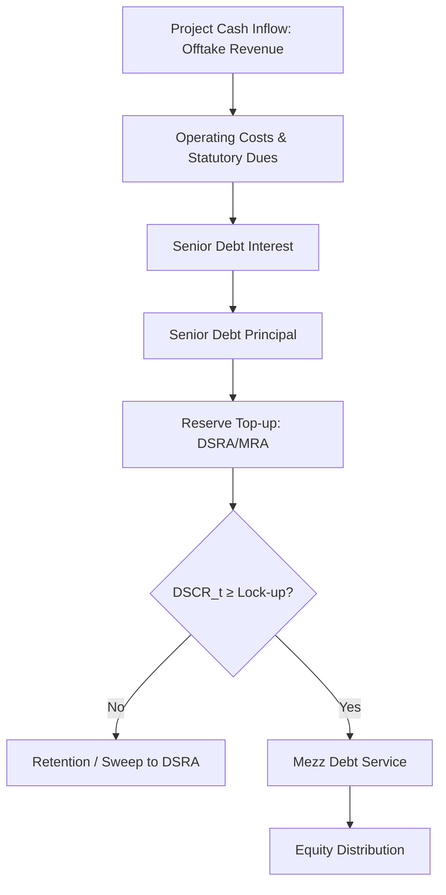
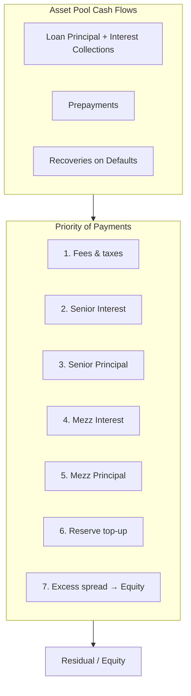
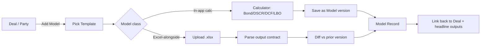

# Financial Modeling Module — Specification (Binary Capital / Binary Bonds CRM)

> **Scope.** This is the engineering + product spec for the **Financial Modeling** module of the Binary Capital Advisors LLP CRM. It defines what the module models, the math it implements, the data it stores, where the heavy computation lives (in-app vs Excel round-tripping), and how it links to the rest of the CRM (Deals, Parties, Credit module, Compliance).
>
> **Firm context.** One operating entity — Binary Capital Advisors LLP — running two practice lines: Binary Capital (IB & advisory: structured finance, project finance, supply-chain financing, M&A, ECM/DCM) and Binary Bonds (bond house: corporate bond underwriting, G-Sec/SDL/T-Bill/SGB auction participation, high-yield, secondary trading/market-making, portfolio management, credit rating advisory). Regulators: SEBI, RBI, FIMMDA; subject to PMLA (KYC/AML) and DPDP Act 2023. Office: Spaces Adani Height, Andheri West, Mumbai 400053. Named principals: Shray Vasudeva (Founder/MD), Shahrukh Sheikh (Managing Partner), Rati Ravi Kant (Director, Credit & Risk).
>
> **Document status.** Decision-grade. Where a number/regulation is uncertain it is marked **"to confirm"** rather than fabricated.

---

## 0. Design Principles

1. **Models are first-class CRM objects, not files.** A `Model` has an ID, owner, version, type, linked Deal/Party, assumptions, outputs, and an audit trail — exactly like a Party or Deal.
2. **Heavy sheets stay in Excel; the CRM indexes and audits them.** Excel is the lingua franca of Indian IB and rating agencies (CRISIL/ICRA/CARE/India Ratings/Acuite/Infomerics). We do not attempt to replace a 40-tab project-finance model in the browser. We attach, version, parse outputs, and round-trip assumptions.
3. **Lightweight, repeatable calculators belong IN the app.** Bond pricing, YTM, duration/convexity, quick DSCR/LLCR, simple WACC, quick LBO IRR — these are decision-speed tools that should run without launching Excel.
4. **Every number is reproducible.** Assumptions log + versioning + audit trail = a model output can be reconstructed months later for a rating committee or an internal deal review.
5. **Indian conventions by default, with explicit day-count/compounding flags.** Never silently assume US conventions.
6. **Compliance is structural.** KYC-linked model access, DPDP-minimal data retention, audit log immutable. See §7.

---

## 1. Bond Pricing & Fixed-Income Analytics

**BC service that uses it:** Binary Bonds — Corporate Bond Underwriting (pricing advisory), Secondary Market Trading/Market-Making (two-way quotes, price discovery), Bond Portfolio Management (duration/convexity, attribution), High-Yield Bonds (relative value), G-Secs (RBI auction cut-off analysis), Credit Rating Advisory (spread/rating-equivalent analysis). This is the single most-used calculator in the firm.

### 1.1 Inputs

| Input | Type | Notes / Indian convention |
|---|---|---|
| `face_value` | number | Indian corporate bonds & G-Secs: ₹100 face (default). SGB: ₹100 per unit; some old NCDs ₹1,000. |
| `coupon_rate` | % p.a. | Fixed (default). Floating (linked to FKMI/F-BILL/variable MIBOR) and zero-coupon supported; for floating, store benchmark + spread. |
| `coupon_frequency` | enum | `Annual` (Indian corporate bonds & NCDs — default), `Semi-Annual` (GoI dated G-Secs **and SDL** — default for G-Sec/SDL; SDL pays semi-annually like GoI dated securities), `Quarterly`/`Monthly` (rare; some NCDs), `Zero` (zero-coupon). |
| `day_count` | enum | `ACT/365` (Indian G-Secs & most corporate bonds — default), `30/360` (some corporate bonds, structured notes), `ACT/ACT` (rare). **Confirm per ISIN from offer document.** |
| `settlement` | enum | `T+1` (G-Secs on NDS-OM/CCIL — default), `T+1` (corporate bonds on BSE/NSE — default; SEBI moved corporate-bond settlement to T+1 in 2024), `T+0`/`T+1` (corporate-bond block trades on BSE cleared via ICCL, per brochure — **not** G-Sec block trades; G-Secs settle T+1 on NDS-OM/CCIL). Store per-trade. |
| `issue_date`, `maturity_date`, `last_coupon_date`, `next_coupon_date` | date | Derived from ISIN master where available. |
| `valuation_date` (aka settlement date) | date | The "as-of" for clean/dirty price. |
| `yield` (YTM) | % p.a. | Target input for price-from-yield; or solved for YTM-from-price. |
| `market_price` (clean or dirty — flag it) | number | For YTM solve. |
| `instrument_type` | enum | `GSEC`, `SDL`, `TBILL`, `SGB`, `CORP_IG`, `CORP_HY`, `NCD`, `CP`, `STRUCTURED`. |
| `benchmark` (for spread) | ref | Matched-maturity GoI G-Sec YTM for G-spread; benchmark curve for Z-spread/OAS. |
| `optionality` | flags | `callable` (call dates + call price), `puttable` (put dates + put price), `convertible` (conversion terms). Drive OAS vs Z-spread. |

### 1.2 Key formulas

**Accrued interest (Indian ACT/365 default — FIMMDA):**

$$
AI = Face \times c \times \frac{days(last\_coupon, settlement)}{DaysInYear}
$$

Equivalently, the per-coupon prorate form (identical when `days_in_coupon_period = DaysInYear/freq`):

$$
AI = \left(Face \times \frac{c}{freq}\right) \times \frac{days(last\_coupon, settlement)}{days\_in\_coupon\_period}
$$

where for ACT/365 `DaysInYear = 365` (ignore leap-day nuance unless the ISIN specifies ACT/ACT); for 30/360 use the 30/360 day fraction. **Do NOT mix `c/freq` with `days/365`** — the old hybrid form divided the coupon by `freq` but the days by `365`, which is off by a factor of `freq` for semi-annual/quarterly coupons. For irregular stub coupon periods the two forms diverge slightly (strict ACT/365 form 1 vs ACT/ACT-style prorate form 2); use form 1 strictly under ACT/365, and confirm per ISIN. For T-Bills (discount instruments) accrued interest is not applicable — price is discount-based (see §1.2.5).

**Clean price from yield (per-period discounting, the Indian corporate-bond convention — discount each coupon at the periodic yield, NOT semi-annual compounding unless the instrument is semi-annual):**

Let `y` = annual YTM, `f` = coupon frequency (1=annual, 2=semi-annual), periodic yield `r = y/f`, periodic coupon `C = Face × c / f`, `n` = remaining whole coupons, and `w` = **accrued/elapsed fraction** of the current coupon period (`w = days(last_coupon, settlement) / days_in_coupon_period` — the elapsed fraction, NOT the remaining fraction). Sanity: settlement on the last coupon date ⇒ `w = 0` ⇒ the first remaining coupon is discounted by exactly 1 period; settlement on the next coupon date ⇒ `w = 1` ⇒ the first coupon is discounted by 0 periods (received now).

$$
PV_{coupons} = \sum_{t=1}^{n} \frac{C}{(1+r)^{\,t - 1 + (1-w)}}
$$

$$
PV_{principal} = \frac{Face}{(1+r)^{\,n - 1 + (1-w)}}
$$

$$
Dirty = PV_{coupons} + PV_{principal}, \quad Clean = Dirty - AI
$$

> The `(1-w)` exponent handles stub settlement cleanly. Equivalent and commonly used: discount the full remaining cash-flow stream back to settlement directly (each CF discounted by its exact time-to-settlement in years at `y` for annual, `y/2` for semi-annual).

**Yield-to-maturity from price:** solve the above for `y` such that `Dirty = market_price` via Newton-Raphson / bisection. Convergence tolerance 1e-8; bound `y ∈ (−99%, 1000%)`. Report current yield too: `CY = (C × f) / Clean`.

**1.2.4 Macaulay duration (dimensionally consistent — discount at the periodic yield raised to the period count, then convert periods→years):**

Let `t_i` = time-to-settlement of cash flow `i` in years, `f` = frequency, `r = y/f` the periodic yield, and `k_i = t_i × f` = the same cash flow's period index (periods from settlement).

$$
D_{Mac} = \frac{1}{f} \cdot \frac{\sum_{i} k_i \times \frac{CF_i}{(1+r)^{k_i}}}{Dirty}
\ = \ \frac{\sum_{i} t_i \times \frac{CF_i}{(1+r)^{t_i \cdot f}}}{Dirty}
$$

The left form computes the weighted average in **periods** (weight `k_i`, discount exponent `k_i`) and divides by `f` to return **years**; the right form is the algebraically identical year-weighted form (weight `t_i` in years, discount exponent `t_i × f`). The original `(1+r)^{t_i}` was dimensionally inconsistent — a periodic yield `r` raised to a year-power; for a semi-annual bond it undercounted the discount for any `t_i > 1/f`. For annual-pay bonds (`f = 1`, `r = y`): `D_Mac = Σ t_i × CF_i / (1+y)^{t_i} / Dirty`. For an annual-coupon bond priced at par, `D_Mac ≈ (1+y)^{-1}` annuity-weighted maturity.

**Modified duration & DV01:**

$$
D_{mod} = \frac{D_{Mac}}{1 + r} \quad (\text{periodic } r = y/f)
$$

$$
DV01 \approx Dirty \times D_{mod} \times 1\text{bp} \quad (\text{₹ per ₹100 face, per 1 bp})
$$

**Convexity (periods throughout, then convert periods²→years² so the Taylor term with Δy in annual bp holds):**

Let `t_i' = t_i × f` = the period index of cash flow `i` (the same `k_i` used in duration), `r = y/f`:

$$
Convexity = \frac{1}{Dirty \cdot f^{2}} \sum_{i} \frac{CF_i \times t_i'(t_i'+1)}{(1+r)^{t_i'+2}}
$$

The `1/f²` factor converts the period²-weighted sum into years², so `½ × Convexity × (Δy)²` (with `Δy` expressed in annual decimals) is dimensionally consistent with `ΔP/P`. For annual-pay bonds (`f = 1`, `r = y`): `Convexity = (1/Dirty) Σ CF_i × t_i(t_i+1) / (1+y)^{t_i+2}`.

**Price-yield relationship (second-order Taylor):**

$$
\frac{\Delta P}{P} \approx -D_{mod}\,\Delta y + \tfrac{1}{2} Convexity\,(\Delta y)^2
$$

Display this as an interactive price-yield curve and a ±200bp shocked price table in the UI.

**1.2.5 T-Bill pricing (discount yield → price):** Indian T-Bills (91/182/364 day) are issued at discount.

$$
Price = Face \times \left(1 - Y_d \times \frac{DaysToMaturity}{365}\right)
$$

Then true YTM (bond-equivalent):

$$
YTM = \left(\frac{Face}{Price} - 1\right) \times \frac{365}{DaysToMaturity}
$$

**1.2.6 Spreads:**

- **G-spread** = `YTM_bond − YTM_matched-maturity_GSec` (most common in India; report the matched G-Sec ISIN & YTM).
- **Z-spread (OAS without optionality)** = parallel shift to the zero-coupon GoI curve such that discounted CFs = dirty price. Requires a GoI zero curve (build via bootstrap from NDS-OM G-Sec/SDL quotes — see §1.3).
- **OAS** = Z-spread net of option cost; for callable/puttable bonds, binomial tree (Hull-White / BDT) on the GoI curve with the embedded option exercised rationally; `OAS = Z-spread − Option Value (in bp)`.
- For IG corporate bonds, also report **rating-equivalent spread** vs the firm's internal rating→spread map (see Credit module) for relative-value screens.

### 1.3 Outputs

- Clean price, dirty price, accrued interest, YTM, current yield.
- Macaulay duration, modified duration, DV01, convexity.
- G-spread, Z-spread, OAS (if optionality), rating-equivalent spread.
- Price-yield table (±300bp grid), price-yield chart (interactive).
- Cash-flow schedule table (date, CF type, amount, discount factor, PV).
- For floating-rate: implied forward coupon path under the chosen benchmark scenario.
- Settlement-date calendar check (Indian holidays via CCIL/NSE holiday file — **to confirm data source**).

### 1.4 Assumptions & conventions to surface in UI

- Day-count, compounding frequency, settlement cycle displayed as **explicit chips** on every result (prevents the classic 30/360-vs-ACT/365 and semi-vs-annual errors).
- "Price quoted clean or dirty?" toggle — Indian secondary market quotes corporate bonds on **clean price, YTM** basis (FIMMDA convention); G-Secs quoted on price; T-Bills on discount yield. Default per instrument_type.
- Holiday calendar = Indian + Mumbai holidays; settlement rolled forward per RBI/CCIL convention.
- For OAS: interest-rate model, volatility assumption, and grid size logged.

### 1.5 Lightweight in-app calculator scope

The **Bond Calculator** (in-app) MUST handle: plain-vanilla fixed-coupon IG/HY corporate bonds, G-Secs, SDLs, T-Bills (discount), zero-coupon NCDs, and simple callable/puttable bonds (European exercise) with OAS via a one-factor tree. It SHOULD handle SGB (redemption linked to gold price — model as floating-redemption). It NEED NOT handle complex structured notes / convertible-bond equity-option decomposition — those go to Excel (attach + import outputs).

---

## 2. Project Finance / SPV Modeling

**BC service that uses it:** Project Advisory / Project Financing (non-recourse SPV financing for infra, renewables, roads, real estate) and Structured Finance (SPV structuring). Claims: ₹500+ Cr arranged, 50+ projects, 15-yr avg tenure.

### 2.1 Model structure — two phases

**Construction phase:** capex schedule (EPC, land, IDC, DSRA funding, contingency), debt drawdown schedule (proportional to equity injection per the financing agreement), interest during construction (IDC) capitalized, contingency & cost-overrun buffer, expected COD (commercial operation date). No revenue; cash outflows only.

**Operations phase:** revenue (offtake × tariff/price, with degradation for renewables), O&M, insurance, working capital, debt service (sculpted), taxes, distributions.

### 2.2 Inputs

- Capex by component, phasing, % contingency (default 5–10% for infra; 10–15% for greenfield).
- Financing mix: debt:equity (e.g., 70:30 for road HAM, 75:25 for solar), door-to-door tenor, grace/moratorium (construction), repayment profile (sculpted / DSCR-based / equated / balloon).
- Pricing: tariff (power/renewable — fixed + variable escalator), toll (road NHAI — with traffic ramp + escalation), offtake assumptions (capacity utilization %, PLF for power), availability factor.
- OPEX: O&M with escalation, insurance, MG&AR/royalty for infra concessions.
- Tax: corporate tax rate (25.17% Section 115BAA default vs 22% / 30%+surcharge+cess — model the choice), depreciation (40%/15%/5%/40% SLM vs WDV; Sec 32, additional depreciation 20% for power), MAT/AMT history (now abolished for non-IFoS cos — confirm), ITC/ITC reversal for GST.
- Working capital: receivables days (typical NHAI/renewable DISCOM receivables), debt service reserve account (DSRA) = 6 months debt service (default), maintenance reserve account (MRA) for road/infra.
- Macro: inflation (CPI/WPI), policy rate path (for floating debt), FX (for USD-denominated ECBs / Masala bond hedging cost).

### 2.3 Key formulas

**Debt Service Coverage Ratio (DSCR):**

$$
DSCR_t = \frac{CFADS_t}{Principal_t + Interest_t}
$$

where `CFADS` (Cash Flow Available for Debt Service) = EBITDA − Cash taxes − Maintenance capex − Change in working capital (some lenders add back DSRA releases).

- **Min DSCR** over the tenor (covenant test, typically ≥ 1.10x–1.20x for IG-rated infra; lender-specific).
- **Average DSCR** = `Σ CFADS / Σ Debt Service` (life-of-loan).
- **Loan Life DSCR (LLCR):** discount CFADS at the **cost of debt** (`K_d` = the loan's interest rate, or the weighted/blended cost across debt tranches) — NOT WACC. The denominator is debt outstanding, so the discount rate must match the obligation being measured:

$$
LLCR = \frac{PV(CFADS\text{ over loan life})}{Outstanding\ Debt} = \frac{\sum_{t=1}^{LL} CFADS_t / (1+K_d)^t}{Debt_t}
$$

Using WACC here overstates the PV (WACC > `K_d` after tax shielding) and inflates LLCR.

- **Project Life DSCR (PLCR):** same numerator (CFADS) extended over the **full concession/project life** (longer than loan life). Because the cash flows beyond loan life accrue to equity, PLCR **may** be discounted at the **project WACC** for the equity-like tail portion (lender convention varies — confirm with the lender's term sheet); over the loan-life portion use `K_d` for consistency with LLCR. PLCR ≥ LLCR generally; PLCR/LLCR ratio signals tail value.

**Debt sculpting** (target a constant DSCR `D*`):

$$
Debt\ Service_t = \frac{CFADS_t}{D^*}
$$

then split each period's debt service into interest (on outstanding balance) + principal (residual); iterate until principal schedule fully amortizes the loan within the tenor. For capped-tenor constraints, solve for the maximum debt size such that all period DSCRs ≥ `D_min` and the loan is repaid by the final maturity — this is the **debt sizing** optimization (use Goal Seek / Solver-equivalent in the in-app PF calculator for a single tenor; full sculpting in Excel).

**CFADS build (typical Indian infra):**

```
Revenue (Offtake × Tariff, escalated)
− Variable O&M
− Fixed O&M
= EBITDA
− Cash Tax (post-depreciation, post-interest, with MAT/AMT history & Sec 115BAA choice)
− Maintenance capex
± Change in working capital
± DSRA release/build
= CFADS
```

### 2.4 Non-recourse cash-flow waterfall

Priority of payments (model as an ordered cascade each period):

1. Operating costs (O&M, insurance, third-party charges)
2. Statutory dues (tax, GST, royalty)
3. Senior debt interest
4. Senior debt principal (sculpted)
5. DSRA / MRA top-up
6. Mezzanine / subordinated debt service
7. Distribution to equity (only if DSCR_t ≥ Distribution Lock-up DSCR, e.g., 1.15x; lock-up gates distributions)

Mermaid of the waterfall:



### 2.5 Sensitivity & scenario

| Driver | Stress |
|---|---|
| Tariff / toll | −10%, −15%, −20% |
| Offtake / PLF / traffic | −10%, −20%, ramp delay 6–12 mo |
| Cost overrun | +5%, +10%, +15% capex; COD delay 3/6/12 mo |
| Interest rate | +100bp, +200bp (for floating/ECB) |
| O&M inflation | +200bp vs base |
| FX (ECB) | ±5%, ±10% |

Report: min/avg DSCR, LLCR, PLCR, equity IRR, project IRR, and the **break-even** for min-DSCR = 1.10x on each driver. Tornado chart in UI.

### 2.6 Outputs

CFADS schedule, debt service schedule, DSCR/LLCR/PLCR time series, equity IRR & MOIC, project IRR (unlevered), breakeven analysis, sensitivity tables & tornado, lock-up test schedule, key covenant compliance over tenor.

### 2.7 Where it runs

Full multi-tab PF model = **Excel (alongside)** — attach versioned `.xlsx`, import key outputs (min DSCR, LLCR, equity IRR) into the CRM Model record. The in-app **Quick DSCR / Debt Sizing calculator** (§7) handles a single-tenor, single-tranche, constant-tariff sketch for mandate screening.

---

## 3. Securitization / Structured Finance Modeling

**BC service that uses it:** Structured Finance (ABS/securitization — auto loans, mortgages, trade receivables, consumer loans), Supply Chain Financing (reverse factoring pool), Structured Bonds. Methodology per site: Asset Analysis → Structure Design → Risk Assessment → Documentation → Execution.

### 3.1 Inputs

- **Asset pool:** number of loans/receivables, aggregate principal, weighted-avg yield, weighted-avg tenor, weighted-avg seasoning, geographic/borrower/industry concentration, pool origination vintages.
- **Credit quality of pool:** default rate assumption (annualized), default timing curve (S-curve / linear), recovery rate & lag (Indian context: 30–60% for unsecured retail, higher for vehicle/mortgage), prepayment/CPR assumption.
- **Structure:** tranches (Senior / Mezzanine / Equity), target rating per tranche, par & coupon per tranche, priority of payments, credit enhancement (OC, subordination, cash reserve, third-party guarantee, excess spread).
- **Fees:** origination, servicing, trust/trustee, rating agency, swap hedging cost.
- **Cash reserve / liquidity facility:** size, trigger-based draws.
- **Tax:** pass-through trust (Indian securitization typically structured via a trust; SPV route less common post-RBI Securitisation Guidelines 2012 — **to confirm current guidelines**).

### 3.2 Seniority tranches & credit enhancement



**Credit enhancement forms:**

- **Subordination** — junior tranche absorbs first losses; `CE_% = Junior_tranche_par / Total_pool`.
- **Overcollateralization (OC)** — pool par > sum of tranche par; `OC_% = (Pool − ΣTranches) / Pool`.
- **Cash reserve** — funded at closing from proceeds, drawn to cover senior shortfalls, replenished from excess spread.
- **Excess spread** — pool yield minus weighted tranche coupon minus fees; first-loss absorber before OC/reserve.
- **Third-party guarantee** — partial guarantee (e.g., from an NBFC/infrastructure guarantee co) on the senior tranche; model as a contingent cash inflow on senior shortfalls.

**Rating targets per tranche (Indian rating scale, indicative — to confirm with each agency's criteria):**

| Tranche | Target rating (CRISIL/ICRA/CARE/India Ratings/Acuite/Infomerics) | Indicative loss coverage |
|---|---|---|
| Senior | `AAA (SO)` / `AA+ (SO)` | ~ cover base-case + 1–2x stress losses |
| Mezzanine | `A+ (SO)` to `BBB (SO)` | covers base-case losses only |
| Equity / Junior | unrated | residual, first-loss |

(The `(SO)` suffix denotes "structured obligation" rating per Indian agency convention.)

### 3.3 Cash-flow waterfall formula (period t)

```
Collections_t = ScheduledPrincipal_t + ScheduledInterest_t
             + Prepayments_t + Recoveries_t(lag)
Losses_t = Defaults_t × (1 − Recovery_rate)

Available_t = Collections_t + ExcessSpread_{t-1} carry + Reserve_draws_t
            − Fees_t − Taxes_t

# Senior cascade
SeniorInterest_t = min(SeniorCoupon_t, Available_t);  Available_t -= ...
SeniorPrincipal_t = min(SeniorOutstanding_t, Available_t); Available_t -= ...

# Mezz cascade (analogous)
...

# Reserve replenishment from excess spread
Reserve_t = min(TargetReserve, Reserve_{t-1} + Available_t)

# Equity residual
Equity_t = max(0, Available_t after reserve)
```

Run a **vector simulation** over the pool life (monthly) with the default curve; compute:

- **Probability of Tranche Loss / Expected Loss on tranche** (EL = PD × LGD × EAD; formerly mislabeled "Senior PAR / Probability of Awful Ruin"), ** WAL** (weighted-average life) per tranche,
- **Credit enhancement required** to hit target rating = stress losses at the agency's stress multiplier,
- **Tranche IRRs** at the pricing coupon,
- **Excess spread / OC decay** over time.

### 3.4 Outputs

Per-tranche: rating, par, coupon, WAL, IRR, **EL (Expected Loss = PD × LGD × EAD)**, loss coverage multiple, break-even default rate (BDR) at which the tranche loses par. Pool: cumulative default rate, cumulative loss rate, prepayment speed (CPR/SMM). Waterfall schedule (period-by-period). Sensitivity: default rate ±, recovery ±, prepayment ±.

### 3.5 Where it runs

Tranche-level cash-flow engine with monthly vectors and rating-target stress = **Excel (alongside)** for the full structure; the CRM stores structure metadata, tranche targets, and imported outputs. A simple **OC/subordination sizing calculator** (in-app) computes required CE for a target stress-loss multiple — useful at mandate-screening stage.

---

## 4. DCF & Valuation Modeling

**BC service that uses it:** M&A Advisory (buy-side/sell-side valuations, fairness opinions), Capital Markets Advisory (IPO pricing, QIP valuation support), Project Advisory (project NPV).

### 4.1 Inputs

- Historical financials (3–5 yr): revenue, EBITDA, EBIT, capex, D&A, working capital, tax.
- Forecast drivers: revenue growth, EBITDA margin, capex % of revenue, WC % of revenue, tax rate, depreciation schedule.
- WACC inputs: risk-free rate (matched GoI G-Sec YTM), equity risk premium (India ERP ~ 6.5–7.5% — **to confirm firm standard**), beta (levered/unlevered; relever to target capital structure), size premium, country risk premium, cost of debt (pre-tax YTM on the target's debt), capital structure (D/E), tax rate.
- Terminal value: Gordon growth `g` (long-run India GDP-ish, 4–6%) **or** exit multiple (EV/EBITDA).
- Valuation date, currency (INR default; FX-adjusted for cross-border).

### 4.2 Key formulas

**Free Cash Flow to Firm (FCFF):**

$$
FCFF_t = EBIT_t \times (1 - \tau) + D\&_A_t - \Delta NWC_t - Capex_t
$$

**WACC:**

$$
WACC = E/(E+D) \cdot K_e + D/(E+D) \cdot K_d \cdot (1-\tau)
$$

$$
K_e = R_f + \beta_{levered}(ERP) + SP + CRP
$$

$$
K_d = YTM_{debt} \quad (\text{pre-tax})
$$

**Terminal value — Gordon growth:**

$$
TV_n = \frac{FCFF_{n+1}}{WACC - g} = \frac{FCFF_n(1+g)}{WACC - g}
$$

**Terminal value — exit multiple:**

$$
TV_n = EV/EBITDA_{exit} \times EBITDA_n
$$

**Enterprise value:**

$$
EV = \sum_{t=1}^{n} \frac{FCFF_t}{(1+WACC)^t} + \frac{TV_n}{(1+WACC)^n}
$$

**Equity value (bridge):**

$$
Equity\ Value = EV - Net\ Debt - Minority\ Interest - Preferred + Investments\ (non-op)
$$

where `Net Debt = Total Debt − Cash & equivalents` (cash is already netted inside Net Debt — do **NOT** add it back; the old `+ Cash` form double-counted cash). Equivalent gross-debt form: `Equity Value = EV − Total Debt + Cash − Minority Interest − Preferred + Investments(non-op)`. Add a separate cash term only if cash has been explicitly reclassified out of Net Debt (e.g., excess/non-operating cash carved out).

**Companion multiples** (cross-check): `EV/EBITDA`, `P/E`, `EV/Sales`, `PEG`; report trailing & forward, with peer set (Indian listed comps — pull from the CRM's Party/Instrument master where listed comps are stored).

### 4.3 Sensitivity

Two-way tables: WACC × g (Gordon) and WACC × Exit Multiple; revenue growth × EBITDA margin; one-way on every driver. Tornado chart. Probability-weighted scenarios (bull/base/bear with weights).

### 4.4 Outputs

EV, equity value, implied per-share value (for listed comps / IPO), WACC build summary, FCFF schedule, terminal value decomposition, sensitivity grids, peer multiples table, scenario-weighted value range. For fairness opinions: output a value range with methodology notes (the audit trail here is regulator-relevant).

### 4.5 Where it runs

Full DCF with peer-set = **Excel (alongside)**. In-app **Quick WACC / Quick DCF** calculators (§7) for screening: input the WACC components, a 5-yr FCFF sketch, terminal method → EV range.

---

## 5. M&A / LBO (Brief)

**BC service that uses it:** M&A Advisory (buy-side modeling, returns to sponsor), Capital Markets (leveraged recaps).

### 5.1 Sources & Uses

```
USES:                        SOURCES:
- Purchase of equity          - New debt (Term loan A/B, bonds)
- Refinance of existing debt  - Sponsor equity
- Transaction fees            - Seller rollover equity
- Financing fees              - Cash on balance sheet
```

**Transaction value / Enterprise value reconciliation:** `EV = Equity Purchase Price + Net Debt Transferred`; **Goodwill** = `Purchase Price − Fair Value of Net Identifiable Assets` (Ind AS 103 / IFRS 3).

### 5.2 Simple LBO returns

Project debt paydown over a 5–7 yr hold; model EBITDA growth, cash sweep (excess cash → debt repayment, subject to min-DSCR/covenant), exit at chosen EV/EBITDA multiple. Then:

$$
MOIC = \frac{Exit\ Equity\ Value}{Initial\ Sponsor\ Equity}
$$

$$
IRR = \left(\frac{Exit\ Equity}{Initial\ Equity}\right)^{1/hold} - 1
$$

Report MOIC, IRR, debt/EBITDA at exit, equity check, cumulative debt paydown, returns attribution (EBITDA growth vs multiple expansion vs debt paydown) — the last is the standard LBO "returns bridge."

### 5.3 Where it runs

**Excel (alongside)** for a full LBO with debt waterfall & sweep; the in-app **Quick LBO IRR** calculator (§7) handles a single-tranche, constant-multiple, no-sweep sketch for screening.

---

## 6. Model Governance

This is the spine that makes every above model defensible to rating committees, lenders, and internal risk. It is non-negotiable for an SEBI/RBI/FIMMDA-regulated firm holding client data.

### 6.1 Template library

A versioned, permissioned library of canonical model templates, one per model type (and per sub-type, e.g., "Road HAM", "Solar PV", "HAM Toll", "ABS — Auto Loans", "DCF — Listed Indian Corp", "LBO — Mid-market"). Each template:

- Owned by a named principal (default owners: Rati Ravi Kant for credit/risk templates; Shray Vasudeva / Shahrukh Sheikh for IB templates).
- Versioned (`template_id`, `version`, `status`: `draft`/`approved`/`deprecated`).
- Has a defined assumptions schema (the inputs in each § above) so CRM records can validate against it.
- Seeded with BC-standard conventions (Indian day-counts, 25.17% tax default, 70:30 D:E infra default, ERP standard) to prevent drift.

### 6.2 Versioning

Every `Model` object carries `model_id`, `version` (semver-ish: major.minor), `parent_version_id` (for forks), `status`, `created_by`, `created_at`, `approved_by`, `approved_at`. Editing a frozen/approved version creates a new version; the prior remains immutable and referenceable.

### 6.3 Assumptions log

A structured, append-only log of every assumption with: key, value, unit, source (e.g., "RBI policy rate as of 2026-06-26", "offer document ISIN INE0xxx", "management forecast v3"), entered/changed_by, timestamp, and rationale. External-linkable to the source document in the CRM's Document store. This is the single biggest lever for rating-agency & lender trust.

### 6.4 Audit trail (who-edited-what)

Append-only event log on every Model: `viewed`, `assumption_changed` (diff), `calc_rerun`, `output_imported`, `file_attached`, `version_forked`, `version_approved`, `linked_to_deal`, `shared_externally` (with DPDP/PMLA gating). Immutable, exportable to PDF for committee packs. Access tied to KYC/role (a Party's model outputs are visible only to users whose mandate covers that Party — see §7.3).

### 6.5 Review & approval workflow

`draft → reviewed (by a second principal) → approved` before a model output can be attached to a live Deal or shared externally. The "maker-checker" pattern reflects regulatory expectation for IB advisory outputs (fairness opinions, rating rationales).

---

## 7. IN the CRM vs ALONGSIDE — the defensible split

The governing principle: **the CRM owns the model as an object (metadata, assumptions, outputs, links, audit) and the lightweight calculators; Excel owns the heavy computation via versioned attachments with output round-tripping.**

### 7.1 IN the CRM (built natively, in-app)

| Capability | Why in-app |
|---|---|
| **Model Registry** — every model as a first-class object (type, owner, version, status, links, audit) | Needs global search, linking, governance, permissioning — exactly what the CRM is for. |
| **Assumptions log** (structured, append-only, source-linked) | Must be queryable across models for risk review and compliance; not buried in Excel. |
| **Link a Deal / Party / Instrument to a Model + its key outputs** | The whole point of the CRM: relationship graph. |
| **Bond Pricing Calculator** (§1) — full vanilla + callable/puttable + T-Bill + G-Sec/SDL, day-count/compounding explicit | Decision-speed, used by the trading desk dozens of times a day; errors here cost real money; standardizing in-app reduces 30/360 vs ACT/365 mistakes. |
| **Quick DSCR / Debt Sizing calculator** (§2) — single-tenor, single-tranche screening | Used at mandate-screening before the full PF model is built; answer in seconds. |
| **Quick WACC / Quick DCF calculator** (§4) — 5-yr FCFF sketch + terminal | Screening-stage valuation range before the banker builds the full model. |
| **Quick LBO IRR calculator** (§5) — single-tranche, constant-multiple | Buy-side screening. |
| **Tranche CE sizing calculator** (§3) — OC/subordination for a target stress-loss multiple | Structuring sketch before the full ABS waterfall model. |
| **Output storage & visualization** — charts (price-yield, DSCR time series, tornado, sensitivity grids) | Display is a CRM job; charts render from stored outputs. |
| **Model governance** — template library, versioning, approval workflow, audit trail | Compliance requires it be centralized and immutable. |

### 7.2 ALONGSIDE (Excel, attached & round-tripped)

| Capability | Why alongside |
|---|---|
| **Full Project Finance / SPV models** (multi-tranche debt, sculpting with multiple constraints, tax/MAT/ITC detail, working capital, DSRA/MRA dynamics) | Excel + Solver is the industry standard; rating agencies expect the .xlsx; rebuilding in-app would take years and never match. |
| **Full securitization waterfall models** (monthly vectors, default curves, multi-tranche, triggers, swap hedging) | Same — agency-ready Excel. |
| **Full DCF/valuation with peer sets** (3-statement, multi-scenario, comps build) | Banker-built, presentation-ready. |
| **Full LBO** (debt waterfall, cash sweep, PIK, mezz, returns bridge) | Excel. |
| **Structured/convertible bond note decomposition** (equity option, cap-floor, conversion premium) | Too idiosyncratic per deal. |
| **Portfolio attribution & risk** for Bond Portfolio Management | Buy-side analytics suites / Excel; the CRM imports periodic outputs. |

### 7.3 The round-trip interface (critical)

The bridge between Excel and the CRM must be **structured**, not free-form:

1. **Attach** the `.xlsx` (and supporting PDFs) to the Model record as a versioned file (Document store, DPDP-encrypted at rest).
2. **Define an output contract** per template: a named range/table in Excel (e.g., `bc_outputs.min_dscr`, `bc_outputs.llcr`, `bc_outputs.equity_irr`, `bc_outputs.ev`, `bc_outputs.moinc`) that the CRM parses on import. Templates ship with this contract pre-defined; custom models map ranges manually once.
3. **Import outputs** via an uploader that reads the named ranges and writes structured fields back to the Model record (and the assumptions log if a "key assumptions" range is defined).
4. **Re-link to Deal/Party** automatically when imported (since the Model is already linked).
5. **Diff on re-import**: when a new Excel version is uploaded, the CRM diffs the imported outputs vs the prior version and shows the change in the audit trail (e.g., "min DSCR 1.18x → 1.14x on v4").
6. **Never execute Excel server-side.** No headless Excel computation — too fragile/unsafe. Excel runs on the banker's desktop; the CRM only parses outputs.

### 7.4 Permissioning & compliance

- Model access scoped by `Party` mandate (user must have an active mandate covering the linked Party/Deal).
- KYC status of the linked Party gates external sharing (no sharing a model for a Party with KYC `lapsed`).
- PMLA: high-value transaction-model outputs that touch onboarding flows flagged for AML review (integration with Compliance module).
- DPDP Act 2023: personal data in assumptions (e.g., a borrower's financials) minimised; retention tied to the engagement; right-to-erasure workflow on engagement close (mark records, purge per policy — **policy to confirm with counsel**).
- Export controls: any external share logged with recipient, time, and a watermarked PDF.

---

## 8. Screen / UX Concepts

### 8.1 Model Library (list view)

- Filters: type (Bond / PF-SPV / Securitization / DCF / LBO), status (draft/reviewed/approved), owner, linked Deal, linked Party, date range.
- Columns: Model ID, name, type, version, status, owner, linked Deal, last output date, key headline output (e.g., "Min DSCR 1.18x", "EV ₹420 Cr", "YTM 8.42%"), audit-flag.
- Bulk actions: approve, deprecate, export audit trail, share (with DPDP/PMLA gating).
- Search: full-text over name + assumptions log + linked Party/Deal.

### 8.2 Model Detail (the single source of truth for one model)

Tabs:

1. **Overview** — type, version lineage (mini-tree of forks), owner, approver, linked Deal & Party chips, status badge, key headline outputs as cards (Bond: YTM/price/duration; PF: min/avg DSCR, LLCR, equity IRR; DCF: EV range; LBO: IRR/MOIC).
2. **Inputs / Assumptions** — structured form grouped per the schema for that model type; each field shows source-link and "edit → new version" gating. For Excel-alongside models, this tab holds the **output-contract mapping** + attached files instead of full inputs.
3. **Outputs** — charts (price-yield curve, DSCR time series, tornado, sensitivity grids, waterfall diagram) + tables (cash-flow schedule, debt service, tranche summary).
4. **Calculators** (in-app models only) — the interactive bond/DSCR/DCF/LBO calculators with live recompute and "save as model version" on change.
5. **Files** — versioned Excel/PDF attachments; upload triggers output-import flow; diff view vs prior version's imported outputs.
6. **Audit Trail** — chronological, filterable, exportable event log (who/what/when/diff).
7. **Links** — Deal, Party(s), Instrument(s), Credit Memo (cross-link to Credit module), Compliance flags.

### 8.3 Link-to-Deal flow

From a Deal record: **"Add Model"** → pick template or existing model → fills defaults from Deal metadata (issuer/counterparty, instrument, tenor) → opens the right calculator or prompts Excel upload → on output import, the Deal's "Key Terms" panel surfaces headline outputs (e.g., a bond underwriting Deal shows underwriter-side pricing: YTM, price, spread to comparable G-Sec; a project finance Deal shows min DSCR, LLCR, debt sized).

### 8.4 In-app Calculator UX (Bond example)

- Left: inputs form (instrument_type dropdown → sets defaults: face ₹100, freq, day-count, settlement). Yield & price fields with a "solve direction" toggle (price→YTM or YTM→price).
- Right: live results (clean/dirty, AI, YTM, duration, DV01, convexity, G-spread), price-yield chart with draggable yield handle, cash-flow schedule table.
- Conventions chips (ACT/365, Annual, T+1) always visible — never hidden.
- "Save as Model" → creates a versioned Model record linked to the chosen Instrument/Deal.
- Audit log entry on every recompute with the assumption snapshot.



---

## 9. Data Model (sketch)

```
Model
  model_id (PK), type, template_id, template_version, version, parent_version_id,
  status, owner_user_id, approver_user_id,
  linked_deal_id, linked_party_id[], linked_instrument_id[],
  created_at, approved_at,
  assumptions[]   -> Assumption(key, value, unit, source_doc_id, rationale, changed_by, changed_at)
  outputs{}       -> typed per model type (JSON, schema from template)
  files[]         -> ModelFile(file_id, version, uploaded_by, uploaded_at, sha256, output_contract_version)
  audit[]         -> AuditEvent(type, actor, ts, diff, metadata)

Template
  template_id, version, type, status, owner_user_id,
  assumptions_schema (JSON Schema), output_contract (named ranges / field map),
  default_conventions, created_at, approved_at

ModelFile (extends Document)
  file_id, model_id, version, filename, mime, sha256, size,
  output_contract_version, imported_outputs{}, imported_by, imported_at
```

---

## 10. Open questions (to confirm, not guess)

1. **Holiday calendar & settlement source** — which Indian holiday file does the firm use (CCIL / NSE / FIMMDA)? Licensing? *(to confirm)*
2. **India ERP standard** — what equity risk premium / country risk premium / size premium does BC use as house standard? *(to confirm; default placeholder 6.5–7.5% ERP)*
3. **Current securitization guidelines** — RBI Securitisation of Standard Assets (latest rev.) true-sale / MT requirements & minimum holding period (HP) / minimum retention (MR); confirm exact current thresholds. *(to confirm)*
4. **Tax defaults** — firm house view on Sec 115BAA (25.17%) vs 22% vs 30%+surcharge for project companies; MAT/AMT treatment post-abolition; Sec 80-IA/80-IAD availability for renewables/infra (sunset). *(to confirm with tax counsel)*
5. **Rating-agency stress multipliers** — each agency's published stress multipliers for sizing CE; do we mirror CRISIL/ICRA/CARE/India Ratings/Acuite/Infomerics exactly or use BC internal? *(to confirm)*
6. **DPDP retention / erasure policy** — engagement-close data retention & right-to-erasure workflow specifics for model data containing personal/counterparty financials. *(to confirm with counsel)*
7. **PMLA thresholds** — exact transaction-value thresholds that flag a model output for AML review. *(to confirm)*
8. **Excel output-contract adoption** — will bankers accept standardized named ranges, or do we need a per-model manual mapping UI first? *(product decision — recommend ship with manual mapping + provide templates that already define ranges)*
9. **Floating-rate benchmark** — which IBORs/term SOFR/FKMI/MIBOR variants does the desk price? Transition timeline for any discontinued benchmarks. *(to confirm with trading desk)*
10. **SGB redemption model** — model as gold-price-linked floating redemption; confirm data feed for daily ₹/10g gold price (IBJA/MCX). *(to confirm)*
11. **Cross-border/FX & hedging** — ECB/Masala bond hedge cost assumption source; is a hedging-cost overlay part of the PF template by default? *(to confirm)*
12. **Green/climate-finance reporting** — for green bond / renewable PF models, do we need a separate green-bond-use-of-proceeds tracking sub-module? *(to confirm with DCM team)*
